<html xmlns:v="urn:schemas-microsoft-com:vml"
xmlns:o="urn:schemas-microsoft-com:office:office"
xmlns:w="urn:schemas-microsoft-com:office:word"
xmlns:m="http://schemas.microsoft.com/office/2004/12/omml"
xmlns:mv="http://macVmlSchemaUri" xmlns="http://www.w3.org/TR/REC-html40">

<head>
<meta name=Title content="">
<meta name=Keywords content="">
<meta http-equiv=Content-Type content="text/html; charset=macintosh">
<meta name=ProgId content=Word.Document>
<meta name=Generator content="Microsoft Word 14">
<meta name=Originator content="Microsoft Word 14">
<link rel=File-List href="TrackMe_Project_Report_files/filelist.xml">
<link rel=Edit-Time-Data href="TrackMe_Project_Report_files/editdata.mso">
<!--[if !mso]>

<![endif]--><!--[if gte mso 9]><xml>
 <o:DocumentProperties>
  <o:Author>Matthew Finn</o:Author>
  <o:LastAuthor>Matthew Finn</o:LastAuthor>
  <o:Revision>2</o:Revision>
  <o:TotalTime>2</o:TotalTime>
  <o:LastPrinted>2017-03-31T15:02:00Z</o:LastPrinted>
  <o:Created>2017-04-04T13:27:00Z</o:Created>
  <o:LastSaved>2017-04-04T13:27:00Z</o:LastSaved>
  <o:Pages>2</o:Pages>
  <o:Words>9410</o:Words>
  <o:Characters>53638</o:Characters>
  <o:Lines>446</o:Lines>
  <o:Paragraphs>125</o:Paragraphs>
  <o:CharactersWithSpaces>62923</o:CharactersWithSpaces>
  <o:Version>14.0</o:Version>
 </o:DocumentProperties>
 <o:OfficeDocumentSettings>
  <o:AllowPNG/>
 </o:OfficeDocumentSettings>
</xml><![endif]-->
<link rel=dataStoreItem href="TrackMe_Project_Report_files/item0001.xml"
target=":TrackMe_Project_Report_files:props0002.xml">
<link rel=themeData href="TrackMe_Project_Report_files/themedata.xml">
<!--[if gte mso 9]><xml>
 <w:WordDocument>
  <w:TrackMoves>false</w:TrackMoves>
  <w:TrackFormatting/>
  <w:PunctuationKerning/>
  <w:ValidateAgainstSchemas/>
  <w:SaveIfXMLInvalid>false</w:SaveIfXMLInvalid>
  <w:IgnoreMixedContent>false</w:IgnoreMixedContent>
  <w:AlwaysShowPlaceholderText>false</w:AlwaysShowPlaceholderText>
  <w:DoNotPromoteQF/>
  <w:LidThemeOther>EN-US</w:LidThemeOther>
  <w:LidThemeAsian>JA</w:LidThemeAsian>
  <w:LidThemeComplexScript>X-NONE</w:LidThemeComplexScript>
  <w:Compatibility>
   <w:BreakWrappedTables/>
   <w:SnapToGridInCell/>
   <w:WrapTextWithPunct/>
   <w:UseAsianBreakRules/>
   <w:DontGrowAutofit/>
   <w:SplitPgBreakAndParaMark/>
   <w:EnableOpenTypeKerning/>
   <w:DontFlipMirrorIndents/>
   <w:OverrideTableStyleHps/>
   <w:UseFELayout/>
  </w:Compatibility>
  <m:mathPr>
   <m:mathFont m:val="Cambria Math"/>
   <m:brkBin m:val="before"/>
   <m:brkBinSub m:val="&#45;-"/>
   <m:smallFrac m:val="off"/>
   <m:dispDef/>
   <m:lMargin m:val="0"/>
   <m:rMargin m:val="0"/>
   <m:defJc m:val="centerGroup"/>
   <m:wrapIndent m:val="1440"/>
   <m:intLim m:val="subSup"/>
   <m:naryLim m:val="undOvr"/>
  </m:mathPr></w:WordDocument>
</xml><![endif]--><!--[if gte mso 9]><xml>
 <w:LatentStyles DefLockedState="false" DefUnhideWhenUsed="true"
  DefSemiHidden="true" DefQFormat="false" DefPriority="99"
  LatentStyleCount="276">
  <w:LsdException Locked="false" Priority="0" SemiHidden="false"
   UnhideWhenUsed="false" QFormat="true" Name="Normal"/>
  <w:LsdException Locked="false" Priority="9" SemiHidden="false"
   UnhideWhenUsed="false" QFormat="true" Name="heading 1"/>
  <w:LsdException Locked="false" Priority="9" QFormat="true" Name="heading 2"/>
  <w:LsdException Locked="false" Priority="9" QFormat="true" Name="heading 3"/>
  <w:LsdException Locked="false" Priority="9" QFormat="true" Name="heading 4"/>
  <w:LsdException Locked="false" Priority="9" QFormat="true" Name="heading 5"/>
  <w:LsdException Locked="false" Priority="9" QFormat="true" Name="heading 6"/>
  <w:LsdException Locked="false" Priority="9" QFormat="true" Name="heading 7"/>
  <w:LsdException Locked="false" Priority="9" QFormat="true" Name="heading 8"/>
  <w:LsdException Locked="false" Priority="9" QFormat="true" Name="heading 9"/>
  <w:LsdException Locked="false" Priority="39" Name="toc 1"/>
  <w:LsdException Locked="false" Priority="39" Name="toc 2"/>
  <w:LsdException Locked="false" Priority="39" Name="toc 3"/>
  <w:LsdException Locked="false" Priority="39" Name="toc 4"/>
  <w:LsdException Locked="false" Priority="39" Name="toc 5"/>
  <w:LsdException Locked="false" Priority="39" Name="toc 6"/>
  <w:LsdException Locked="false" Priority="39" Name="toc 7"/>
  <w:LsdException Locked="false" Priority="39" Name="toc 8"/>
  <w:LsdException Locked="false" Priority="39" Name="toc 9"/>
  <w:LsdException Locked="false" Priority="35" QFormat="true" Name="caption"/>
  <w:LsdException Locked="false" Priority="10" SemiHidden="false"
   UnhideWhenUsed="false" QFormat="true" Name="Title"/>
  <w:LsdException Locked="false" Priority="1" Name="Default Paragraph Font"/>
  <w:LsdException Locked="false" Priority="11" SemiHidden="false"
   UnhideWhenUsed="false" QFormat="true" Name="Subtitle"/>
  <w:LsdException Locked="false" Priority="22" SemiHidden="false"
   UnhideWhenUsed="false" QFormat="true" Name="Strong"/>
  <w:LsdException Locked="false" Priority="20" SemiHidden="false"
   UnhideWhenUsed="false" QFormat="true" Name="Emphasis"/>
  <w:LsdException Locked="false" Priority="59" SemiHidden="false"
   UnhideWhenUsed="false" Name="Table Grid"/>
  <w:LsdException Locked="false" UnhideWhenUsed="false" Name="Placeholder Text"/>
  <w:LsdException Locked="false" Priority="1" SemiHidden="false"
   UnhideWhenUsed="false" QFormat="true" Name="No Spacing"/>
  <w:LsdException Locked="false" Priority="60" SemiHidden="false"
   UnhideWhenUsed="false" Name="Light Shading"/>
  <w:LsdException Locked="false" Priority="61" SemiHidden="false"
   UnhideWhenUsed="false" Name="Light List"/>
  <w:LsdException Locked="false" Priority="62" SemiHidden="false"
   UnhideWhenUsed="false" Name="Light Grid"/>
  <w:LsdException Locked="false" Priority="63" SemiHidden="false"
   UnhideWhenUsed="false" Name="Medium Shading 1"/>
  <w:LsdException Locked="false" Priority="64" SemiHidden="false"
   UnhideWhenUsed="false" Name="Medium Shading 2"/>
  <w:LsdException Locked="false" Priority="65" SemiHidden="false"
   UnhideWhenUsed="false" Name="Medium List 1"/>
  <w:LsdException Locked="false" Priority="66" SemiHidden="false"
   UnhideWhenUsed="false" Name="Medium List 2"/>
  <w:LsdException Locked="false" Priority="67" SemiHidden="false"
   UnhideWhenUsed="false" Name="Medium Grid 1"/>
  <w:LsdException Locked="false" Priority="68" SemiHidden="false"
   UnhideWhenUsed="false" Name="Medium Grid 2"/>
  <w:LsdException Locked="false" Priority="69" SemiHidden="false"
   UnhideWhenUsed="false" Name="Medium Grid 3"/>
  <w:LsdException Locked="false" Priority="70" SemiHidden="false"
   UnhideWhenUsed="false" Name="Dark List"/>
  <w:LsdException Locked="false" Priority="71" SemiHidden="false"
   UnhideWhenUsed="false" Name="Colorful Shading"/>
  <w:LsdException Locked="false" Priority="72" SemiHidden="false"
   UnhideWhenUsed="false" Name="Colorful List"/>
  <w:LsdException Locked="false" Priority="73" SemiHidden="false"
   UnhideWhenUsed="false" Name="Colorful Grid"/>
  <w:LsdException Locked="false" Priority="60" SemiHidden="false"
   UnhideWhenUsed="false" Name="Light Shading Accent 1"/>
  <w:LsdException Locked="false" Priority="61" SemiHidden="false"
   UnhideWhenUsed="false" Name="Light List Accent 1"/>
  <w:LsdException Locked="false" Priority="62" SemiHidden="false"
   UnhideWhenUsed="false" Name="Light Grid Accent 1"/>
  <w:LsdException Locked="false" Priority="63" SemiHidden="false"
   UnhideWhenUsed="false" Name="Medium Shading 1 Accent 1"/>
  <w:LsdException Locked="false" Priority="64" SemiHidden="false"
   UnhideWhenUsed="false" Name="Medium Shading 2 Accent 1"/>
  <w:LsdException Locked="false" Priority="65" SemiHidden="false"
   UnhideWhenUsed="false" Name="Medium List 1 Accent 1"/>
  <w:LsdException Locked="false" UnhideWhenUsed="false" Name="Revision"/>
  <w:LsdException Locked="false" Priority="34" SemiHidden="false"
   UnhideWhenUsed="false" QFormat="true" Name="List Paragraph"/>
  <w:LsdException Locked="false" Priority="29" SemiHidden="false"
   UnhideWhenUsed="false" QFormat="true" Name="Quote"/>
  <w:LsdException Locked="false" Priority="30" SemiHidden="false"
   UnhideWhenUsed="false" QFormat="true" Name="Intense Quote"/>
  <w:LsdException Locked="false" Priority="66" SemiHidden="false"
   UnhideWhenUsed="false" Name="Medium List 2 Accent 1"/>
  <w:LsdException Locked="false" Priority="67" SemiHidden="false"
   UnhideWhenUsed="false" Name="Medium Grid 1 Accent 1"/>
  <w:LsdException Locked="false" Priority="68" SemiHidden="false"
   UnhideWhenUsed="false" Name="Medium Grid 2 Accent 1"/>
  <w:LsdException Locked="false" Priority="69" SemiHidden="false"
   UnhideWhenUsed="false" Name="Medium Grid 3 Accent 1"/>
  <w:LsdException Locked="false" Priority="70" SemiHidden="false"
   UnhideWhenUsed="false" Name="Dark List Accent 1"/>
  <w:LsdException Locked="false" Priority="71" SemiHidden="false"
   UnhideWhenUsed="false" Name="Colorful Shading Accent 1"/>
  <w:LsdException Locked="false" Priority="72" SemiHidden="false"
   UnhideWhenUsed="false" Name="Colorful List Accent 1"/>
  <w:LsdException Locked="false" Priority="73" SemiHidden="false"
   UnhideWhenUsed="false" Name="Colorful Grid Accent 1"/>
  <w:LsdException Locked="false" Priority="60" SemiHidden="false"
   UnhideWhenUsed="false" Name="Light Shading Accent 2"/>
  <w:LsdException Locked="false" Priority="61" SemiHidden="false"
   UnhideWhenUsed="false" Name="Light List Accent 2"/>
  <w:LsdException Locked="false" Priority="62" SemiHidden="false"
   UnhideWhenUsed="false" Name="Light Grid Accent 2"/>
  <w:LsdException Locked="false" Priority="63" SemiHidden="false"
   UnhideWhenUsed="false" Name="Medium Shading 1 Accent 2"/>
  <w:LsdException Locked="false" Priority="64" SemiHidden="false"
   UnhideWhenUsed="false" Name="Medium Shading 2 Accent 2"/>
  <w:LsdException Locked="false" Priority="65" SemiHidden="false"
   UnhideWhenUsed="false" Name="Medium List 1 Accent 2"/>
  <w:LsdException Locked="false" Priority="66" SemiHidden="false"
   UnhideWhenUsed="false" Name="Medium List 2 Accent 2"/>
  <w:LsdException Locked="false" Priority="67" SemiHidden="false"
   UnhideWhenUsed="false" Name="Medium Grid 1 Accent 2"/>
  <w:LsdException Locked="false" Priority="68" SemiHidden="false"
   UnhideWhenUsed="false" Name="Medium Grid 2 Accent 2"/>
  <w:LsdException Locked="false" Priority="69" SemiHidden="false"
   UnhideWhenUsed="false" Name="Medium Grid 3 Accent 2"/>
  <w:LsdException Locked="false" Priority="70" SemiHidden="false"
   UnhideWhenUsed="false" Name="Dark List Accent 2"/>
  <w:LsdException Locked="false" Priority="71" SemiHidden="false"
   UnhideWhenUsed="false" Name="Colorful Shading Accent 2"/>
  <w:LsdException Locked="false" Priority="72" SemiHidden="false"
   UnhideWhenUsed="false" Name="Colorful List Accent 2"/>
  <w:LsdException Locked="false" Priority="73" SemiHidden="false"
   UnhideWhenUsed="false" Name="Colorful Grid Accent 2"/>
  <w:LsdException Locked="false" Priority="60" SemiHidden="false"
   UnhideWhenUsed="false" Name="Light Shading Accent 3"/>
  <w:LsdException Locked="false" Priority="61" SemiHidden="false"
   UnhideWhenUsed="false" Name="Light List Accent 3"/>
  <w:LsdException Locked="false" Priority="62" SemiHidden="false"
   UnhideWhenUsed="false" Name="Light Grid Accent 3"/>
  <w:LsdException Locked="false" Priority="63" SemiHidden="false"
   UnhideWhenUsed="false" Name="Medium Shading 1 Accent 3"/>
  <w:LsdException Locked="false" Priority="64" SemiHidden="false"
   UnhideWhenUsed="false" Name="Medium Shading 2 Accent 3"/>
  <w:LsdException Locked="false" Priority="65" SemiHidden="false"
   UnhideWhenUsed="false" Name="Medium List 1 Accent 3"/>
  <w:LsdException Locked="false" Priority="66" SemiHidden="false"
   UnhideWhenUsed="false" Name="Medium List 2 Accent 3"/>
  <w:LsdException Locked="false" Priority="67" SemiHidden="false"
   UnhideWhenUsed="false" Name="Medium Grid 1 Accent 3"/>
  <w:LsdException Locked="false" Priority="68" SemiHidden="false"
   UnhideWhenUsed="false" Name="Medium Grid 2 Accent 3"/>
  <w:LsdException Locked="false" Priority="69" SemiHidden="false"
   UnhideWhenUsed="false" Name="Medium Grid 3 Accent 3"/>
  <w:LsdException Locked="false" Priority="70" SemiHidden="false"
   UnhideWhenUsed="false" Name="Dark List Accent 3"/>
  <w:LsdException Locked="false" Priority="71" SemiHidden="false"
   UnhideWhenUsed="false" Name="Colorful Shading Accent 3"/>
  <w:LsdException Locked="false" Priority="72" SemiHidden="false"
   UnhideWhenUsed="false" Name="Colorful List Accent 3"/>
  <w:LsdException Locked="false" Priority="73" SemiHidden="false"
   UnhideWhenUsed="false" Name="Colorful Grid Accent 3"/>
  <w:LsdException Locked="false" Priority="60" SemiHidden="false"
   UnhideWhenUsed="false" Name="Light Shading Accent 4"/>
  <w:LsdException Locked="false" Priority="61" SemiHidden="false"
   UnhideWhenUsed="false" Name="Light List Accent 4"/>
  <w:LsdException Locked="false" Priority="62" SemiHidden="false"
   UnhideWhenUsed="false" Name="Light Grid Accent 4"/>
  <w:LsdException Locked="false" Priority="63" SemiHidden="false"
   UnhideWhenUsed="false" Name="Medium Shading 1 Accent 4"/>
  <w:LsdException Locked="false" Priority="64" SemiHidden="false"
   UnhideWhenUsed="false" Name="Medium Shading 2 Accent 4"/>
  <w:LsdException Locked="false" Priority="65" SemiHidden="false"
   UnhideWhenUsed="false" Name="Medium List 1 Accent 4"/>
  <w:LsdException Locked="false" Priority="66" SemiHidden="false"
   UnhideWhenUsed="false" Name="Medium List 2 Accent 4"/>
  <w:LsdException Locked="false" Priority="67" SemiHidden="false"
   UnhideWhenUsed="false" Name="Medium Grid 1 Accent 4"/>
  <w:LsdException Locked="false" Priority="68" SemiHidden="false"
   UnhideWhenUsed="false" Name="Medium Grid 2 Accent 4"/>
  <w:LsdException Locked="false" Priority="69" SemiHidden="false"
   UnhideWhenUsed="false" Name="Medium Grid 3 Accent 4"/>
  <w:LsdException Locked="false" Priority="70" SemiHidden="false"
   UnhideWhenUsed="false" Name="Dark List Accent 4"/>
  <w:LsdException Locked="false" Priority="71" SemiHidden="false"
   UnhideWhenUsed="false" Name="Colorful Shading Accent 4"/>
  <w:LsdException Locked="false" Priority="72" SemiHidden="false"
   UnhideWhenUsed="false" Name="Colorful List Accent 4"/>
  <w:LsdException Locked="false" Priority="73" SemiHidden="false"
   UnhideWhenUsed="false" Name="Colorful Grid Accent 4"/>
  <w:LsdException Locked="false" Priority="60" SemiHidden="false"
   UnhideWhenUsed="false" Name="Light Shading Accent 5"/>
  <w:LsdException Locked="false" Priority="61" SemiHidden="false"
   UnhideWhenUsed="false" Name="Light List Accent 5"/>
  <w:LsdException Locked="false" Priority="62" SemiHidden="false"
   UnhideWhenUsed="false" Name="Light Grid Accent 5"/>
  <w:LsdException Locked="false" Priority="63" SemiHidden="false"
   UnhideWhenUsed="false" Name="Medium Shading 1 Accent 5"/>
  <w:LsdException Locked="false" Priority="64" SemiHidden="false"
   UnhideWhenUsed="false" Name="Medium Shading 2 Accent 5"/>
  <w:LsdException Locked="false" Priority="65" SemiHidden="false"
   UnhideWhenUsed="false" Name="Medium List 1 Accent 5"/>
  <w:LsdException Locked="false" Priority="66" SemiHidden="false"
   UnhideWhenUsed="false" Name="Medium List 2 Accent 5"/>
  <w:LsdException Locked="false" Priority="67" SemiHidden="false"
   UnhideWhenUsed="false" Name="Medium Grid 1 Accent 5"/>
  <w:LsdException Locked="false" Priority="68" SemiHidden="false"
   UnhideWhenUsed="false" Name="Medium Grid 2 Accent 5"/>
  <w:LsdException Locked="false" Priority="69" SemiHidden="false"
   UnhideWhenUsed="false" Name="Medium Grid 3 Accent 5"/>
  <w:LsdException Locked="false" Priority="70" SemiHidden="false"
   UnhideWhenUsed="false" Name="Dark List Accent 5"/>
  <w:LsdException Locked="false" Priority="71" SemiHidden="false"
   UnhideWhenUsed="false" Name="Colorful Shading Accent 5"/>
  <w:LsdException Locked="false" Priority="72" SemiHidden="false"
   UnhideWhenUsed="false" Name="Colorful List Accent 5"/>
  <w:LsdException Locked="false" Priority="73" SemiHidden="false"
   UnhideWhenUsed="false" Name="Colorful Grid Accent 5"/>
  <w:LsdException Locked="false" Priority="60" SemiHidden="false"
   UnhideWhenUsed="false" Name="Light Shading Accent 6"/>
  <w:LsdException Locked="false" Priority="61" SemiHidden="false"
   UnhideWhenUsed="false" Name="Light List Accent 6"/>
  <w:LsdException Locked="false" Priority="62" SemiHidden="false"
   UnhideWhenUsed="false" Name="Light Grid Accent 6"/>
  <w:LsdException Locked="false" Priority="63" SemiHidden="false"
   UnhideWhenUsed="false" Name="Medium Shading 1 Accent 6"/>
  <w:LsdException Locked="false" Priority="64" SemiHidden="false"
   UnhideWhenUsed="false" Name="Medium Shading 2 Accent 6"/>
  <w:LsdException Locked="false" Priority="65" SemiHidden="false"
   UnhideWhenUsed="false" Name="Medium List 1 Accent 6"/>
  <w:LsdException Locked="false" Priority="66" SemiHidden="false"
   UnhideWhenUsed="false" Name="Medium List 2 Accent 6"/>
  <w:LsdException Locked="false" Priority="67" SemiHidden="false"
   UnhideWhenUsed="false" Name="Medium Grid 1 Accent 6"/>
  <w:LsdException Locked="false" Priority="68" SemiHidden="false"
   UnhideWhenUsed="false" Name="Medium Grid 2 Accent 6"/>
  <w:LsdException Locked="false" Priority="69" SemiHidden="false"
   UnhideWhenUsed="false" Name="Medium Grid 3 Accent 6"/>
  <w:LsdException Locked="false" Priority="70" SemiHidden="false"
   UnhideWhenUsed="false" Name="Dark List Accent 6"/>
  <w:LsdException Locked="false" Priority="71" SemiHidden="false"
   UnhideWhenUsed="false" Name="Colorful Shading Accent 6"/>
  <w:LsdException Locked="false" Priority="72" SemiHidden="false"
   UnhideWhenUsed="false" Name="Colorful List Accent 6"/>
  <w:LsdException Locked="false" Priority="73" SemiHidden="false"
   UnhideWhenUsed="false" Name="Colorful Grid Accent 6"/>
  <w:LsdException Locked="false" Priority="19" SemiHidden="false"
   UnhideWhenUsed="false" QFormat="true" Name="Subtle Emphasis"/>
  <w:LsdException Locked="false" Priority="21" SemiHidden="false"
   UnhideWhenUsed="false" QFormat="true" Name="Intense Emphasis"/>
  <w:LsdException Locked="false" Priority="31" SemiHidden="false"
   UnhideWhenUsed="false" QFormat="true" Name="Subtle Reference"/>
  <w:LsdException Locked="false" Priority="32" SemiHidden="false"
   UnhideWhenUsed="false" QFormat="true" Name="Intense Reference"/>
  <w:LsdException Locked="false" Priority="33" SemiHidden="false"
   UnhideWhenUsed="false" QFormat="true" Name="Book Title"/>
  <w:LsdException Locked="false" Priority="37" Name="Bibliography"/>
  <w:LsdException Locked="false" Priority="39" QFormat="true" Name="TOC Heading"/>
 </w:LatentStyles>
</xml><![endif]-->
<style>
<!--
 /* Font Definitions */
@font-face
	{font-family:Arial;
	panose-1:2 11 6 4 2 2 2 2 2 4;
	mso-font-charset:0;
	mso-generic-font-family:auto;
	mso-font-pitch:variable;
	mso-font-signature:-536859905 -1073711037 9 0 511 0;}
@font-face
	{font-family:"Courier New";
	panose-1:2 7 3 9 2 2 5 2 4 4;
	mso-font-charset:0;
	mso-generic-font-family:auto;
	mso-font-pitch:variable;
	mso-font-signature:-536859905 -1073711037 9 0 511 0;}
@font-face
	{font-family:Times;
	panose-1:2 0 5 0 0 0 0 0 0 0;
	mso-font-charset:0;
	mso-generic-font-family:auto;
	mso-font-pitch:variable;
	mso-font-signature:3 0 0 0 1 0;}
@font-face
	{font-family:Wingdings;
	panose-1:5 0 0 0 0 0 0 0 0 0;
	mso-font-charset:2;
	mso-generic-font-family:auto;
	mso-font-pitch:variable;
	mso-font-signature:0 268435456 0 0 -2147483648 0;}
@font-face
	{font-family:Wingdings;
	panose-1:5 0 0 0 0 0 0 0 0 0;
	mso-font-charset:2;
	mso-generic-font-family:auto;
	mso-font-pitch:variable;
	mso-font-signature:0 268435456 0 0 -2147483648 0;}
@font-face
	{font-family:Calibri;
	panose-1:2 15 5 2 2 2 4 3 2 4;
	mso-font-charset:0;
	mso-generic-font-family:auto;
	mso-font-pitch:variable;
	mso-font-signature:-520092929 1073786111 9 0 415 0;}
@font-face
	{font-family:Cambria;
	panose-1:2 4 5 3 5 4 6 3 2 4;
	mso-font-charset:0;
	mso-generic-font-family:auto;
	mso-font-pitch:variable;
	mso-font-signature:-536870145 1073743103 0 0 415 0;}
@font-face
	{font-family:"\FF2D\FF33 \FF30\30B4\30B7\30C3\30AF";
	mso-font-charset:78;
	mso-generic-font-family:auto;
	mso-font-pitch:variable;
	mso-font-signature:1 134676480 16 0 131072 0;}
@font-face
	{font-family:"Lucida Grande";
	panose-1:2 11 6 0 4 5 2 2 2 4;
	mso-font-charset:0;
	mso-generic-font-family:auto;
	mso-font-pitch:variable;
	mso-font-signature:-520090897 1342218751 0 0 447 0;}
@font-face
	{font-family:Roboto-Regular;
	panose-1:0 0 0 0 0 0 0 0 0 0;
	mso-font-alt:Cambria;
	mso-font-charset:0;
	mso-generic-font-family:auto;
	mso-font-format:other;
	mso-font-pitch:auto;
	mso-font-signature:3 0 0 0 1 0;}
@font-face
	{font-family:"Zapf Dingbats";
	panose-1:5 2 1 2 1 7 4 2 6 9;
	mso-font-charset:2;
	mso-generic-font-family:auto;
	mso-font-pitch:variable;
	mso-font-signature:0 268435456 0 0 -2147483648 0;}
@font-face
	{font-family:"Helvetica Neue";
	panose-1:2 0 5 3 0 0 0 2 0 4;
	mso-font-charset:0;
	mso-generic-font-family:auto;
	mso-font-pitch:variable;
	mso-font-signature:-452984065 1342208475 16 0 1 0;}
 /* Style Definitions */
p.MsoNormal, li.MsoNormal, div.MsoNormal
	{mso-style-unhide:no;
	mso-style-qformat:yes;
	mso-style-parent:"";
	margin-top:0cm;
	margin-right:0cm;
	margin-bottom:10.0pt;
	margin-left:0cm;
	line-height:150%;
	mso-pagination:widow-orphan;
	font-size:12.0pt;
	font-family:Calibri;
	mso-ascii-font-family:Calibri;
	mso-ascii-theme-font:minor-latin;
	mso-fareast-font-family:"\FF2D\FF33 \FF30\30B4\30B7\30C3\30AF";
	mso-fareast-theme-font:minor-fareast;
	mso-hansi-font-family:Calibri;
	mso-hansi-theme-font:minor-latin;
	mso-bidi-font-family:"Times New Roman";
	mso-bidi-theme-font:minor-bidi;
	mso-ansi-language:EN-US;}
h1
	{mso-style-priority:9;
	mso-style-unhide:no;
	mso-style-qformat:yes;
	mso-style-link:"Heading 1 Char";
	mso-style-next:Normal;
	margin-top:24.0pt;
	margin-right:0cm;
	margin-bottom:0cm;
	margin-left:0cm;
	margin-bottom:.0001pt;
	line-height:150%;
	mso-pagination:widow-orphan lines-together;
	page-break-after:avoid;
	mso-outline-level:1;
	font-size:14.0pt;
	font-family:Calibri;
	mso-ascii-font-family:Calibri;
	mso-ascii-theme-font:major-latin;
	mso-fareast-font-family:"\FF2D\FF33 \FF30\30B4\30B7\30C3\30AF";
	mso-fareast-theme-font:major-fareast;
	mso-hansi-font-family:Calibri;
	mso-hansi-theme-font:major-latin;
	mso-bidi-font-family:"Times New Roman";
	mso-bidi-theme-font:major-bidi;
	color:black;
	mso-themecolor:text1;
	mso-font-kerning:0pt;
	mso-ansi-language:EN-US;
	font-weight:bold;}
h2
	{mso-style-priority:9;
	mso-style-qformat:yes;
	mso-style-link:"Heading 2 Char";
	mso-style-next:Normal;
	margin-top:10.0pt;
	margin-right:0cm;
	margin-bottom:0cm;
	margin-left:0cm;
	margin-bottom:.0001pt;
	line-height:150%;
	mso-pagination:widow-orphan lines-together;
	page-break-after:avoid;
	mso-outline-level:2;
	font-size:13.0pt;
	font-family:Calibri;
	mso-ascii-font-family:Calibri;
	mso-ascii-theme-font:major-latin;
	mso-fareast-font-family:"\FF2D\FF33 \FF30\30B4\30B7\30C3\30AF";
	mso-fareast-theme-font:major-fareast;
	mso-hansi-font-family:Calibri;
	mso-hansi-theme-font:major-latin;
	mso-bidi-font-family:"Times New Roman";
	mso-bidi-theme-font:major-bidi;
	color:black;
	mso-themecolor:text1;
	mso-ansi-language:EN-US;
	font-weight:bold;}
h3
	{mso-style-priority:9;
	mso-style-qformat:yes;
	mso-style-link:"Heading 3 Char";
	mso-style-next:Normal;
	margin-top:10.0pt;
	margin-right:0cm;
	margin-bottom:0cm;
	margin-left:0cm;
	margin-bottom:.0001pt;
	line-height:150%;
	mso-pagination:widow-orphan lines-together;
	page-break-after:avoid;
	mso-outline-level:3;
	font-size:12.0pt;
	font-family:Calibri;
	mso-ascii-font-family:Calibri;
	mso-ascii-theme-font:major-latin;
	mso-fareast-font-family:"\FF2D\FF33 \FF30\30B4\30B7\30C3\30AF";
	mso-fareast-theme-font:major-fareast;
	mso-hansi-font-family:Calibri;
	mso-hansi-theme-font:major-latin;
	mso-bidi-font-family:"Times New Roman";
	mso-bidi-theme-font:major-bidi;
	color:black;
	mso-themecolor:text1;
	mso-ansi-language:EN-US;
	font-weight:bold;}
h4
	{mso-style-priority:9;
	mso-style-qformat:yes;
	mso-style-link:"Heading 4 Char";
	mso-style-next:Normal;
	margin-top:10.0pt;
	margin-right:0cm;
	margin-bottom:0cm;
	margin-left:0cm;
	margin-bottom:.0001pt;
	line-height:150%;
	mso-pagination:widow-orphan lines-together;
	page-break-after:avoid;
	mso-outline-level:4;
	font-size:12.0pt;
	font-family:Calibri;
	mso-ascii-font-family:Calibri;
	mso-ascii-theme-font:major-latin;
	mso-fareast-font-family:"\FF2D\FF33 \FF30\30B4\30B7\30C3\30AF";
	mso-fareast-theme-font:major-fareast;
	mso-hansi-font-family:Calibri;
	mso-hansi-theme-font:major-latin;
	mso-bidi-font-family:"Times New Roman";
	mso-bidi-theme-font:major-bidi;
	color:black;
	mso-themecolor:text1;
	mso-ansi-language:EN-US;
	font-weight:bold;
	font-style:italic;}
h5
	{mso-style-priority:9;
	mso-style-qformat:yes;
	mso-style-link:"Heading 5 Char";
	mso-style-next:Normal;
	margin-top:10.0pt;
	margin-right:0cm;
	margin-bottom:0cm;
	margin-left:0cm;
	margin-bottom:.0001pt;
	line-height:150%;
	mso-pagination:widow-orphan lines-together;
	page-break-after:avoid;
	mso-outline-level:5;
	font-size:12.0pt;
	font-family:Calibri;
	mso-ascii-font-family:Calibri;
	mso-ascii-theme-font:major-latin;
	mso-fareast-font-family:"\FF2D\FF33 \FF30\30B4\30B7\30C3\30AF";
	mso-fareast-theme-font:major-fareast;
	mso-hansi-font-family:Calibri;
	mso-hansi-theme-font:major-latin;
	mso-bidi-font-family:"Times New Roman";
	mso-bidi-theme-font:major-bidi;
	color:#243F60;
	mso-themecolor:accent1;
	mso-themeshade:127;
	mso-ansi-language:EN-US;
	font-weight:normal;}
h6
	{mso-style-priority:9;
	mso-style-qformat:yes;
	mso-style-link:"Heading 6 Char";
	mso-style-next:Normal;
	margin-top:10.0pt;
	margin-right:0cm;
	margin-bottom:0cm;
	margin-left:0cm;
	margin-bottom:.0001pt;
	line-height:150%;
	mso-pagination:widow-orphan lines-together;
	page-break-after:avoid;
	mso-outline-level:6;
	font-size:12.0pt;
	font-family:Calibri;
	mso-ascii-font-family:Calibri;
	mso-ascii-theme-font:major-latin;
	mso-fareast-font-family:"\FF2D\FF33 \FF30\30B4\30B7\30C3\30AF";
	mso-fareast-theme-font:major-fareast;
	mso-hansi-font-family:Calibri;
	mso-hansi-theme-font:major-latin;
	mso-bidi-font-family:"Times New Roman";
	mso-bidi-theme-font:major-bidi;
	color:#243F60;
	mso-themecolor:accent1;
	mso-themeshade:127;
	mso-ansi-language:EN-US;
	font-weight:normal;
	font-style:italic;}
p.MsoHeading7, li.MsoHeading7, div.MsoHeading7
	{mso-style-noshow:yes;
	mso-style-priority:9;
	mso-style-qformat:yes;
	mso-style-link:"Heading 7 Char";
	mso-style-next:Normal;
	margin-top:10.0pt;
	margin-right:0cm;
	margin-bottom:0cm;
	margin-left:0cm;
	margin-bottom:.0001pt;
	line-height:150%;
	mso-pagination:widow-orphan lines-together;
	page-break-after:avoid;
	mso-outline-level:7;
	font-size:12.0pt;
	font-family:Calibri;
	mso-ascii-font-family:Calibri;
	mso-ascii-theme-font:major-latin;
	mso-fareast-font-family:"\FF2D\FF33 \FF30\30B4\30B7\30C3\30AF";
	mso-fareast-theme-font:major-fareast;
	mso-hansi-font-family:Calibri;
	mso-hansi-theme-font:major-latin;
	mso-bidi-font-family:"Times New Roman";
	mso-bidi-theme-font:major-bidi;
	color:#404040;
	mso-themecolor:text1;
	mso-themetint:191;
	mso-ansi-language:EN-US;
	font-style:italic;}
p.MsoHeading8, li.MsoHeading8, div.MsoHeading8
	{mso-style-noshow:yes;
	mso-style-priority:9;
	mso-style-qformat:yes;
	mso-style-link:"Heading 8 Char";
	mso-style-next:Normal;
	margin-top:10.0pt;
	margin-right:0cm;
	margin-bottom:0cm;
	margin-left:0cm;
	margin-bottom:.0001pt;
	line-height:150%;
	mso-pagination:widow-orphan lines-together;
	page-break-after:avoid;
	mso-outline-level:8;
	font-size:10.0pt;
	font-family:Calibri;
	mso-ascii-font-family:Calibri;
	mso-ascii-theme-font:major-latin;
	mso-fareast-font-family:"\FF2D\FF33 \FF30\30B4\30B7\30C3\30AF";
	mso-fareast-theme-font:major-fareast;
	mso-hansi-font-family:Calibri;
	mso-hansi-theme-font:major-latin;
	mso-bidi-font-family:"Times New Roman";
	mso-bidi-theme-font:major-bidi;
	color:#4F81BD;
	mso-themecolor:accent1;
	mso-ansi-language:EN-US;}
p.MsoHeading9, li.MsoHeading9, div.MsoHeading9
	{mso-style-noshow:yes;
	mso-style-priority:9;
	mso-style-qformat:yes;
	mso-style-link:"Heading 9 Char";
	mso-style-next:Normal;
	margin-top:10.0pt;
	margin-right:0cm;
	margin-bottom:0cm;
	margin-left:0cm;
	margin-bottom:.0001pt;
	line-height:150%;
	mso-pagination:widow-orphan lines-together;
	page-break-after:avoid;
	mso-outline-level:9;
	font-size:10.0pt;
	font-family:Calibri;
	mso-ascii-font-family:Calibri;
	mso-ascii-theme-font:major-latin;
	mso-fareast-font-family:"\FF2D\FF33 \FF30\30B4\30B7\30C3\30AF";
	mso-fareast-theme-font:major-fareast;
	mso-hansi-font-family:Calibri;
	mso-hansi-theme-font:major-latin;
	mso-bidi-font-family:"Times New Roman";
	mso-bidi-theme-font:major-bidi;
	color:#404040;
	mso-themecolor:text1;
	mso-themetint:191;
	mso-ansi-language:EN-US;
	font-style:italic;}
p.MsoToc1, li.MsoToc1, div.MsoToc1
	{mso-style-update:auto;
	mso-style-priority:39;
	mso-style-next:Normal;
	margin-top:6.0pt;
	margin-right:0cm;
	margin-bottom:10.0pt;
	margin-left:0cm;
	line-height:normal;
	mso-pagination:widow-orphan;
	tab-stops:29.0pt right dotted 414.5pt;
	font-size:12.0pt;
	font-family:Calibri;
	mso-ascii-font-family:Calibri;
	mso-ascii-theme-font:minor-latin;
	mso-fareast-font-family:"\FF2D\FF33 \FF30\30B4\30B7\30C3\30AF";
	mso-fareast-theme-font:minor-fareast;
	mso-hansi-font-family:Calibri;
	mso-hansi-theme-font:minor-latin;
	mso-bidi-font-family:"Times New Roman";
	mso-bidi-theme-font:minor-bidi;
	mso-ansi-language:EN-US;
	font-weight:bold;
	mso-bidi-font-weight:normal;}
p.MsoToc2, li.MsoToc2, div.MsoToc2
	{mso-style-update:auto;
	mso-style-priority:39;
	mso-style-next:Normal;
	margin-top:0cm;
	margin-right:0cm;
	margin-bottom:10.0pt;
	margin-left:12.0pt;
	line-height:150%;
	mso-pagination:widow-orphan;
	font-size:11.0pt;
	font-family:Calibri;
	mso-ascii-font-family:Calibri;
	mso-ascii-theme-font:minor-latin;
	mso-fareast-font-family:"\FF2D\FF33 \FF30\30B4\30B7\30C3\30AF";
	mso-fareast-theme-font:minor-fareast;
	mso-hansi-font-family:Calibri;
	mso-hansi-theme-font:minor-latin;
	mso-bidi-font-family:"Times New Roman";
	mso-bidi-theme-font:minor-bidi;
	mso-ansi-language:EN-US;
	font-weight:bold;
	mso-bidi-font-weight:normal;}
p.MsoToc3, li.MsoToc3, div.MsoToc3
	{mso-style-update:auto;
	mso-style-priority:39;
	mso-style-next:Normal;
	margin-top:0cm;
	margin-right:0cm;
	margin-bottom:10.0pt;
	margin-left:24.0pt;
	line-height:150%;
	mso-pagination:widow-orphan;
	font-size:11.0pt;
	font-family:Calibri;
	mso-ascii-font-family:Calibri;
	mso-ascii-theme-font:minor-latin;
	mso-fareast-font-family:"\FF2D\FF33 \FF30\30B4\30B7\30C3\30AF";
	mso-fareast-theme-font:minor-fareast;
	mso-hansi-font-family:Calibri;
	mso-hansi-theme-font:minor-latin;
	mso-bidi-font-family:"Times New Roman";
	mso-bidi-theme-font:minor-bidi;
	mso-ansi-language:EN-US;}
p.MsoToc4, li.MsoToc4, div.MsoToc4
	{mso-style-update:auto;
	mso-style-priority:39;
	mso-style-next:Normal;
	margin-top:0cm;
	margin-right:0cm;
	margin-bottom:10.0pt;
	margin-left:36.0pt;
	line-height:150%;
	mso-pagination:widow-orphan;
	font-size:10.0pt;
	font-family:Calibri;
	mso-ascii-font-family:Calibri;
	mso-ascii-theme-font:minor-latin;
	mso-fareast-font-family:"\FF2D\FF33 \FF30\30B4\30B7\30C3\30AF";
	mso-fareast-theme-font:minor-fareast;
	mso-hansi-font-family:Calibri;
	mso-hansi-theme-font:minor-latin;
	mso-bidi-font-family:"Times New Roman";
	mso-bidi-theme-font:minor-bidi;
	mso-ansi-language:EN-US;}
p.MsoToc5, li.MsoToc5, div.MsoToc5
	{mso-style-update:auto;
	mso-style-priority:39;
	mso-style-next:Normal;
	margin-top:0cm;
	margin-right:0cm;
	margin-bottom:10.0pt;
	margin-left:48.0pt;
	line-height:150%;
	mso-pagination:widow-orphan;
	font-size:10.0pt;
	font-family:Calibri;
	mso-ascii-font-family:Calibri;
	mso-ascii-theme-font:minor-latin;
	mso-fareast-font-family:"\FF2D\FF33 \FF30\30B4\30B7\30C3\30AF";
	mso-fareast-theme-font:minor-fareast;
	mso-hansi-font-family:Calibri;
	mso-hansi-theme-font:minor-latin;
	mso-bidi-font-family:"Times New Roman";
	mso-bidi-theme-font:minor-bidi;
	mso-ansi-language:EN-US;}
p.MsoToc6, li.MsoToc6, div.MsoToc6
	{mso-style-update:auto;
	mso-style-priority:39;
	mso-style-next:Normal;
	margin-top:0cm;
	margin-right:0cm;
	margin-bottom:10.0pt;
	margin-left:60.0pt;
	line-height:150%;
	mso-pagination:widow-orphan;
	font-size:10.0pt;
	font-family:Calibri;
	mso-ascii-font-family:Calibri;
	mso-ascii-theme-font:minor-latin;
	mso-fareast-font-family:"\FF2D\FF33 \FF30\30B4\30B7\30C3\30AF";
	mso-fareast-theme-font:minor-fareast;
	mso-hansi-font-family:Calibri;
	mso-hansi-theme-font:minor-latin;
	mso-bidi-font-family:"Times New Roman";
	mso-bidi-theme-font:minor-bidi;
	mso-ansi-language:EN-US;}
p.MsoToc7, li.MsoToc7, div.MsoToc7
	{mso-style-update:auto;
	mso-style-priority:39;
	mso-style-next:Normal;
	margin-top:0cm;
	margin-right:0cm;
	margin-bottom:10.0pt;
	margin-left:72.0pt;
	line-height:150%;
	mso-pagination:widow-orphan;
	font-size:10.0pt;
	font-family:Calibri;
	mso-ascii-font-family:Calibri;
	mso-ascii-theme-font:minor-latin;
	mso-fareast-font-family:"\FF2D\FF33 \FF30\30B4\30B7\30C3\30AF";
	mso-fareast-theme-font:minor-fareast;
	mso-hansi-font-family:Calibri;
	mso-hansi-theme-font:minor-latin;
	mso-bidi-font-family:"Times New Roman";
	mso-bidi-theme-font:minor-bidi;
	mso-ansi-language:EN-US;}
p.MsoToc8, li.MsoToc8, div.MsoToc8
	{mso-style-update:auto;
	mso-style-priority:39;
	mso-style-next:Normal;
	margin-top:0cm;
	margin-right:0cm;
	margin-bottom:10.0pt;
	margin-left:84.0pt;
	line-height:150%;
	mso-pagination:widow-orphan;
	font-size:10.0pt;
	font-family:Calibri;
	mso-ascii-font-family:Calibri;
	mso-ascii-theme-font:minor-latin;
	mso-fareast-font-family:"\FF2D\FF33 \FF30\30B4\30B7\30C3\30AF";
	mso-fareast-theme-font:minor-fareast;
	mso-hansi-font-family:Calibri;
	mso-hansi-theme-font:minor-latin;
	mso-bidi-font-family:"Times New Roman";
	mso-bidi-theme-font:minor-bidi;
	mso-ansi-language:EN-US;}
p.MsoToc9, li.MsoToc9, div.MsoToc9
	{mso-style-update:auto;
	mso-style-priority:39;
	mso-style-next:Normal;
	margin-top:0cm;
	margin-right:0cm;
	margin-bottom:10.0pt;
	margin-left:96.0pt;
	line-height:150%;
	mso-pagination:widow-orphan;
	font-size:10.0pt;
	font-family:Calibri;
	mso-ascii-font-family:Calibri;
	mso-ascii-theme-font:minor-latin;
	mso-fareast-font-family:"\FF2D\FF33 \FF30\30B4\30B7\30C3\30AF";
	mso-fareast-theme-font:minor-fareast;
	mso-hansi-font-family:Calibri;
	mso-hansi-theme-font:minor-latin;
	mso-bidi-font-family:"Times New Roman";
	mso-bidi-theme-font:minor-bidi;
	mso-ansi-language:EN-US;}
p.MsoFootnoteText, li.MsoFootnoteText, div.MsoFootnoteText
	{mso-style-priority:99;
	mso-style-link:"Footnote Text Char";
	margin:0cm;
	margin-bottom:.0001pt;
	line-height:normal;
	mso-pagination:widow-orphan;
	font-size:12.0pt;
	font-family:Calibri;
	mso-ascii-font-family:Calibri;
	mso-ascii-theme-font:minor-latin;
	mso-fareast-font-family:"\FF2D\FF33 \FF30\30B4\30B7\30C3\30AF";
	mso-fareast-theme-font:minor-fareast;
	mso-hansi-font-family:Calibri;
	mso-hansi-theme-font:minor-latin;
	mso-bidi-font-family:"Times New Roman";
	mso-bidi-theme-font:minor-bidi;
	mso-ansi-language:EN-US;}
p.MsoHeader, li.MsoHeader, div.MsoHeader
	{mso-style-priority:99;
	mso-style-link:"Header Char";
	margin:0cm;
	margin-bottom:.0001pt;
	line-height:normal;
	mso-pagination:widow-orphan;
	tab-stops:center 216.0pt right 432.0pt;
	font-size:12.0pt;
	font-family:Calibri;
	mso-ascii-font-family:Calibri;
	mso-ascii-theme-font:minor-latin;
	mso-fareast-font-family:"\FF2D\FF33 \FF30\30B4\30B7\30C3\30AF";
	mso-fareast-theme-font:minor-fareast;
	mso-hansi-font-family:Calibri;
	mso-hansi-theme-font:minor-latin;
	mso-bidi-font-family:"Times New Roman";
	mso-bidi-theme-font:minor-bidi;
	mso-ansi-language:EN-US;}
p.MsoFooter, li.MsoFooter, div.MsoFooter
	{mso-style-priority:99;
	mso-style-link:"Footer Char";
	margin-top:0cm;
	margin-right:0cm;
	margin-bottom:10.0pt;
	margin-left:0cm;
	line-height:150%;
	mso-pagination:widow-orphan;
	tab-stops:center 216.0pt right 432.0pt;
	font-size:12.0pt;
	font-family:Calibri;
	mso-ascii-font-family:Calibri;
	mso-ascii-theme-font:minor-latin;
	mso-fareast-font-family:"\FF2D\FF33 \FF30\30B4\30B7\30C3\30AF";
	mso-fareast-theme-font:minor-fareast;
	mso-hansi-font-family:Calibri;
	mso-hansi-theme-font:minor-latin;
	mso-bidi-font-family:"Times New Roman";
	mso-bidi-theme-font:minor-bidi;
	mso-ansi-language:EN-US;}
p.MsoCaption, li.MsoCaption, div.MsoCaption
	{mso-style-priority:35;
	mso-style-qformat:yes;
	mso-style-next:Normal;
	margin-top:0cm;
	margin-right:0cm;
	margin-bottom:10.0pt;
	margin-left:0cm;
	line-height:normal;
	mso-pagination:widow-orphan;
	font-size:10.0pt;
	font-family:Calibri;
	mso-ascii-font-family:Calibri;
	mso-ascii-theme-font:minor-latin;
	mso-fareast-font-family:"\FF2D\FF33 \FF30\30B4\30B7\30C3\30AF";
	mso-fareast-theme-font:minor-fareast;
	mso-hansi-font-family:Calibri;
	mso-hansi-theme-font:minor-latin;
	mso-bidi-font-family:"Times New Roman";
	mso-bidi-theme-font:minor-bidi;
	color:#4F81BD;
	mso-themecolor:accent1;
	mso-ansi-language:EN-US;
	font-weight:bold;}
p.MsoTof, li.MsoTof, div.MsoTof
	{mso-style-priority:99;
	mso-style-next:Normal;
	margin-top:0cm;
	margin-right:0cm;
	margin-bottom:10.0pt;
	margin-left:24.0pt;
	text-indent:-24.0pt;
	line-height:150%;
	mso-pagination:widow-orphan;
	font-size:12.0pt;
	font-family:Calibri;
	mso-ascii-font-family:Calibri;
	mso-ascii-theme-font:minor-latin;
	mso-fareast-font-family:"\FF2D\FF33 \FF30\30B4\30B7\30C3\30AF";
	mso-fareast-theme-font:minor-fareast;
	mso-hansi-font-family:Calibri;
	mso-hansi-theme-font:minor-latin;
	mso-bidi-font-family:"Times New Roman";
	mso-bidi-theme-font:minor-bidi;
	mso-ansi-language:EN-US;}
span.MsoFootnoteReference
	{mso-style-priority:99;
	vertical-align:super;}
p.MsoTitle, li.MsoTitle, div.MsoTitle
	{mso-style-priority:10;
	mso-style-unhide:no;
	mso-style-qformat:yes;
	mso-style-link:"Title Char";
	mso-style-next:Normal;
	margin-top:0cm;
	margin-right:0cm;
	margin-bottom:15.0pt;
	margin-left:0cm;
	mso-add-space:auto;
	line-height:150%;
	mso-pagination:widow-orphan;
	mso-outline-level:1;
	border:none;
	mso-border-bottom-alt:solid #4F81BD 1.0pt;
	mso-border-bottom-themecolor:accent1;
	padding:0cm;
	mso-padding-alt:0cm 0cm 4.0pt 0cm;
	font-size:26.0pt;
	font-family:Calibri;
	mso-ascii-font-family:Calibri;
	mso-ascii-theme-font:major-latin;
	mso-fareast-font-family:"\FF2D\FF33 \FF30\30B4\30B7\30C3\30AF";
	mso-fareast-theme-font:major-fareast;
	mso-hansi-font-family:Calibri;
	mso-hansi-theme-font:major-latin;
	mso-bidi-font-family:"Times New Roman";
	mso-bidi-theme-font:major-bidi;
	color:black;
	mso-themecolor:text1;
	letter-spacing:.25pt;
	mso-font-kerning:14.0pt;
	mso-ansi-language:EN-US;}
p.MsoTitleCxSpFirst, li.MsoTitleCxSpFirst, div.MsoTitleCxSpFirst
	{mso-style-priority:10;
	mso-style-unhide:no;
	mso-style-qformat:yes;
	mso-style-link:"Title Char";
	mso-style-next:Normal;
	mso-style-type:export-only;
	margin:0cm;
	margin-bottom:.0001pt;
	mso-add-space:auto;
	line-height:150%;
	mso-pagination:widow-orphan;
	mso-outline-level:1;
	border:none;
	mso-border-bottom-alt:solid #4F81BD 1.0pt;
	mso-border-bottom-themecolor:accent1;
	padding:0cm;
	mso-padding-alt:0cm 0cm 4.0pt 0cm;
	font-size:26.0pt;
	font-family:Calibri;
	mso-ascii-font-family:Calibri;
	mso-ascii-theme-font:major-latin;
	mso-fareast-font-family:"\FF2D\FF33 \FF30\30B4\30B7\30C3\30AF";
	mso-fareast-theme-font:major-fareast;
	mso-hansi-font-family:Calibri;
	mso-hansi-theme-font:major-latin;
	mso-bidi-font-family:"Times New Roman";
	mso-bidi-theme-font:major-bidi;
	color:black;
	mso-themecolor:text1;
	letter-spacing:.25pt;
	mso-font-kerning:14.0pt;
	mso-ansi-language:EN-US;}
p.MsoTitleCxSpMiddle, li.MsoTitleCxSpMiddle, div.MsoTitleCxSpMiddle
	{mso-style-priority:10;
	mso-style-unhide:no;
	mso-style-qformat:yes;
	mso-style-link:"Title Char";
	mso-style-next:Normal;
	mso-style-type:export-only;
	margin:0cm;
	margin-bottom:.0001pt;
	mso-add-space:auto;
	line-height:150%;
	mso-pagination:widow-orphan;
	mso-outline-level:1;
	border:none;
	mso-border-bottom-alt:solid #4F81BD 1.0pt;
	mso-border-bottom-themecolor:accent1;
	padding:0cm;
	mso-padding-alt:0cm 0cm 4.0pt 0cm;
	font-size:26.0pt;
	font-family:Calibri;
	mso-ascii-font-family:Calibri;
	mso-ascii-theme-font:major-latin;
	mso-fareast-font-family:"\FF2D\FF33 \FF30\30B4\30B7\30C3\30AF";
	mso-fareast-theme-font:major-fareast;
	mso-hansi-font-family:Calibri;
	mso-hansi-theme-font:major-latin;
	mso-bidi-font-family:"Times New Roman";
	mso-bidi-theme-font:major-bidi;
	color:black;
	mso-themecolor:text1;
	letter-spacing:.25pt;
	mso-font-kerning:14.0pt;
	mso-ansi-language:EN-US;}
p.MsoTitleCxSpLast, li.MsoTitleCxSpLast, div.MsoTitleCxSpLast
	{mso-style-priority:10;
	mso-style-unhide:no;
	mso-style-qformat:yes;
	mso-style-link:"Title Char";
	mso-style-next:Normal;
	mso-style-type:export-only;
	margin-top:0cm;
	margin-right:0cm;
	margin-bottom:15.0pt;
	margin-left:0cm;
	mso-add-space:auto;
	line-height:150%;
	mso-pagination:widow-orphan;
	mso-outline-level:1;
	border:none;
	mso-border-bottom-alt:solid #4F81BD 1.0pt;
	mso-border-bottom-themecolor:accent1;
	padding:0cm;
	mso-padding-alt:0cm 0cm 4.0pt 0cm;
	font-size:26.0pt;
	font-family:Calibri;
	mso-ascii-font-family:Calibri;
	mso-ascii-theme-font:major-latin;
	mso-fareast-font-family:"\FF2D\FF33 \FF30\30B4\30B7\30C3\30AF";
	mso-fareast-theme-font:major-fareast;
	mso-hansi-font-family:Calibri;
	mso-hansi-theme-font:major-latin;
	mso-bidi-font-family:"Times New Roman";
	mso-bidi-theme-font:major-bidi;
	color:black;
	mso-themecolor:text1;
	letter-spacing:.25pt;
	mso-font-kerning:14.0pt;
	mso-ansi-language:EN-US;}
p.MsoSubtitle, li.MsoSubtitle, div.MsoSubtitle
	{mso-style-priority:11;
	mso-style-unhide:no;
	mso-style-qformat:yes;
	mso-style-link:"Subtitle Char";
	mso-style-next:Normal;
	margin-top:0cm;
	margin-right:0cm;
	margin-bottom:10.0pt;
	margin-left:0cm;
	line-height:150%;
	mso-pagination:widow-orphan;
	font-size:12.0pt;
	font-family:Calibri;
	mso-ascii-font-family:Calibri;
	mso-ascii-theme-font:major-latin;
	mso-fareast-font-family:"\FF2D\FF33 \FF30\30B4\30B7\30C3\30AF";
	mso-fareast-theme-font:major-fareast;
	mso-hansi-font-family:Calibri;
	mso-hansi-theme-font:major-latin;
	mso-bidi-font-family:"Times New Roman";
	mso-bidi-theme-font:major-bidi;
	color:black;
	mso-themecolor:text1;
	letter-spacing:.75pt;
	mso-ansi-language:EN-US;
	font-style:italic;}
a:link, span.MsoHyperlink
	{mso-style-priority:99;
	color:blue;
	mso-themecolor:hyperlink;
	text-decoration:underline;
	text-underline:single;}
a:visited, span.MsoHyperlinkFollowed
	{mso-style-noshow:yes;
	mso-style-priority:99;
	color:purple;
	mso-themecolor:followedhyperlink;
	text-decoration:underline;
	text-underline:single;}
p
	{mso-style-noshow:yes;
	mso-style-priority:99;
	mso-margin-top-alt:auto;
	margin-right:0cm;
	mso-margin-bottom-alt:auto;
	margin-left:0cm;
	line-height:150%;
	mso-pagination:widow-orphan;
	font-size:10.0pt;
	font-family:Times;
	mso-fareast-font-family:"\FF2D\FF33 \FF30\30B4\30B7\30C3\30AF";
	mso-fareast-theme-font:minor-fareast;
	mso-bidi-font-family:"Times New Roman";}
p.MsoAcetate, li.MsoAcetate, div.MsoAcetate
	{mso-style-noshow:yes;
	mso-style-priority:99;
	mso-style-link:"Balloon Text Char";
	margin-top:0cm;
	margin-right:0cm;
	margin-bottom:10.0pt;
	margin-left:0cm;
	line-height:150%;
	mso-pagination:widow-orphan;
	font-size:9.0pt;
	font-family:"Lucida Grande";
	mso-fareast-font-family:"\FF2D\FF33 \FF30\30B4\30B7\30C3\30AF";
	mso-fareast-theme-font:minor-fareast;
	mso-ansi-language:EN-US;}
p.MsoNoSpacing, li.MsoNoSpacing, div.MsoNoSpacing
	{mso-style-priority:1;
	mso-style-unhide:no;
	mso-style-qformat:yes;
	mso-style-parent:"";
	mso-style-link:"No Spacing Char";
	margin:0cm;
	margin-bottom:.0001pt;
	line-height:normal;
	mso-pagination:widow-orphan;
	font-size:11.0pt;
	font-family:Calibri;
	mso-ascii-font-family:Calibri;
	mso-ascii-theme-font:minor-latin;
	mso-fareast-font-family:"\FF2D\FF33 \FF30\30B4\30B7\30C3\30AF";
	mso-fareast-theme-font:minor-fareast;
	mso-hansi-font-family:Calibri;
	mso-hansi-theme-font:minor-latin;
	mso-bidi-font-family:"Times New Roman";
	mso-bidi-theme-font:minor-bidi;
	mso-ansi-language:EN-US;}
p.MsoListParagraph, li.MsoListParagraph, div.MsoListParagraph
	{mso-style-priority:34;
	mso-style-unhide:no;
	mso-style-qformat:yes;
	margin-top:0cm;
	margin-right:0cm;
	margin-bottom:10.0pt;
	margin-left:36.0pt;
	mso-add-space:auto;
	line-height:150%;
	mso-pagination:widow-orphan;
	font-size:12.0pt;
	font-family:Calibri;
	mso-ascii-font-family:Calibri;
	mso-ascii-theme-font:minor-latin;
	mso-fareast-font-family:"\FF2D\FF33 \FF30\30B4\30B7\30C3\30AF";
	mso-fareast-theme-font:minor-fareast;
	mso-hansi-font-family:Calibri;
	mso-hansi-theme-font:minor-latin;
	mso-bidi-font-family:"Times New Roman";
	mso-bidi-theme-font:minor-bidi;
	mso-ansi-language:EN-US;}
p.MsoListParagraphCxSpFirst, li.MsoListParagraphCxSpFirst, div.MsoListParagraphCxSpFirst
	{mso-style-priority:34;
	mso-style-unhide:no;
	mso-style-qformat:yes;
	mso-style-type:export-only;
	margin-top:0cm;
	margin-right:0cm;
	margin-bottom:0cm;
	margin-left:36.0pt;
	margin-bottom:.0001pt;
	mso-add-space:auto;
	line-height:150%;
	mso-pagination:widow-orphan;
	font-size:12.0pt;
	font-family:Calibri;
	mso-ascii-font-family:Calibri;
	mso-ascii-theme-font:minor-latin;
	mso-fareast-font-family:"\FF2D\FF33 \FF30\30B4\30B7\30C3\30AF";
	mso-fareast-theme-font:minor-fareast;
	mso-hansi-font-family:Calibri;
	mso-hansi-theme-font:minor-latin;
	mso-bidi-font-family:"Times New Roman";
	mso-bidi-theme-font:minor-bidi;
	mso-ansi-language:EN-US;}
p.MsoListParagraphCxSpMiddle, li.MsoListParagraphCxSpMiddle, div.MsoListParagraphCxSpMiddle
	{mso-style-priority:34;
	mso-style-unhide:no;
	mso-style-qformat:yes;
	mso-style-type:export-only;
	margin-top:0cm;
	margin-right:0cm;
	margin-bottom:0cm;
	margin-left:36.0pt;
	margin-bottom:.0001pt;
	mso-add-space:auto;
	line-height:150%;
	mso-pagination:widow-orphan;
	font-size:12.0pt;
	font-family:Calibri;
	mso-ascii-font-family:Calibri;
	mso-ascii-theme-font:minor-latin;
	mso-fareast-font-family:"\FF2D\FF33 \FF30\30B4\30B7\30C3\30AF";
	mso-fareast-theme-font:minor-fareast;
	mso-hansi-font-family:Calibri;
	mso-hansi-theme-font:minor-latin;
	mso-bidi-font-family:"Times New Roman";
	mso-bidi-theme-font:minor-bidi;
	mso-ansi-language:EN-US;}
p.MsoListParagraphCxSpLast, li.MsoListParagraphCxSpLast, div.MsoListParagraphCxSpLast
	{mso-style-priority:34;
	mso-style-unhide:no;
	mso-style-qformat:yes;
	mso-style-type:export-only;
	margin-top:0cm;
	margin-right:0cm;
	margin-bottom:10.0pt;
	margin-left:36.0pt;
	mso-add-space:auto;
	line-height:150%;
	mso-pagination:widow-orphan;
	font-size:12.0pt;
	font-family:Calibri;
	mso-ascii-font-family:Calibri;
	mso-ascii-theme-font:minor-latin;
	mso-fareast-font-family:"\FF2D\FF33 \FF30\30B4\30B7\30C3\30AF";
	mso-fareast-theme-font:minor-fareast;
	mso-hansi-font-family:Calibri;
	mso-hansi-theme-font:minor-latin;
	mso-bidi-font-family:"Times New Roman";
	mso-bidi-theme-font:minor-bidi;
	mso-ansi-language:EN-US;}
p.MsoQuote, li.MsoQuote, div.MsoQuote
	{mso-style-priority:29;
	mso-style-unhide:no;
	mso-style-qformat:yes;
	mso-style-link:"Quote Char";
	mso-style-next:Normal;
	margin-top:0cm;
	margin-right:0cm;
	margin-bottom:10.0pt;
	margin-left:0cm;
	line-height:150%;
	mso-pagination:widow-orphan;
	font-size:12.0pt;
	font-family:Calibri;
	mso-ascii-font-family:Calibri;
	mso-ascii-theme-font:minor-latin;
	mso-fareast-font-family:"\FF2D\FF33 \FF30\30B4\30B7\30C3\30AF";
	mso-fareast-theme-font:minor-fareast;
	mso-hansi-font-family:Calibri;
	mso-hansi-theme-font:minor-latin;
	mso-bidi-font-family:"Times New Roman";
	mso-bidi-theme-font:minor-bidi;
	color:black;
	mso-themecolor:text1;
	mso-ansi-language:EN-US;
	font-style:italic;}
p.MsoIntenseQuote, li.MsoIntenseQuote, div.MsoIntenseQuote
	{mso-style-priority:30;
	mso-style-unhide:no;
	mso-style-qformat:yes;
	mso-style-link:"Intense Quote Char";
	mso-style-next:Normal;
	margin-top:10.0pt;
	margin-right:46.8pt;
	margin-bottom:14.0pt;
	margin-left:46.8pt;
	line-height:150%;
	mso-pagination:widow-orphan;
	border:none;
	mso-border-bottom-alt:solid #4F81BD .5pt;
	mso-border-bottom-themecolor:accent1;
	padding:0cm;
	mso-padding-alt:0cm 0cm 4.0pt 0cm;
	font-size:12.0pt;
	font-family:Calibri;
	mso-ascii-font-family:Calibri;
	mso-ascii-theme-font:minor-latin;
	mso-fareast-font-family:"\FF2D\FF33 \FF30\30B4\30B7\30C3\30AF";
	mso-fareast-theme-font:minor-fareast;
	mso-hansi-font-family:Calibri;
	mso-hansi-theme-font:minor-latin;
	mso-bidi-font-family:"Times New Roman";
	mso-bidi-theme-font:minor-bidi;
	color:#4F81BD;
	mso-themecolor:accent1;
	mso-ansi-language:EN-US;
	font-weight:bold;
	font-style:italic;}
span.MsoSubtleEmphasis
	{mso-style-priority:19;
	mso-style-unhide:no;
	mso-style-qformat:yes;
	color:gray;
	mso-themecolor:text1;
	mso-themetint:127;
	font-style:italic;}
span.MsoIntenseEmphasis
	{mso-style-priority:21;
	mso-style-unhide:no;
	mso-style-qformat:yes;
	color:#4F81BD;
	mso-themecolor:accent1;
	font-weight:bold;
	font-style:italic;}
span.MsoSubtleReference
	{mso-style-priority:31;
	mso-style-unhide:no;
	mso-style-qformat:yes;
	font-variant:small-caps;
	color:black;
	mso-themecolor:text1;}
span.MsoIntenseReference
	{mso-style-priority:32;
	mso-style-unhide:no;
	mso-style-qformat:yes;
	font-variant:small-caps;
	color:#C0504D;
	mso-themecolor:accent2;
	letter-spacing:.25pt;
	font-weight:bold;
	text-decoration:underline;
	text-underline:single;}
span.MsoBookTitle
	{mso-style-priority:33;
	mso-style-unhide:no;
	mso-style-qformat:yes;
	font-variant:small-caps;
	letter-spacing:.25pt;
	font-weight:bold;}
p.MsoTocHeading, li.MsoTocHeading, div.MsoTocHeading
	{mso-style-noshow:yes;
	mso-style-priority:39;
	mso-style-qformat:yes;
	mso-style-parent:"Heading 1";
	mso-style-next:Normal;
	margin-top:24.0pt;
	margin-right:0cm;
	margin-bottom:0cm;
	margin-left:0cm;
	margin-bottom:.0001pt;
	line-height:150%;
	mso-pagination:widow-orphan lines-together;
	page-break-after:avoid;
	font-size:14.0pt;
	font-family:Calibri;
	mso-ascii-font-family:Calibri;
	mso-ascii-theme-font:major-latin;
	mso-fareast-font-family:"\FF2D\FF33 \FF30\30B4\30B7\30C3\30AF";
	mso-fareast-theme-font:major-fareast;
	mso-hansi-font-family:Calibri;
	mso-hansi-theme-font:major-latin;
	mso-bidi-font-family:"Times New Roman";
	mso-bidi-theme-font:major-bidi;
	color:black;
	mso-themecolor:text1;
	mso-ansi-language:EN-US;
	font-weight:bold;}
span.TitleChar
	{mso-style-name:"Title Char";
	mso-style-priority:10;
	mso-style-unhide:no;
	mso-style-locked:yes;
	mso-style-link:Title;
	mso-ansi-font-size:26.0pt;
	mso-bidi-font-size:26.0pt;
	font-family:Calibri;
	mso-ascii-font-family:Calibri;
	mso-ascii-theme-font:major-latin;
	mso-fareast-font-family:"\FF2D\FF33 \FF30\30B4\30B7\30C3\30AF";
	mso-fareast-theme-font:major-fareast;
	mso-hansi-font-family:Calibri;
	mso-hansi-theme-font:major-latin;
	mso-bidi-font-family:"Times New Roman";
	mso-bidi-theme-font:major-bidi;
	color:black;
	mso-themecolor:text1;
	letter-spacing:.25pt;
	mso-font-kerning:14.0pt;}
span.Heading1Char
	{mso-style-name:"Heading 1 Char";
	mso-style-priority:9;
	mso-style-unhide:no;
	mso-style-locked:yes;
	mso-style-link:"Heading 1";
	mso-ansi-font-size:14.0pt;
	mso-bidi-font-size:14.0pt;
	font-family:Calibri;
	mso-ascii-font-family:Calibri;
	mso-ascii-theme-font:major-latin;
	mso-fareast-font-family:"\FF2D\FF33 \FF30\30B4\30B7\30C3\30AF";
	mso-fareast-theme-font:major-fareast;
	mso-hansi-font-family:Calibri;
	mso-hansi-theme-font:major-latin;
	mso-bidi-font-family:"Times New Roman";
	mso-bidi-theme-font:major-bidi;
	color:black;
	mso-themecolor:text1;
	font-weight:bold;}
span.Heading2Char
	{mso-style-name:"Heading 2 Char";
	mso-style-priority:9;
	mso-style-unhide:no;
	mso-style-locked:yes;
	mso-style-link:"Heading 2";
	mso-ansi-font-size:13.0pt;
	mso-bidi-font-size:13.0pt;
	font-family:Calibri;
	mso-ascii-font-family:Calibri;
	mso-ascii-theme-font:major-latin;
	mso-fareast-font-family:"\FF2D\FF33 \FF30\30B4\30B7\30C3\30AF";
	mso-fareast-theme-font:major-fareast;
	mso-hansi-font-family:Calibri;
	mso-hansi-theme-font:major-latin;
	mso-bidi-font-family:"Times New Roman";
	mso-bidi-theme-font:major-bidi;
	color:black;
	mso-themecolor:text1;
	font-weight:bold;}
span.BalloonTextChar
	{mso-style-name:"Balloon Text Char";
	mso-style-noshow:yes;
	mso-style-priority:99;
	mso-style-unhide:no;
	mso-style-locked:yes;
	mso-style-link:"Balloon Text";
	mso-ansi-font-size:9.0pt;
	mso-bidi-font-size:9.0pt;
	font-family:"Lucida Grande";
	mso-ascii-font-family:"Lucida Grande";
	mso-hansi-font-family:"Lucida Grande";
	mso-bidi-font-family:"Lucida Grande";}
span.SubtitleChar
	{mso-style-name:"Subtitle Char";
	mso-style-priority:11;
	mso-style-unhide:no;
	mso-style-locked:yes;
	mso-style-link:Subtitle;
	mso-ansi-font-size:12.0pt;
	mso-bidi-font-size:12.0pt;
	font-family:Calibri;
	mso-ascii-font-family:Calibri;
	mso-ascii-theme-font:major-latin;
	mso-fareast-font-family:"\FF2D\FF33 \FF30\30B4\30B7\30C3\30AF";
	mso-fareast-theme-font:major-fareast;
	mso-hansi-font-family:Calibri;
	mso-hansi-theme-font:major-latin;
	mso-bidi-font-family:"Times New Roman";
	mso-bidi-theme-font:major-bidi;
	color:black;
	mso-themecolor:text1;
	letter-spacing:.75pt;
	font-style:italic;}
span.Heading3Char
	{mso-style-name:"Heading 3 Char";
	mso-style-priority:9;
	mso-style-unhide:no;
	mso-style-locked:yes;
	mso-style-link:"Heading 3";
	font-family:Calibri;
	mso-ascii-font-family:Calibri;
	mso-ascii-theme-font:major-latin;
	mso-fareast-font-family:"\FF2D\FF33 \FF30\30B4\30B7\30C3\30AF";
	mso-fareast-theme-font:major-fareast;
	mso-hansi-font-family:Calibri;
	mso-hansi-theme-font:major-latin;
	mso-bidi-font-family:"Times New Roman";
	mso-bidi-theme-font:major-bidi;
	color:black;
	mso-themecolor:text1;
	font-weight:bold;}
span.Heading4Char
	{mso-style-name:"Heading 4 Char";
	mso-style-priority:9;
	mso-style-unhide:no;
	mso-style-locked:yes;
	mso-style-link:"Heading 4";
	font-family:Calibri;
	mso-ascii-font-family:Calibri;
	mso-ascii-theme-font:major-latin;
	mso-fareast-font-family:"\FF2D\FF33 \FF30\30B4\30B7\30C3\30AF";
	mso-fareast-theme-font:major-fareast;
	mso-hansi-font-family:Calibri;
	mso-hansi-theme-font:major-latin;
	mso-bidi-font-family:"Times New Roman";
	mso-bidi-theme-font:major-bidi;
	color:black;
	mso-themecolor:text1;
	font-weight:bold;
	font-style:italic;}
span.Heading5Char
	{mso-style-name:"Heading 5 Char";
	mso-style-priority:9;
	mso-style-unhide:no;
	mso-style-locked:yes;
	mso-style-link:"Heading 5";
	font-family:Calibri;
	mso-ascii-font-family:Calibri;
	mso-ascii-theme-font:major-latin;
	mso-fareast-font-family:"\FF2D\FF33 \FF30\30B4\30B7\30C3\30AF";
	mso-fareast-theme-font:major-fareast;
	mso-hansi-font-family:Calibri;
	mso-hansi-theme-font:major-latin;
	mso-bidi-font-family:"Times New Roman";
	mso-bidi-theme-font:major-bidi;
	color:#243F60;
	mso-themecolor:accent1;
	mso-themeshade:127;}
p.ByLine, li.ByLine, div.ByLine
	{mso-style-name:ByLine;
	mso-style-unhide:no;
	mso-style-parent:Title;
	margin-top:12.0pt;
	margin-right:0cm;
	margin-bottom:36.0pt;
	margin-left:0cm;
	text-align:right;
	line-height:150%;
	mso-pagination:widow-orphan;
	mso-outline-level:1;
	font-size:14.0pt;
	mso-bidi-font-size:10.0pt;
	font-family:Arial;
	mso-fareast-font-family:"Times New Roman";
	mso-bidi-font-family:"Times New Roman";
	mso-font-kerning:14.0pt;
	mso-ansi-language:EN-US;
	font-weight:bold;
	mso-bidi-font-weight:normal;}
span.Heading6Char
	{mso-style-name:"Heading 6 Char";
	mso-style-priority:9;
	mso-style-unhide:no;
	mso-style-locked:yes;
	mso-style-link:"Heading 6";
	font-family:Calibri;
	mso-ascii-font-family:Calibri;
	mso-ascii-theme-font:major-latin;
	mso-fareast-font-family:"\FF2D\FF33 \FF30\30B4\30B7\30C3\30AF";
	mso-fareast-theme-font:major-fareast;
	mso-hansi-font-family:Calibri;
	mso-hansi-theme-font:major-latin;
	mso-bidi-font-family:"Times New Roman";
	mso-bidi-theme-font:major-bidi;
	color:#243F60;
	mso-themecolor:accent1;
	mso-themeshade:127;
	font-style:italic;}
span.FooterChar
	{mso-style-name:"Footer Char";
	mso-style-priority:99;
	mso-style-unhide:no;
	mso-style-locked:yes;
	mso-style-link:Footer;}
span.Heading7Char
	{mso-style-name:"Heading 7 Char";
	mso-style-noshow:yes;
	mso-style-priority:9;
	mso-style-unhide:no;
	mso-style-locked:yes;
	mso-style-link:"Heading 7";
	font-family:Calibri;
	mso-ascii-font-family:Calibri;
	mso-ascii-theme-font:major-latin;
	mso-fareast-font-family:"\FF2D\FF33 \FF30\30B4\30B7\30C3\30AF";
	mso-fareast-theme-font:major-fareast;
	mso-hansi-font-family:Calibri;
	mso-hansi-theme-font:major-latin;
	mso-bidi-font-family:"Times New Roman";
	mso-bidi-theme-font:major-bidi;
	color:#404040;
	mso-themecolor:text1;
	mso-themetint:191;
	font-style:italic;}
span.Heading8Char
	{mso-style-name:"Heading 8 Char";
	mso-style-noshow:yes;
	mso-style-priority:9;
	mso-style-unhide:no;
	mso-style-locked:yes;
	mso-style-link:"Heading 8";
	mso-ansi-font-size:10.0pt;
	mso-bidi-font-size:10.0pt;
	font-family:Calibri;
	mso-ascii-font-family:Calibri;
	mso-ascii-theme-font:major-latin;
	mso-fareast-font-family:"\FF2D\FF33 \FF30\30B4\30B7\30C3\30AF";
	mso-fareast-theme-font:major-fareast;
	mso-hansi-font-family:Calibri;
	mso-hansi-theme-font:major-latin;
	mso-bidi-font-family:"Times New Roman";
	mso-bidi-theme-font:major-bidi;
	color:#4F81BD;
	mso-themecolor:accent1;}
span.Heading9Char
	{mso-style-name:"Heading 9 Char";
	mso-style-noshow:yes;
	mso-style-priority:9;
	mso-style-unhide:no;
	mso-style-locked:yes;
	mso-style-link:"Heading 9";
	mso-ansi-font-size:10.0pt;
	mso-bidi-font-size:10.0pt;
	font-family:Calibri;
	mso-ascii-font-family:Calibri;
	mso-ascii-theme-font:major-latin;
	mso-fareast-font-family:"\FF2D\FF33 \FF30\30B4\30B7\30C3\30AF";
	mso-fareast-theme-font:major-fareast;
	mso-hansi-font-family:Calibri;
	mso-hansi-theme-font:major-latin;
	mso-bidi-font-family:"Times New Roman";
	mso-bidi-theme-font:major-bidi;
	color:#404040;
	mso-themecolor:text1;
	mso-themetint:191;
	font-style:italic;}
span.QuoteChar
	{mso-style-name:"Quote Char";
	mso-style-priority:29;
	mso-style-unhide:no;
	mso-style-locked:yes;
	mso-style-link:Quote;
	color:black;
	mso-themecolor:text1;
	font-style:italic;}
span.IntenseQuoteChar
	{mso-style-name:"Intense Quote Char";
	mso-style-priority:30;
	mso-style-unhide:no;
	mso-style-locked:yes;
	mso-style-link:"Intense Quote";
	color:#4F81BD;
	mso-themecolor:accent1;
	font-weight:bold;
	font-style:italic;}
span.NoSpacingChar
	{mso-style-name:"No Spacing Char";
	mso-style-priority:1;
	mso-style-unhide:no;
	mso-style-locked:yes;
	mso-style-link:"No Spacing";}
span.HeaderChar
	{mso-style-name:"Header Char";
	mso-style-priority:99;
	mso-style-unhide:no;
	mso-style-locked:yes;
	mso-style-link:Header;}
p.PersonalName, li.PersonalName, div.PersonalName
	{mso-style-name:"Personal Name";
	mso-style-unhide:no;
	mso-style-parent:Title;
	margin-top:0cm;
	margin-right:0cm;
	margin-bottom:15.0pt;
	margin-left:0cm;
	mso-add-space:auto;
	line-height:150%;
	mso-pagination:widow-orphan;
	mso-outline-level:1;
	border:none;
	mso-border-bottom-alt:solid #4F81BD 1.0pt;
	mso-border-bottom-themecolor:accent1;
	padding:0cm;
	mso-padding-alt:0cm 0cm 4.0pt 0cm;
	font-size:14.0pt;
	font-family:Calibri;
	mso-ascii-font-family:Calibri;
	mso-ascii-theme-font:major-latin;
	mso-fareast-font-family:"\FF2D\FF33 \FF30\30B4\30B7\30C3\30AF";
	mso-fareast-theme-font:major-fareast;
	mso-hansi-font-family:Calibri;
	mso-hansi-theme-font:major-latin;
	mso-bidi-font-family:"Times New Roman";
	mso-bidi-theme-font:major-bidi;
	color:black;
	text-transform:uppercase;
	letter-spacing:.25pt;
	mso-font-kerning:14.0pt;
	mso-ansi-language:EN-US;
	font-weight:bold;
	mso-bidi-font-weight:normal;}
p.PersonalNameCxSpFirst, li.PersonalNameCxSpFirst, div.PersonalNameCxSpFirst
	{mso-style-name:"Personal NameCxSpFirst";
	mso-style-unhide:no;
	mso-style-parent:Title;
	mso-style-type:export-only;
	margin:0cm;
	margin-bottom:.0001pt;
	mso-add-space:auto;
	line-height:150%;
	mso-pagination:widow-orphan;
	mso-outline-level:1;
	border:none;
	mso-border-bottom-alt:solid #4F81BD 1.0pt;
	mso-border-bottom-themecolor:accent1;
	padding:0cm;
	mso-padding-alt:0cm 0cm 4.0pt 0cm;
	font-size:14.0pt;
	font-family:Calibri;
	mso-ascii-font-family:Calibri;
	mso-ascii-theme-font:major-latin;
	mso-fareast-font-family:"\FF2D\FF33 \FF30\30B4\30B7\30C3\30AF";
	mso-fareast-theme-font:major-fareast;
	mso-hansi-font-family:Calibri;
	mso-hansi-theme-font:major-latin;
	mso-bidi-font-family:"Times New Roman";
	mso-bidi-theme-font:major-bidi;
	color:black;
	text-transform:uppercase;
	letter-spacing:.25pt;
	mso-font-kerning:14.0pt;
	mso-ansi-language:EN-US;
	font-weight:bold;
	mso-bidi-font-weight:normal;}
p.PersonalNameCxSpMiddle, li.PersonalNameCxSpMiddle, div.PersonalNameCxSpMiddle
	{mso-style-name:"Personal NameCxSpMiddle";
	mso-style-unhide:no;
	mso-style-parent:Title;
	mso-style-type:export-only;
	margin:0cm;
	margin-bottom:.0001pt;
	mso-add-space:auto;
	line-height:150%;
	mso-pagination:widow-orphan;
	mso-outline-level:1;
	border:none;
	mso-border-bottom-alt:solid #4F81BD 1.0pt;
	mso-border-bottom-themecolor:accent1;
	padding:0cm;
	mso-padding-alt:0cm 0cm 4.0pt 0cm;
	font-size:14.0pt;
	font-family:Calibri;
	mso-ascii-font-family:Calibri;
	mso-ascii-theme-font:major-latin;
	mso-fareast-font-family:"\FF2D\FF33 \FF30\30B4\30B7\30C3\30AF";
	mso-fareast-theme-font:major-fareast;
	mso-hansi-font-family:Calibri;
	mso-hansi-theme-font:major-latin;
	mso-bidi-font-family:"Times New Roman";
	mso-bidi-theme-font:major-bidi;
	color:black;
	text-transform:uppercase;
	letter-spacing:.25pt;
	mso-font-kerning:14.0pt;
	mso-ansi-language:EN-US;
	font-weight:bold;
	mso-bidi-font-weight:normal;}
p.PersonalNameCxSpLast, li.PersonalNameCxSpLast, div.PersonalNameCxSpLast
	{mso-style-name:"Personal NameCxSpLast";
	mso-style-unhide:no;
	mso-style-parent:Title;
	mso-style-type:export-only;
	margin-top:0cm;
	margin-right:0cm;
	margin-bottom:15.0pt;
	margin-left:0cm;
	mso-add-space:auto;
	line-height:150%;
	mso-pagination:widow-orphan;
	mso-outline-level:1;
	border:none;
	mso-border-bottom-alt:solid #4F81BD 1.0pt;
	mso-border-bottom-themecolor:accent1;
	padding:0cm;
	mso-padding-alt:0cm 0cm 4.0pt 0cm;
	font-size:14.0pt;
	font-family:Calibri;
	mso-ascii-font-family:Calibri;
	mso-ascii-theme-font:major-latin;
	mso-fareast-font-family:"\FF2D\FF33 \FF30\30B4\30B7\30C3\30AF";
	mso-fareast-theme-font:major-fareast;
	mso-hansi-font-family:Calibri;
	mso-hansi-theme-font:major-latin;
	mso-bidi-font-family:"Times New Roman";
	mso-bidi-theme-font:major-bidi;
	color:black;
	text-transform:uppercase;
	letter-spacing:.25pt;
	mso-font-kerning:14.0pt;
	mso-ansi-language:EN-US;
	font-weight:bold;
	mso-bidi-font-weight:normal;}
p.Style1, li.Style1, div.Style1
	{mso-style-name:Style1;
	mso-style-unhide:no;
	mso-style-qformat:yes;
	mso-style-parent:Subtitle;
	margin-top:0cm;
	margin-right:0cm;
	margin-bottom:10.0pt;
	margin-left:0cm;
	line-height:150%;
	mso-pagination:widow-orphan;
	font-size:12.0pt;
	font-family:Calibri;
	mso-ascii-font-family:Calibri;
	mso-ascii-theme-font:major-latin;
	mso-fareast-font-family:"\FF2D\FF33 \FF30\30B4\30B7\30C3\30AF";
	mso-fareast-theme-font:major-fareast;
	mso-hansi-font-family:Calibri;
	mso-hansi-theme-font:major-latin;
	mso-bidi-font-family:"Times New Roman";
	mso-bidi-theme-font:major-bidi;
	color:black;
	mso-themecolor:text1;
	letter-spacing:.75pt;
	mso-ansi-language:EN-US;
	font-style:italic;}
span.FootnoteTextChar
	{mso-style-name:"Footnote Text Char";
	mso-style-priority:99;
	mso-style-unhide:no;
	mso-style-locked:yes;
	mso-style-link:"Footnote Text";
	mso-ansi-font-size:12.0pt;
	mso-bidi-font-size:12.0pt;}
.MsoChpDefault
	{mso-style-type:export-only;
	mso-default-props:yes;
	font-size:11.0pt;
	mso-ansi-font-size:11.0pt;
	mso-bidi-font-size:11.0pt;
	font-family:Calibri;
	mso-ascii-font-family:Calibri;
	mso-ascii-theme-font:minor-latin;
	mso-fareast-font-family:"\FF2D\FF33 \FF30\30B4\30B7\30C3\30AF";
	mso-fareast-theme-font:minor-fareast;
	mso-hansi-font-family:Calibri;
	mso-hansi-theme-font:minor-latin;
	mso-bidi-font-family:"Times New Roman";
	mso-bidi-theme-font:minor-bidi;
	mso-ansi-language:EN-US;}
.MsoPapDefault
	{mso-style-type:export-only;
	margin-bottom:10.0pt;
	line-height:115%;}
 /* Page Definitions */
@page
	{mso-footnote-separator:url(":TrackMe_Project_Report_files:header.htm") fs;
	mso-footnote-continuation-separator:url(":TrackMe_Project_Report_files:header.htm") fcs;
	mso-endnote-separator:url(":TrackMe_Project_Report_files:header.htm") es;
	mso-endnote-continuation-separator:url(":TrackMe_Project_Report_files:header.htm") ecs;}
@page WordSection1
	{size:595.0pt 842.0pt;
	margin:72.0pt 90.0pt 72.0pt 90.0pt;
	mso-header-margin:0cm;
	mso-footer-margin:0cm;
	mso-page-numbers-chapter-separator:em-dash;
	mso-title-page:yes;
	mso-even-footer:url(":TrackMe_Project_Report_files:header.htm") ef1;
	mso-footer:url(":TrackMe_Project_Report_files:header.htm") f1;
	mso-paper-source:0;}
div.WordSection1
	{page:WordSection1;}
 /* List Definitions */
@list l0
	{mso-list-id:1;
	mso-list-type:hybrid;
	mso-list-template-ids:1 1 -1 -1 -1 -1 -1 -1 -1 -1;}
@list l0:level1
	{mso-level-number-format:bullet;
	mso-level-text:¥;
	mso-level-tab-stop:none;
	mso-level-number-position:left;
	text-indent:-18.0pt;}
@list l0:level2
	{mso-level-start-at:0;
	mso-level-text:"";
	mso-level-tab-stop:none;
	mso-level-number-position:left;
	margin-left:0cm;
	text-indent:0cm;}
@list l0:level3
	{mso-level-start-at:0;
	mso-level-text:"";
	mso-level-tab-stop:none;
	mso-level-number-position:left;
	margin-left:0cm;
	text-indent:0cm;}
@list l0:level4
	{mso-level-start-at:0;
	mso-level-text:"";
	mso-level-tab-stop:none;
	mso-level-number-position:left;
	margin-left:0cm;
	text-indent:0cm;}
@list l0:level5
	{mso-level-start-at:0;
	mso-level-text:"";
	mso-level-tab-stop:none;
	mso-level-number-position:left;
	margin-left:0cm;
	text-indent:0cm;}
@list l0:level6
	{mso-level-start-at:0;
	mso-level-text:"";
	mso-level-tab-stop:none;
	mso-level-number-position:left;
	margin-left:0cm;
	text-indent:0cm;}
@list l0:level7
	{mso-level-start-at:0;
	mso-level-text:"";
	mso-level-tab-stop:none;
	mso-level-number-position:left;
	margin-left:0cm;
	text-indent:0cm;}
@list l0:level8
	{mso-level-start-at:0;
	mso-level-text:"";
	mso-level-tab-stop:none;
	mso-level-number-position:left;
	margin-left:0cm;
	text-indent:0cm;}
@list l0:level9
	{mso-level-start-at:0;
	mso-level-text:"";
	mso-level-tab-stop:none;
	mso-level-number-position:left;
	margin-left:0cm;
	text-indent:0cm;}
@list l1
	{mso-list-id:184372911;
	mso-list-type:hybrid;
	mso-list-template-ids:-384017500 67698689 67698691 67698693 67698689 67698691 67698693 67698689 67698691 67698693;}
@list l1:level1
	{mso-level-number-format:bullet;
	mso-level-text:\F0B7;
	mso-level-tab-stop:none;
	mso-level-number-position:left;
	text-indent:-18.0pt;
	font-family:Symbol;}
@list l1:level2
	{mso-level-number-format:bullet;
	mso-level-text:o;
	mso-level-tab-stop:none;
	mso-level-number-position:left;
	text-indent:-18.0pt;
	font-family:"Courier New";
	mso-bidi-font-family:"Times New Roman";}
@list l1:level3
	{mso-level-number-format:bullet;
	mso-level-text:\F0A7;
	mso-level-tab-stop:none;
	mso-level-number-position:left;
	text-indent:-18.0pt;
	font-family:Wingdings;}
@list l1:level4
	{mso-level-number-format:bullet;
	mso-level-text:\F0B7;
	mso-level-tab-stop:none;
	mso-level-number-position:left;
	text-indent:-18.0pt;
	font-family:Symbol;}
@list l1:level5
	{mso-level-number-format:bullet;
	mso-level-text:o;
	mso-level-tab-stop:none;
	mso-level-number-position:left;
	text-indent:-18.0pt;
	font-family:"Courier New";
	mso-bidi-font-family:"Times New Roman";}
@list l1:level6
	{mso-level-number-format:bullet;
	mso-level-text:\F0A7;
	mso-level-tab-stop:none;
	mso-level-number-position:left;
	text-indent:-18.0pt;
	font-family:Wingdings;}
@list l1:level7
	{mso-level-number-format:bullet;
	mso-level-text:\F0B7;
	mso-level-tab-stop:none;
	mso-level-number-position:left;
	text-indent:-18.0pt;
	font-family:Symbol;}
@list l1:level8
	{mso-level-number-format:bullet;
	mso-level-text:o;
	mso-level-tab-stop:none;
	mso-level-number-position:left;
	text-indent:-18.0pt;
	font-family:"Courier New";
	mso-bidi-font-family:"Times New Roman";}
@list l1:level9
	{mso-level-number-format:bullet;
	mso-level-text:\F0A7;
	mso-level-tab-stop:none;
	mso-level-number-position:left;
	text-indent:-18.0pt;
	font-family:Wingdings;}
@list l2
	{mso-list-id:231740927;
	mso-list-type:hybrid;
	mso-list-template-ids:226813826 67698689 67698691 67698693 67698689 67698691 67698693 67698689 67698691 67698693;}
@list l2:level1
	{mso-level-number-format:bullet;
	mso-level-text:\F0B7;
	mso-level-tab-stop:none;
	mso-level-number-position:left;
	text-indent:-18.0pt;
	font-family:Symbol;}
@list l2:level2
	{mso-level-number-format:bullet;
	mso-level-text:o;
	mso-level-tab-stop:none;
	mso-level-number-position:left;
	text-indent:-18.0pt;
	font-family:"Courier New";
	mso-bidi-font-family:"Times New Roman";}
@list l2:level3
	{mso-level-number-format:bullet;
	mso-level-text:\F0A7;
	mso-level-tab-stop:none;
	mso-level-number-position:left;
	text-indent:-18.0pt;
	font-family:Wingdings;}
@list l2:level4
	{mso-level-number-format:bullet;
	mso-level-text:\F0B7;
	mso-level-tab-stop:none;
	mso-level-number-position:left;
	text-indent:-18.0pt;
	font-family:Symbol;}
@list l2:level5
	{mso-level-number-format:bullet;
	mso-level-text:o;
	mso-level-tab-stop:none;
	mso-level-number-position:left;
	text-indent:-18.0pt;
	font-family:"Courier New";
	mso-bidi-font-family:"Times New Roman";}
@list l2:level6
	{mso-level-number-format:bullet;
	mso-level-text:\F0A7;
	mso-level-tab-stop:none;
	mso-level-number-position:left;
	text-indent:-18.0pt;
	font-family:Wingdings;}
@list l2:level7
	{mso-level-number-format:bullet;
	mso-level-text:\F0B7;
	mso-level-tab-stop:none;
	mso-level-number-position:left;
	text-indent:-18.0pt;
	font-family:Symbol;}
@list l2:level8
	{mso-level-number-format:bullet;
	mso-level-text:o;
	mso-level-tab-stop:none;
	mso-level-number-position:left;
	text-indent:-18.0pt;
	font-family:"Courier New";
	mso-bidi-font-family:"Times New Roman";}
@list l2:level9
	{mso-level-number-format:bullet;
	mso-level-text:\F0A7;
	mso-level-tab-stop:none;
	mso-level-number-position:left;
	text-indent:-18.0pt;
	font-family:Wingdings;}
@list l3
	{mso-list-id:246768123;
	mso-list-type:hybrid;
	mso-list-template-ids:1867124018 67698689 67698691 67698693 67698689 67698691 67698693 67698689 67698691 67698693;}
@list l3:level1
	{mso-level-number-format:bullet;
	mso-level-text:\F0B7;
	mso-level-tab-stop:none;
	mso-level-number-position:left;
	text-indent:-18.0pt;
	font-family:Symbol;}
@list l3:level2
	{mso-level-number-format:bullet;
	mso-level-text:o;
	mso-level-tab-stop:none;
	mso-level-number-position:left;
	text-indent:-18.0pt;
	font-family:"Courier New";
	mso-bidi-font-family:"Times New Roman";}
@list l3:level3
	{mso-level-number-format:bullet;
	mso-level-text:\F0A7;
	mso-level-tab-stop:none;
	mso-level-number-position:left;
	text-indent:-18.0pt;
	font-family:Wingdings;}
@list l3:level4
	{mso-level-number-format:bullet;
	mso-level-text:\F0B7;
	mso-level-tab-stop:none;
	mso-level-number-position:left;
	text-indent:-18.0pt;
	font-family:Symbol;}
@list l3:level5
	{mso-level-number-format:bullet;
	mso-level-text:o;
	mso-level-tab-stop:none;
	mso-level-number-position:left;
	text-indent:-18.0pt;
	font-family:"Courier New";
	mso-bidi-font-family:"Times New Roman";}
@list l3:level6
	{mso-level-number-format:bullet;
	mso-level-text:\F0A7;
	mso-level-tab-stop:none;
	mso-level-number-position:left;
	text-indent:-18.0pt;
	font-family:Wingdings;}
@list l3:level7
	{mso-level-number-format:bullet;
	mso-level-text:\F0B7;
	mso-level-tab-stop:none;
	mso-level-number-position:left;
	text-indent:-18.0pt;
	font-family:Symbol;}
@list l3:level8
	{mso-level-number-format:bullet;
	mso-level-text:o;
	mso-level-tab-stop:none;
	mso-level-number-position:left;
	text-indent:-18.0pt;
	font-family:"Courier New";
	mso-bidi-font-family:"Times New Roman";}
@list l3:level9
	{mso-level-number-format:bullet;
	mso-level-text:\F0A7;
	mso-level-tab-stop:none;
	mso-level-number-position:left;
	text-indent:-18.0pt;
	font-family:Wingdings;}
@list l4
	{mso-list-id:305822200;
	mso-list-type:hybrid;
	mso-list-template-ids:125058452 67698689 67698691 67698693 67698689 67698691 67698693 67698689 67698691 67698693;}
@list l4:level1
	{mso-level-number-format:bullet;
	mso-level-text:\F0B7;
	mso-level-tab-stop:none;
	mso-level-number-position:left;
	margin-left:39.0pt;
	text-indent:-18.0pt;
	font-family:Symbol;}
@list l4:level2
	{mso-level-number-format:bullet;
	mso-level-text:o;
	mso-level-tab-stop:none;
	mso-level-number-position:left;
	margin-left:75.0pt;
	text-indent:-18.0pt;
	font-family:"Courier New";
	mso-bidi-font-family:"Times New Roman";}
@list l4:level3
	{mso-level-number-format:bullet;
	mso-level-text:\F0A7;
	mso-level-tab-stop:none;
	mso-level-number-position:left;
	margin-left:111.0pt;
	text-indent:-18.0pt;
	font-family:Wingdings;}
@list l4:level4
	{mso-level-number-format:bullet;
	mso-level-text:\F0B7;
	mso-level-tab-stop:none;
	mso-level-number-position:left;
	margin-left:147.0pt;
	text-indent:-18.0pt;
	font-family:Symbol;}
@list l4:level5
	{mso-level-number-format:bullet;
	mso-level-text:o;
	mso-level-tab-stop:none;
	mso-level-number-position:left;
	margin-left:183.0pt;
	text-indent:-18.0pt;
	font-family:"Courier New";
	mso-bidi-font-family:"Times New Roman";}
@list l4:level6
	{mso-level-number-format:bullet;
	mso-level-text:\F0A7;
	mso-level-tab-stop:none;
	mso-level-number-position:left;
	margin-left:219.0pt;
	text-indent:-18.0pt;
	font-family:Wingdings;}
@list l4:level7
	{mso-level-number-format:bullet;
	mso-level-text:\F0B7;
	mso-level-tab-stop:none;
	mso-level-number-position:left;
	margin-left:255.0pt;
	text-indent:-18.0pt;
	font-family:Symbol;}
@list l4:level8
	{mso-level-number-format:bullet;
	mso-level-text:o;
	mso-level-tab-stop:none;
	mso-level-number-position:left;
	margin-left:291.0pt;
	text-indent:-18.0pt;
	font-family:"Courier New";
	mso-bidi-font-family:"Times New Roman";}
@list l4:level9
	{mso-level-number-format:bullet;
	mso-level-text:\F0A7;
	mso-level-tab-stop:none;
	mso-level-number-position:left;
	margin-left:327.0pt;
	text-indent:-18.0pt;
	font-family:Wingdings;}
@list l5
	{mso-list-id:461077336;
	mso-list-type:hybrid;
	mso-list-template-ids:2027611934 67698689 67698691 67698693 67698689 67698691 67698693 67698689 67698691 67698693;}
@list l5:level1
	{mso-level-number-format:bullet;
	mso-level-text:\F0B7;
	mso-level-tab-stop:none;
	mso-level-number-position:left;
	text-indent:-18.0pt;
	font-family:Symbol;}
@list l5:level2
	{mso-level-number-format:bullet;
	mso-level-text:o;
	mso-level-tab-stop:none;
	mso-level-number-position:left;
	text-indent:-18.0pt;
	font-family:"Courier New";
	mso-bidi-font-family:"Times New Roman";}
@list l5:level3
	{mso-level-number-format:bullet;
	mso-level-text:\F0A7;
	mso-level-tab-stop:none;
	mso-level-number-position:left;
	text-indent:-18.0pt;
	font-family:Wingdings;}
@list l5:level4
	{mso-level-number-format:bullet;
	mso-level-text:\F0B7;
	mso-level-tab-stop:none;
	mso-level-number-position:left;
	text-indent:-18.0pt;
	font-family:Symbol;}
@list l5:level5
	{mso-level-number-format:bullet;
	mso-level-text:o;
	mso-level-tab-stop:none;
	mso-level-number-position:left;
	text-indent:-18.0pt;
	font-family:"Courier New";
	mso-bidi-font-family:"Times New Roman";}
@list l5:level6
	{mso-level-number-format:bullet;
	mso-level-text:\F0A7;
	mso-level-tab-stop:none;
	mso-level-number-position:left;
	text-indent:-18.0pt;
	font-family:Wingdings;}
@list l5:level7
	{mso-level-number-format:bullet;
	mso-level-text:\F0B7;
	mso-level-tab-stop:none;
	mso-level-number-position:left;
	text-indent:-18.0pt;
	font-family:Symbol;}
@list l5:level8
	{mso-level-number-format:bullet;
	mso-level-text:o;
	mso-level-tab-stop:none;
	mso-level-number-position:left;
	text-indent:-18.0pt;
	font-family:"Courier New";
	mso-bidi-font-family:"Times New Roman";}
@list l5:level9
	{mso-level-number-format:bullet;
	mso-level-text:\F0A7;
	mso-level-tab-stop:none;
	mso-level-number-position:left;
	text-indent:-18.0pt;
	font-family:Wingdings;}
@list l6
	{mso-list-id:479154315;
	mso-list-type:hybrid;
	mso-list-template-ids:2068844112 67698703 67698713 67698715 67698703 67698713 67698715 67698703 67698713 67698715;}
@list l6:level1
	{mso-level-tab-stop:none;
	mso-level-number-position:left;
	text-indent:-18.0pt;}
@list l6:level2
	{mso-level-number-format:alpha-lower;
	mso-level-tab-stop:none;
	mso-level-number-position:left;
	text-indent:-18.0pt;}
@list l6:level3
	{mso-level-number-format:roman-lower;
	mso-level-tab-stop:none;
	mso-level-number-position:right;
	text-indent:-9.0pt;}
@list l6:level4
	{mso-level-tab-stop:none;
	mso-level-number-position:left;
	text-indent:-18.0pt;}
@list l6:level5
	{mso-level-number-format:alpha-lower;
	mso-level-tab-stop:none;
	mso-level-number-position:left;
	text-indent:-18.0pt;}
@list l6:level6
	{mso-level-number-format:roman-lower;
	mso-level-tab-stop:none;
	mso-level-number-position:right;
	text-indent:-9.0pt;}
@list l6:level7
	{mso-level-tab-stop:none;
	mso-level-number-position:left;
	text-indent:-18.0pt;}
@list l6:level8
	{mso-level-number-format:alpha-lower;
	mso-level-tab-stop:none;
	mso-level-number-position:left;
	text-indent:-18.0pt;}
@list l6:level9
	{mso-level-number-format:roman-lower;
	mso-level-tab-stop:none;
	mso-level-number-position:right;
	text-indent:-9.0pt;}
@list l7
	{mso-list-id:504978786;
	mso-list-type:hybrid;
	mso-list-template-ids:-1958547882 67698689 67698691 67698693 67698689 67698691 67698693 67698689 67698691 67698693;}
@list l7:level1
	{mso-level-number-format:bullet;
	mso-level-text:\F0B7;
	mso-level-tab-stop:none;
	mso-level-number-position:left;
	margin-left:72.0pt;
	text-indent:-18.0pt;
	font-family:Symbol;}
@list l7:level2
	{mso-level-number-format:bullet;
	mso-level-text:o;
	mso-level-tab-stop:none;
	mso-level-number-position:left;
	margin-left:108.0pt;
	text-indent:-18.0pt;
	font-family:"Courier New";
	mso-bidi-font-family:"Times New Roman";}
@list l7:level3
	{mso-level-number-format:bullet;
	mso-level-text:\F0A7;
	mso-level-tab-stop:none;
	mso-level-number-position:left;
	margin-left:144.0pt;
	text-indent:-18.0pt;
	font-family:Wingdings;}
@list l7:level4
	{mso-level-number-format:bullet;
	mso-level-text:\F0B7;
	mso-level-tab-stop:none;
	mso-level-number-position:left;
	margin-left:180.0pt;
	text-indent:-18.0pt;
	font-family:Symbol;}
@list l7:level5
	{mso-level-number-format:bullet;
	mso-level-text:o;
	mso-level-tab-stop:none;
	mso-level-number-position:left;
	margin-left:216.0pt;
	text-indent:-18.0pt;
	font-family:"Courier New";
	mso-bidi-font-family:"Times New Roman";}
@list l7:level6
	{mso-level-number-format:bullet;
	mso-level-text:\F0A7;
	mso-level-tab-stop:none;
	mso-level-number-position:left;
	margin-left:252.0pt;
	text-indent:-18.0pt;
	font-family:Wingdings;}
@list l7:level7
	{mso-level-number-format:bullet;
	mso-level-text:\F0B7;
	mso-level-tab-stop:none;
	mso-level-number-position:left;
	margin-left:288.0pt;
	text-indent:-18.0pt;
	font-family:Symbol;}
@list l7:level8
	{mso-level-number-format:bullet;
	mso-level-text:o;
	mso-level-tab-stop:none;
	mso-level-number-position:left;
	margin-left:324.0pt;
	text-indent:-18.0pt;
	font-family:"Courier New";
	mso-bidi-font-family:"Times New Roman";}
@list l7:level9
	{mso-level-number-format:bullet;
	mso-level-text:\F0A7;
	mso-level-tab-stop:none;
	mso-level-number-position:left;
	margin-left:360.0pt;
	text-indent:-18.0pt;
	font-family:Wingdings;}
@list l8
	{mso-list-id:744956445;
	mso-list-type:hybrid;
	mso-list-template-ids:-872673138 67698703 67698713 67698715 67698703 67698713 67698715 67698703 67698713 67698715;}
@list l8:level1
	{mso-level-tab-stop:none;
	mso-level-number-position:left;
	text-indent:-18.0pt;}
@list l8:level2
	{mso-level-number-format:alpha-lower;
	mso-level-tab-stop:none;
	mso-level-number-position:left;
	text-indent:-18.0pt;}
@list l8:level3
	{mso-level-number-format:roman-lower;
	mso-level-tab-stop:none;
	mso-level-number-position:right;
	text-indent:-9.0pt;}
@list l8:level4
	{mso-level-tab-stop:none;
	mso-level-number-position:left;
	text-indent:-18.0pt;}
@list l8:level5
	{mso-level-number-format:alpha-lower;
	mso-level-tab-stop:none;
	mso-level-number-position:left;
	text-indent:-18.0pt;}
@list l8:level6
	{mso-level-number-format:roman-lower;
	mso-level-tab-stop:none;
	mso-level-number-position:right;
	text-indent:-9.0pt;}
@list l8:level7
	{mso-level-tab-stop:none;
	mso-level-number-position:left;
	text-indent:-18.0pt;}
@list l8:level8
	{mso-level-number-format:alpha-lower;
	mso-level-tab-stop:none;
	mso-level-number-position:left;
	text-indent:-18.0pt;}
@list l8:level9
	{mso-level-number-format:roman-lower;
	mso-level-tab-stop:none;
	mso-level-number-position:right;
	text-indent:-9.0pt;}
@list l9
	{mso-list-id:959914893;
	mso-list-type:hybrid;
	mso-list-template-ids:64002790 67698689 67698691 67698693 67698689 67698691 67698693 67698689 67698691 67698693;}
@list l9:level1
	{mso-level-number-format:bullet;
	mso-level-text:\F0B7;
	mso-level-tab-stop:none;
	mso-level-number-position:left;
	text-indent:-18.0pt;
	font-family:Symbol;}
@list l9:level2
	{mso-level-number-format:bullet;
	mso-level-text:o;
	mso-level-tab-stop:none;
	mso-level-number-position:left;
	text-indent:-18.0pt;
	font-family:"Courier New";
	mso-bidi-font-family:"Times New Roman";}
@list l9:level3
	{mso-level-number-format:bullet;
	mso-level-text:\F0A7;
	mso-level-tab-stop:none;
	mso-level-number-position:left;
	text-indent:-18.0pt;
	font-family:Wingdings;}
@list l9:level4
	{mso-level-number-format:bullet;
	mso-level-text:\F0B7;
	mso-level-tab-stop:none;
	mso-level-number-position:left;
	text-indent:-18.0pt;
	font-family:Symbol;}
@list l9:level5
	{mso-level-number-format:bullet;
	mso-level-text:o;
	mso-level-tab-stop:none;
	mso-level-number-position:left;
	text-indent:-18.0pt;
	font-family:"Courier New";
	mso-bidi-font-family:"Times New Roman";}
@list l9:level6
	{mso-level-number-format:bullet;
	mso-level-text:\F0A7;
	mso-level-tab-stop:none;
	mso-level-number-position:left;
	text-indent:-18.0pt;
	font-family:Wingdings;}
@list l9:level7
	{mso-level-number-format:bullet;
	mso-level-text:\F0B7;
	mso-level-tab-stop:none;
	mso-level-number-position:left;
	text-indent:-18.0pt;
	font-family:Symbol;}
@list l9:level8
	{mso-level-number-format:bullet;
	mso-level-text:o;
	mso-level-tab-stop:none;
	mso-level-number-position:left;
	text-indent:-18.0pt;
	font-family:"Courier New";
	mso-bidi-font-family:"Times New Roman";}
@list l9:level9
	{mso-level-number-format:bullet;
	mso-level-text:\F0A7;
	mso-level-tab-stop:none;
	mso-level-number-position:left;
	text-indent:-18.0pt;
	font-family:Wingdings;}
@list l10
	{mso-list-id:996154905;
	mso-list-type:hybrid;
	mso-list-template-ids:-1364959528 67698703 67698713 67698715 67698703 67698713 67698715 67698703 67698713 67698715;}
@list l10:level1
	{mso-level-tab-stop:none;
	mso-level-number-position:left;
	text-indent:-18.0pt;}
@list l10:level2
	{mso-level-number-format:alpha-lower;
	mso-level-tab-stop:none;
	mso-level-number-position:left;
	text-indent:-18.0pt;}
@list l10:level3
	{mso-level-number-format:roman-lower;
	mso-level-tab-stop:none;
	mso-level-number-position:right;
	text-indent:-9.0pt;}
@list l10:level4
	{mso-level-tab-stop:none;
	mso-level-number-position:left;
	text-indent:-18.0pt;}
@list l10:level5
	{mso-level-number-format:alpha-lower;
	mso-level-tab-stop:none;
	mso-level-number-position:left;
	text-indent:-18.0pt;}
@list l10:level6
	{mso-level-number-format:roman-lower;
	mso-level-tab-stop:none;
	mso-level-number-position:right;
	text-indent:-9.0pt;}
@list l10:level7
	{mso-level-tab-stop:none;
	mso-level-number-position:left;
	text-indent:-18.0pt;}
@list l10:level8
	{mso-level-number-format:alpha-lower;
	mso-level-tab-stop:none;
	mso-level-number-position:left;
	text-indent:-18.0pt;}
@list l10:level9
	{mso-level-number-format:roman-lower;
	mso-level-tab-stop:none;
	mso-level-number-position:right;
	text-indent:-9.0pt;}
@list l11
	{mso-list-id:998311188;
	mso-list-type:hybrid;
	mso-list-template-ids:-45350704 67698689 67698691 67698693 67698689 67698691 67698693 67698689 67698691 67698693;}
@list l11:level1
	{mso-level-number-format:bullet;
	mso-level-text:\F0B7;
	mso-level-tab-stop:none;
	mso-level-number-position:left;
	text-indent:-18.0pt;
	font-family:Symbol;}
@list l11:level2
	{mso-level-number-format:bullet;
	mso-level-text:o;
	mso-level-tab-stop:none;
	mso-level-number-position:left;
	text-indent:-18.0pt;
	font-family:"Courier New";
	mso-bidi-font-family:"Times New Roman";}
@list l11:level3
	{mso-level-number-format:bullet;
	mso-level-text:\F0A7;
	mso-level-tab-stop:none;
	mso-level-number-position:left;
	text-indent:-18.0pt;
	font-family:Wingdings;}
@list l11:level4
	{mso-level-number-format:bullet;
	mso-level-text:\F0B7;
	mso-level-tab-stop:none;
	mso-level-number-position:left;
	text-indent:-18.0pt;
	font-family:Symbol;}
@list l11:level5
	{mso-level-number-format:bullet;
	mso-level-text:o;
	mso-level-tab-stop:none;
	mso-level-number-position:left;
	text-indent:-18.0pt;
	font-family:"Courier New";
	mso-bidi-font-family:"Times New Roman";}
@list l11:level6
	{mso-level-number-format:bullet;
	mso-level-text:\F0A7;
	mso-level-tab-stop:none;
	mso-level-number-position:left;
	text-indent:-18.0pt;
	font-family:Wingdings;}
@list l11:level7
	{mso-level-number-format:bullet;
	mso-level-text:\F0B7;
	mso-level-tab-stop:none;
	mso-level-number-position:left;
	text-indent:-18.0pt;
	font-family:Symbol;}
@list l11:level8
	{mso-level-number-format:bullet;
	mso-level-text:o;
	mso-level-tab-stop:none;
	mso-level-number-position:left;
	text-indent:-18.0pt;
	font-family:"Courier New";
	mso-bidi-font-family:"Times New Roman";}
@list l11:level9
	{mso-level-number-format:bullet;
	mso-level-text:\F0A7;
	mso-level-tab-stop:none;
	mso-level-number-position:left;
	text-indent:-18.0pt;
	font-family:Wingdings;}
@list l12
	{mso-list-id:1243369976;
	mso-list-type:hybrid;
	mso-list-template-ids:-1661297962 67698689 67698691 67698693 67698689 67698691 67698693 67698689 67698691 67698693;}
@list l12:level1
	{mso-level-number-format:bullet;
	mso-level-text:\F0B7;
	mso-level-tab-stop:none;
	mso-level-number-position:left;
	text-indent:-18.0pt;
	font-family:Symbol;}
@list l12:level2
	{mso-level-number-format:bullet;
	mso-level-text:o;
	mso-level-tab-stop:none;
	mso-level-number-position:left;
	text-indent:-18.0pt;
	font-family:"Courier New";
	mso-bidi-font-family:"Times New Roman";}
@list l12:level3
	{mso-level-number-format:bullet;
	mso-level-text:\F0A7;
	mso-level-tab-stop:none;
	mso-level-number-position:left;
	text-indent:-18.0pt;
	font-family:Wingdings;}
@list l12:level4
	{mso-level-number-format:bullet;
	mso-level-text:\F0B7;
	mso-level-tab-stop:none;
	mso-level-number-position:left;
	text-indent:-18.0pt;
	font-family:Symbol;}
@list l12:level5
	{mso-level-number-format:bullet;
	mso-level-text:o;
	mso-level-tab-stop:none;
	mso-level-number-position:left;
	text-indent:-18.0pt;
	font-family:"Courier New";
	mso-bidi-font-family:"Times New Roman";}
@list l12:level6
	{mso-level-number-format:bullet;
	mso-level-text:\F0A7;
	mso-level-tab-stop:none;
	mso-level-number-position:left;
	text-indent:-18.0pt;
	font-family:Wingdings;}
@list l12:level7
	{mso-level-number-format:bullet;
	mso-level-text:\F0B7;
	mso-level-tab-stop:none;
	mso-level-number-position:left;
	text-indent:-18.0pt;
	font-family:Symbol;}
@list l12:level8
	{mso-level-number-format:bullet;
	mso-level-text:o;
	mso-level-tab-stop:none;
	mso-level-number-position:left;
	text-indent:-18.0pt;
	font-family:"Courier New";
	mso-bidi-font-family:"Times New Roman";}
@list l12:level9
	{mso-level-number-format:bullet;
	mso-level-text:\F0A7;
	mso-level-tab-stop:none;
	mso-level-number-position:left;
	text-indent:-18.0pt;
	font-family:Wingdings;}
@list l13
	{mso-list-id:1316491360;
	mso-list-type:hybrid;
	mso-list-template-ids:-764359774 67698703 67698713 67698715 67698703 67698713 67698715 67698703 67698713 67698715;}
@list l13:level1
	{mso-level-tab-stop:none;
	mso-level-number-position:left;
	text-indent:-18.0pt;}
@list l13:level2
	{mso-level-number-format:alpha-lower;
	mso-level-tab-stop:none;
	mso-level-number-position:left;
	text-indent:-18.0pt;}
@list l13:level3
	{mso-level-number-format:roman-lower;
	mso-level-tab-stop:none;
	mso-level-number-position:right;
	text-indent:-9.0pt;}
@list l13:level4
	{mso-level-tab-stop:none;
	mso-level-number-position:left;
	text-indent:-18.0pt;}
@list l13:level5
	{mso-level-number-format:alpha-lower;
	mso-level-tab-stop:none;
	mso-level-number-position:left;
	text-indent:-18.0pt;}
@list l13:level6
	{mso-level-number-format:roman-lower;
	mso-level-tab-stop:none;
	mso-level-number-position:right;
	text-indent:-9.0pt;}
@list l13:level7
	{mso-level-tab-stop:none;
	mso-level-number-position:left;
	text-indent:-18.0pt;}
@list l13:level8
	{mso-level-number-format:alpha-lower;
	mso-level-tab-stop:none;
	mso-level-number-position:left;
	text-indent:-18.0pt;}
@list l13:level9
	{mso-level-number-format:roman-lower;
	mso-level-tab-stop:none;
	mso-level-number-position:right;
	text-indent:-9.0pt;}
@list l14
	{mso-list-id:1352031591;
	mso-list-type:hybrid;
	mso-list-template-ids:165297088 67698689 67698691 67698693 67698689 67698691 67698693 67698689 67698691 67698693;}
@list l14:level1
	{mso-level-number-format:bullet;
	mso-level-text:\F0B7;
	mso-level-tab-stop:none;
	mso-level-number-position:left;
	text-indent:-18.0pt;
	font-family:Symbol;}
@list l14:level2
	{mso-level-number-format:bullet;
	mso-level-text:o;
	mso-level-tab-stop:none;
	mso-level-number-position:left;
	text-indent:-18.0pt;
	font-family:"Courier New";
	mso-bidi-font-family:"Times New Roman";}
@list l14:level3
	{mso-level-number-format:bullet;
	mso-level-text:\F0A7;
	mso-level-tab-stop:none;
	mso-level-number-position:left;
	text-indent:-18.0pt;
	font-family:Wingdings;}
@list l14:level4
	{mso-level-number-format:bullet;
	mso-level-text:\F0B7;
	mso-level-tab-stop:none;
	mso-level-number-position:left;
	text-indent:-18.0pt;
	font-family:Symbol;}
@list l14:level5
	{mso-level-number-format:bullet;
	mso-level-text:o;
	mso-level-tab-stop:none;
	mso-level-number-position:left;
	text-indent:-18.0pt;
	font-family:"Courier New";
	mso-bidi-font-family:"Times New Roman";}
@list l14:level6
	{mso-level-number-format:bullet;
	mso-level-text:\F0A7;
	mso-level-tab-stop:none;
	mso-level-number-position:left;
	text-indent:-18.0pt;
	font-family:Wingdings;}
@list l14:level7
	{mso-level-number-format:bullet;
	mso-level-text:\F0B7;
	mso-level-tab-stop:none;
	mso-level-number-position:left;
	text-indent:-18.0pt;
	font-family:Symbol;}
@list l14:level8
	{mso-level-number-format:bullet;
	mso-level-text:o;
	mso-level-tab-stop:none;
	mso-level-number-position:left;
	text-indent:-18.0pt;
	font-family:"Courier New";
	mso-bidi-font-family:"Times New Roman";}
@list l14:level9
	{mso-level-number-format:bullet;
	mso-level-text:\F0A7;
	mso-level-tab-stop:none;
	mso-level-number-position:left;
	text-indent:-18.0pt;
	font-family:Wingdings;}
@list l15
	{mso-list-id:1359162726;
	mso-list-type:hybrid;
	mso-list-template-ids:-1582892888 67698689 67698691 67698693 67698689 67698691 67698693 67698689 67698691 67698693;}
@list l15:level1
	{mso-level-number-format:bullet;
	mso-level-text:\F0B7;
	mso-level-tab-stop:none;
	mso-level-number-position:left;
	text-indent:-18.0pt;
	font-family:Symbol;}
@list l15:level2
	{mso-level-number-format:bullet;
	mso-level-text:o;
	mso-level-tab-stop:none;
	mso-level-number-position:left;
	text-indent:-18.0pt;
	font-family:"Courier New";
	mso-bidi-font-family:"Times New Roman";}
@list l15:level3
	{mso-level-number-format:bullet;
	mso-level-text:\F0A7;
	mso-level-tab-stop:none;
	mso-level-number-position:left;
	text-indent:-18.0pt;
	font-family:Wingdings;}
@list l15:level4
	{mso-level-number-format:bullet;
	mso-level-text:\F0B7;
	mso-level-tab-stop:none;
	mso-level-number-position:left;
	text-indent:-18.0pt;
	font-family:Symbol;}
@list l15:level5
	{mso-level-number-format:bullet;
	mso-level-text:o;
	mso-level-tab-stop:none;
	mso-level-number-position:left;
	text-indent:-18.0pt;
	font-family:"Courier New";
	mso-bidi-font-family:"Times New Roman";}
@list l15:level6
	{mso-level-number-format:bullet;
	mso-level-text:\F0A7;
	mso-level-tab-stop:none;
	mso-level-number-position:left;
	text-indent:-18.0pt;
	font-family:Wingdings;}
@list l15:level7
	{mso-level-number-format:bullet;
	mso-level-text:\F0B7;
	mso-level-tab-stop:none;
	mso-level-number-position:left;
	text-indent:-18.0pt;
	font-family:Symbol;}
@list l15:level8
	{mso-level-number-format:bullet;
	mso-level-text:o;
	mso-level-tab-stop:none;
	mso-level-number-position:left;
	text-indent:-18.0pt;
	font-family:"Courier New";
	mso-bidi-font-family:"Times New Roman";}
@list l15:level9
	{mso-level-number-format:bullet;
	mso-level-text:\F0A7;
	mso-level-tab-stop:none;
	mso-level-number-position:left;
	text-indent:-18.0pt;
	font-family:Wingdings;}
@list l16
	{mso-list-id:1444035568;
	mso-list-type:hybrid;
	mso-list-template-ids:730216954 67698689 67698691 67698693 67698689 67698691 67698693 67698689 67698691 67698693;}
@list l16:level1
	{mso-level-number-format:bullet;
	mso-level-text:\F0B7;
	mso-level-tab-stop:none;
	mso-level-number-position:left;
	text-indent:-18.0pt;
	font-family:Symbol;}
@list l16:level2
	{mso-level-number-format:bullet;
	mso-level-text:o;
	mso-level-tab-stop:none;
	mso-level-number-position:left;
	text-indent:-18.0pt;
	font-family:"Courier New";
	mso-bidi-font-family:"Times New Roman";}
@list l16:level3
	{mso-level-number-format:bullet;
	mso-level-text:\F0A7;
	mso-level-tab-stop:none;
	mso-level-number-position:left;
	text-indent:-18.0pt;
	font-family:Wingdings;}
@list l16:level4
	{mso-level-number-format:bullet;
	mso-level-text:\F0B7;
	mso-level-tab-stop:none;
	mso-level-number-position:left;
	text-indent:-18.0pt;
	font-family:Symbol;}
@list l16:level5
	{mso-level-number-format:bullet;
	mso-level-text:o;
	mso-level-tab-stop:none;
	mso-level-number-position:left;
	text-indent:-18.0pt;
	font-family:"Courier New";
	mso-bidi-font-family:"Times New Roman";}
@list l16:level6
	{mso-level-number-format:bullet;
	mso-level-text:\F0A7;
	mso-level-tab-stop:none;
	mso-level-number-position:left;
	text-indent:-18.0pt;
	font-family:Wingdings;}
@list l16:level7
	{mso-level-number-format:bullet;
	mso-level-text:\F0B7;
	mso-level-tab-stop:none;
	mso-level-number-position:left;
	text-indent:-18.0pt;
	font-family:Symbol;}
@list l16:level8
	{mso-level-number-format:bullet;
	mso-level-text:o;
	mso-level-tab-stop:none;
	mso-level-number-position:left;
	text-indent:-18.0pt;
	font-family:"Courier New";
	mso-bidi-font-family:"Times New Roman";}
@list l16:level9
	{mso-level-number-format:bullet;
	mso-level-text:\F0A7;
	mso-level-tab-stop:none;
	mso-level-number-position:left;
	text-indent:-18.0pt;
	font-family:Wingdings;}
@list l17
	{mso-list-id:1798571990;
	mso-list-type:hybrid;
	mso-list-template-ids:-1517752136 67698703 67698713 67698715 67698703 67698713 67698715 67698703 67698713 67698715;}
@list l17:level1
	{mso-level-tab-stop:none;
	mso-level-number-position:left;
	text-indent:-18.0pt;}
@list l17:level2
	{mso-level-number-format:alpha-lower;
	mso-level-tab-stop:none;
	mso-level-number-position:left;
	text-indent:-18.0pt;}
@list l17:level3
	{mso-level-number-format:roman-lower;
	mso-level-tab-stop:none;
	mso-level-number-position:right;
	text-indent:-9.0pt;}
@list l17:level4
	{mso-level-tab-stop:none;
	mso-level-number-position:left;
	text-indent:-18.0pt;}
@list l17:level5
	{mso-level-number-format:alpha-lower;
	mso-level-tab-stop:none;
	mso-level-number-position:left;
	text-indent:-18.0pt;}
@list l17:level6
	{mso-level-number-format:roman-lower;
	mso-level-tab-stop:none;
	mso-level-number-position:right;
	text-indent:-9.0pt;}
@list l17:level7
	{mso-level-tab-stop:none;
	mso-level-number-position:left;
	text-indent:-18.0pt;}
@list l17:level8
	{mso-level-number-format:alpha-lower;
	mso-level-tab-stop:none;
	mso-level-number-position:left;
	text-indent:-18.0pt;}
@list l17:level9
	{mso-level-number-format:roman-lower;
	mso-level-tab-stop:none;
	mso-level-number-position:right;
	text-indent:-9.0pt;}
@list l18
	{mso-list-id:1828131556;
	mso-list-type:hybrid;
	mso-list-template-ids:-914302226 67698689 67698691 67698693 67698689 67698691 67698693 67698689 67698691 67698693;}
@list l18:level1
	{mso-level-number-format:bullet;
	mso-level-text:\F0B7;
	mso-level-tab-stop:none;
	mso-level-number-position:left;
	margin-left:39.0pt;
	text-indent:-18.0pt;
	font-family:Symbol;}
@list l18:level2
	{mso-level-number-format:bullet;
	mso-level-text:o;
	mso-level-tab-stop:none;
	mso-level-number-position:left;
	margin-left:75.0pt;
	text-indent:-18.0pt;
	font-family:"Courier New";
	mso-bidi-font-family:"Times New Roman";}
@list l18:level3
	{mso-level-number-format:bullet;
	mso-level-text:\F0A7;
	mso-level-tab-stop:none;
	mso-level-number-position:left;
	margin-left:111.0pt;
	text-indent:-18.0pt;
	font-family:Wingdings;}
@list l18:level4
	{mso-level-number-format:bullet;
	mso-level-text:\F0B7;
	mso-level-tab-stop:none;
	mso-level-number-position:left;
	margin-left:147.0pt;
	text-indent:-18.0pt;
	font-family:Symbol;}
@list l18:level5
	{mso-level-number-format:bullet;
	mso-level-text:o;
	mso-level-tab-stop:none;
	mso-level-number-position:left;
	margin-left:183.0pt;
	text-indent:-18.0pt;
	font-family:"Courier New";
	mso-bidi-font-family:"Times New Roman";}
@list l18:level6
	{mso-level-number-format:bullet;
	mso-level-text:\F0A7;
	mso-level-tab-stop:none;
	mso-level-number-position:left;
	margin-left:219.0pt;
	text-indent:-18.0pt;
	font-family:Wingdings;}
@list l18:level7
	{mso-level-number-format:bullet;
	mso-level-text:\F0B7;
	mso-level-tab-stop:none;
	mso-level-number-position:left;
	margin-left:255.0pt;
	text-indent:-18.0pt;
	font-family:Symbol;}
@list l18:level8
	{mso-level-number-format:bullet;
	mso-level-text:o;
	mso-level-tab-stop:none;
	mso-level-number-position:left;
	margin-left:291.0pt;
	text-indent:-18.0pt;
	font-family:"Courier New";
	mso-bidi-font-family:"Times New Roman";}
@list l18:level9
	{mso-level-number-format:bullet;
	mso-level-text:\F0A7;
	mso-level-tab-stop:none;
	mso-level-number-position:left;
	margin-left:327.0pt;
	text-indent:-18.0pt;
	font-family:Wingdings;}
@list l19
	{mso-list-id:1853451579;
	mso-list-template-ids:-1841132058;}
@list l19:level2
	{mso-level-number-format:bullet;
	mso-level-text:\F0B7;
	mso-level-tab-stop:72.0pt;
	mso-level-number-position:left;
	text-indent:-18.0pt;
	mso-ansi-font-size:10.0pt;
	font-family:Symbol;}
@list l20
	{mso-list-id:1931692829;
	mso-list-type:hybrid;
	mso-list-template-ids:-1548731488 67698689 67698691 67698693 67698689 67698691 67698693 67698689 67698691 67698693;}
@list l20:level1
	{mso-level-number-format:bullet;
	mso-level-text:\F0B7;
	mso-level-tab-stop:none;
	mso-level-number-position:left;
	text-indent:-18.0pt;
	font-family:Symbol;}
@list l20:level2
	{mso-level-number-format:bullet;
	mso-level-text:o;
	mso-level-tab-stop:none;
	mso-level-number-position:left;
	text-indent:-18.0pt;
	font-family:"Courier New";
	mso-bidi-font-family:"Times New Roman";}
@list l20:level3
	{mso-level-number-format:bullet;
	mso-level-text:\F0A7;
	mso-level-tab-stop:none;
	mso-level-number-position:left;
	text-indent:-18.0pt;
	font-family:Wingdings;}
@list l20:level4
	{mso-level-number-format:bullet;
	mso-level-text:\F0B7;
	mso-level-tab-stop:none;
	mso-level-number-position:left;
	text-indent:-18.0pt;
	font-family:Symbol;}
@list l20:level5
	{mso-level-number-format:bullet;
	mso-level-text:o;
	mso-level-tab-stop:none;
	mso-level-number-position:left;
	text-indent:-18.0pt;
	font-family:"Courier New";
	mso-bidi-font-family:"Times New Roman";}
@list l20:level6
	{mso-level-number-format:bullet;
	mso-level-text:\F0A7;
	mso-level-tab-stop:none;
	mso-level-number-position:left;
	text-indent:-18.0pt;
	font-family:Wingdings;}
@list l20:level7
	{mso-level-number-format:bullet;
	mso-level-text:\F0B7;
	mso-level-tab-stop:none;
	mso-level-number-position:left;
	text-indent:-18.0pt;
	font-family:Symbol;}
@list l20:level8
	{mso-level-number-format:bullet;
	mso-level-text:o;
	mso-level-tab-stop:none;
	mso-level-number-position:left;
	text-indent:-18.0pt;
	font-family:"Courier New";
	mso-bidi-font-family:"Times New Roman";}
@list l20:level9
	{mso-level-number-format:bullet;
	mso-level-text:\F0A7;
	mso-level-tab-stop:none;
	mso-level-number-position:left;
	text-indent:-18.0pt;
	font-family:Wingdings;}
@list l21
	{mso-list-id:1945647871;
	mso-list-type:hybrid;
	mso-list-template-ids:882919778 67698689 67698691 67698693 67698689 67698691 67698693 67698689 67698691 67698693;}
@list l21:level1
	{mso-level-number-format:bullet;
	mso-level-text:\F0B7;
	mso-level-tab-stop:none;
	mso-level-number-position:left;
	text-indent:-18.0pt;
	font-family:Symbol;}
@list l21:level2
	{mso-level-number-format:bullet;
	mso-level-text:o;
	mso-level-tab-stop:none;
	mso-level-number-position:left;
	text-indent:-18.0pt;
	font-family:"Courier New";
	mso-bidi-font-family:"Times New Roman";}
@list l21:level3
	{mso-level-number-format:bullet;
	mso-level-text:\F0A7;
	mso-level-tab-stop:none;
	mso-level-number-position:left;
	text-indent:-18.0pt;
	font-family:Wingdings;}
@list l21:level4
	{mso-level-number-format:bullet;
	mso-level-text:\F0B7;
	mso-level-tab-stop:none;
	mso-level-number-position:left;
	text-indent:-18.0pt;
	font-family:Symbol;}
@list l21:level5
	{mso-level-number-format:bullet;
	mso-level-text:o;
	mso-level-tab-stop:none;
	mso-level-number-position:left;
	text-indent:-18.0pt;
	font-family:"Courier New";
	mso-bidi-font-family:"Times New Roman";}
@list l21:level6
	{mso-level-number-format:bullet;
	mso-level-text:\F0A7;
	mso-level-tab-stop:none;
	mso-level-number-position:left;
	text-indent:-18.0pt;
	font-family:Wingdings;}
@list l21:level7
	{mso-level-number-format:bullet;
	mso-level-text:\F0B7;
	mso-level-tab-stop:none;
	mso-level-number-position:left;
	text-indent:-18.0pt;
	font-family:Symbol;}
@list l21:level8
	{mso-level-number-format:bullet;
	mso-level-text:o;
	mso-level-tab-stop:none;
	mso-level-number-position:left;
	text-indent:-18.0pt;
	font-family:"Courier New";
	mso-bidi-font-family:"Times New Roman";}
@list l21:level9
	{mso-level-number-format:bullet;
	mso-level-text:\F0A7;
	mso-level-tab-stop:none;
	mso-level-number-position:left;
	text-indent:-18.0pt;
	font-family:Wingdings;}
@list l22
	{mso-list-id:1946690025;
	mso-list-type:hybrid;
	mso-list-template-ids:812156142 67698689 67698691 67698693 67698689 67698691 67698693 67698689 67698691 67698693;}
@list l22:level1
	{mso-level-number-format:bullet;
	mso-level-text:\F0B7;
	mso-level-tab-stop:none;
	mso-level-number-position:left;
	text-indent:-18.0pt;
	font-family:Symbol;}
@list l22:level2
	{mso-level-number-format:bullet;
	mso-level-text:o;
	mso-level-tab-stop:none;
	mso-level-number-position:left;
	text-indent:-18.0pt;
	font-family:"Courier New";
	mso-bidi-font-family:"Times New Roman";}
@list l22:level3
	{mso-level-number-format:bullet;
	mso-level-text:\F0A7;
	mso-level-tab-stop:none;
	mso-level-number-position:left;
	text-indent:-18.0pt;
	font-family:Wingdings;}
@list l22:level4
	{mso-level-number-format:bullet;
	mso-level-text:\F0B7;
	mso-level-tab-stop:none;
	mso-level-number-position:left;
	text-indent:-18.0pt;
	font-family:Symbol;}
@list l22:level5
	{mso-level-number-format:bullet;
	mso-level-text:o;
	mso-level-tab-stop:none;
	mso-level-number-position:left;
	text-indent:-18.0pt;
	font-family:"Courier New";
	mso-bidi-font-family:"Times New Roman";}
@list l22:level6
	{mso-level-number-format:bullet;
	mso-level-text:\F0A7;
	mso-level-tab-stop:none;
	mso-level-number-position:left;
	text-indent:-18.0pt;
	font-family:Wingdings;}
@list l22:level7
	{mso-level-number-format:bullet;
	mso-level-text:\F0B7;
	mso-level-tab-stop:none;
	mso-level-number-position:left;
	text-indent:-18.0pt;
	font-family:Symbol;}
@list l22:level8
	{mso-level-number-format:bullet;
	mso-level-text:o;
	mso-level-tab-stop:none;
	mso-level-number-position:left;
	text-indent:-18.0pt;
	font-family:"Courier New";
	mso-bidi-font-family:"Times New Roman";}
@list l22:level9
	{mso-level-number-format:bullet;
	mso-level-text:\F0A7;
	mso-level-tab-stop:none;
	mso-level-number-position:left;
	text-indent:-18.0pt;
	font-family:Wingdings;}
@list l23
	{mso-list-id:2024159605;
	mso-list-type:hybrid;
	mso-list-template-ids:134394318 67698689 67698691 67698693 67698689 67698691 67698693 67698689 67698691 67698693;}
@list l23:level1
	{mso-level-number-format:bullet;
	mso-level-text:\F0B7;
	mso-level-tab-stop:none;
	mso-level-number-position:left;
	text-indent:-18.0pt;
	font-family:Symbol;}
@list l23:level2
	{mso-level-number-format:bullet;
	mso-level-text:o;
	mso-level-tab-stop:none;
	mso-level-number-position:left;
	text-indent:-18.0pt;
	font-family:"Courier New";
	mso-bidi-font-family:"Times New Roman";}
@list l23:level3
	{mso-level-number-format:bullet;
	mso-level-text:\F0A7;
	mso-level-tab-stop:none;
	mso-level-number-position:left;
	text-indent:-18.0pt;
	font-family:Wingdings;}
@list l23:level4
	{mso-level-number-format:bullet;
	mso-level-text:\F0B7;
	mso-level-tab-stop:none;
	mso-level-number-position:left;
	text-indent:-18.0pt;
	font-family:Symbol;}
@list l23:level5
	{mso-level-number-format:bullet;
	mso-level-text:o;
	mso-level-tab-stop:none;
	mso-level-number-position:left;
	text-indent:-18.0pt;
	font-family:"Courier New";
	mso-bidi-font-family:"Times New Roman";}
@list l23:level6
	{mso-level-number-format:bullet;
	mso-level-text:\F0A7;
	mso-level-tab-stop:none;
	mso-level-number-position:left;
	text-indent:-18.0pt;
	font-family:Wingdings;}
@list l23:level7
	{mso-level-number-format:bullet;
	mso-level-text:\F0B7;
	mso-level-tab-stop:none;
	mso-level-number-position:left;
	text-indent:-18.0pt;
	font-family:Symbol;}
@list l23:level8
	{mso-level-number-format:bullet;
	mso-level-text:o;
	mso-level-tab-stop:none;
	mso-level-number-position:left;
	text-indent:-18.0pt;
	font-family:"Courier New";
	mso-bidi-font-family:"Times New Roman";}
@list l23:level9
	{mso-level-number-format:bullet;
	mso-level-text:\F0A7;
	mso-level-tab-stop:none;
	mso-level-number-position:left;
	text-indent:-18.0pt;
	font-family:Wingdings;}
@list l24
	{mso-list-id:2039550088;
	mso-list-type:hybrid;
	mso-list-template-ids:-1198369622 1590750786 67698691 67698693 67698689 67698691 67698693 67698689 67698691 67698693;}
@list l24:level1
	{mso-level-number-format:bullet;
	mso-level-text:\F0B7;
	mso-level-tab-stop:none;
	mso-level-number-position:left;
	margin-left:72.0pt;
	text-indent:-18.0pt;
	font-family:Symbol;}
@list l24:level2
	{mso-level-number-format:bullet;
	mso-level-text:o;
	mso-level-tab-stop:none;
	mso-level-number-position:left;
	text-indent:-18.0pt;
	font-family:"Courier New";}
@list l24:level3
	{mso-level-number-format:bullet;
	mso-level-text:\F0A7;
	mso-level-tab-stop:none;
	mso-level-number-position:left;
	text-indent:-18.0pt;
	font-family:Wingdings;}
@list l24:level4
	{mso-level-number-format:bullet;
	mso-level-text:\F0B7;
	mso-level-tab-stop:none;
	mso-level-number-position:left;
	text-indent:-18.0pt;
	font-family:Symbol;}
@list l24:level5
	{mso-level-number-format:bullet;
	mso-level-text:o;
	mso-level-tab-stop:none;
	mso-level-number-position:left;
	text-indent:-18.0pt;
	font-family:"Courier New";}
@list l24:level6
	{mso-level-number-format:bullet;
	mso-level-text:\F0A7;
	mso-level-tab-stop:none;
	mso-level-number-position:left;
	text-indent:-18.0pt;
	font-family:Wingdings;}
@list l24:level7
	{mso-level-number-format:bullet;
	mso-level-text:\F0B7;
	mso-level-tab-stop:none;
	mso-level-number-position:left;
	text-indent:-18.0pt;
	font-family:Symbol;}
@list l24:level8
	{mso-level-number-format:bullet;
	mso-level-text:o;
	mso-level-tab-stop:none;
	mso-level-number-position:left;
	text-indent:-18.0pt;
	font-family:"Courier New";}
@list l24:level9
	{mso-level-number-format:bullet;
	mso-level-text:\F0A7;
	mso-level-tab-stop:none;
	mso-level-number-position:left;
	text-indent:-18.0pt;
	font-family:Wingdings;}
@list l25
	{mso-list-id:2099474282;
	mso-list-type:hybrid;
	mso-list-template-ids:889767364 67698689 67698691 67698693 67698689 67698691 67698693 67698689 67698691 67698693;}
@list l25:level1
	{mso-level-number-format:bullet;
	mso-level-text:\F0B7;
	mso-level-tab-stop:none;
	mso-level-number-position:left;
	text-indent:-18.0pt;
	font-family:Symbol;}
@list l25:level2
	{mso-level-number-format:bullet;
	mso-level-text:o;
	mso-level-tab-stop:none;
	mso-level-number-position:left;
	text-indent:-18.0pt;
	font-family:"Courier New";
	mso-bidi-font-family:"Times New Roman";}
@list l25:level3
	{mso-level-number-format:bullet;
	mso-level-text:\F0A7;
	mso-level-tab-stop:none;
	mso-level-number-position:left;
	text-indent:-18.0pt;
	font-family:Wingdings;}
@list l25:level4
	{mso-level-number-format:bullet;
	mso-level-text:\F0B7;
	mso-level-tab-stop:none;
	mso-level-number-position:left;
	text-indent:-18.0pt;
	font-family:Symbol;}
@list l25:level5
	{mso-level-number-format:bullet;
	mso-level-text:o;
	mso-level-tab-stop:none;
	mso-level-number-position:left;
	text-indent:-18.0pt;
	font-family:"Courier New";
	mso-bidi-font-family:"Times New Roman";}
@list l25:level6
	{mso-level-number-format:bullet;
	mso-level-text:\F0A7;
	mso-level-tab-stop:none;
	mso-level-number-position:left;
	text-indent:-18.0pt;
	font-family:Wingdings;}
@list l25:level7
	{mso-level-number-format:bullet;
	mso-level-text:\F0B7;
	mso-level-tab-stop:none;
	mso-level-number-position:left;
	text-indent:-18.0pt;
	font-family:Symbol;}
@list l25:level8
	{mso-level-number-format:bullet;
	mso-level-text:o;
	mso-level-tab-stop:none;
	mso-level-number-position:left;
	text-indent:-18.0pt;
	font-family:"Courier New";
	mso-bidi-font-family:"Times New Roman";}
@list l25:level9
	{mso-level-number-format:bullet;
	mso-level-text:\F0A7;
	mso-level-tab-stop:none;
	mso-level-number-position:left;
	text-indent:-18.0pt;
	font-family:Wingdings;}
ol
	{margin-bottom:0cm;}
ul
	{margin-bottom:0cm;}
-->
</style>
<!--[if gte mso 10]>

<![endif]--><!--[if gte mso 9]><xml>
 <o:shapedefaults v:ext="edit" spidmax="1026"/>
</xml><![endif]--><!--[if gte mso 9]><xml>
 <o:shapelayout v:ext="edit">
  <o:idmap v:ext="edit" data="1"/>
 </o:shapelayout></xml><![endif]-->
</head>

<body lang=EN-IE link=blue vlink=purple style='tab-interval:36.0pt'>

<a name="_Toc351985615"><strong>Personal
Security Smartphone Application</strong></a>

<h1 style='margin-left:108.0pt'><a name="_Toc351895767">&nbsp;&nbsp; </a><a
name="_Toc352593004">Final Year Project Report</a><o:p></o:p></h1>

<o:p>&nbsp;</o:p>

<!--[if gte vml 1]><v:shapetype id="_x0000_t75"
 coordsize="21600,21600" o:spt="75" o:preferrelative="t" path="m@4@5l@4@11@9@11@9@5xe"
 filled="f" stroked="f">
 <v:stroke joinstyle="miter"/>
 <v:formulas>
  <v:f eqn="if lineDrawn pixelLineWidth 0"/>
  <v:f eqn="sum @0 1 0"/>
  <v:f eqn="sum 0 0 @1"/>
  <v:f eqn="prod @2 1 2"/>
  <v:f eqn="prod @3 21600 pixelWidth"/>
  <v:f eqn="prod @3 21600 pixelHeight"/>
  <v:f eqn="sum @0 0 1"/>
  <v:f eqn="prod @6 1 2"/>
  <v:f eqn="prod @7 21600 pixelWidth"/>
  <v:f eqn="sum @8 21600 0"/>
  <v:f eqn="prod @7 21600 pixelHeight"/>
  <v:f eqn="sum @10 21600 0"/>
 </v:formulas>
 <v:path o:extrusionok="f" gradientshapeok="t" o:connecttype="rect"/>
 <o:lock v:ext="edit" aspectratio="t"/>
</v:shapetype><v:shape id="_x0000_i1067" type="#_x0000_t75" alt="Description: Macintosh HD:Users:matthew:Desktop:College:4th Year:CT434 FYP:Logo:1:Logomakr_xxhdpi.png"
 style='width:2in;height:143pt;visibility:visible;mso-wrap-style:square'>
 <v:imagedata src="TrackMe_Project_Report_files/image001.png" o:title="Logomakr_xxhdpi.png"/>
</v:shape><![endif]--><![if !vml]><![endif]>

&nbsp;&nbsp;&nbsp;&nbsp;&nbsp;&nbsp;&nbsp;&nbsp;&nbsp;&nbsp;&nbsp;&nbsp;&nbsp;&nbsp;&nbsp;&nbsp;&nbsp;&nbsp;&nbsp;&nbsp;&nbsp;&nbsp;&nbsp;&nbsp;&nbsp;&nbsp;&nbsp;&nbsp;&nbsp;&nbsp;&nbsp;&nbsp;&nbsp;&nbsp;&nbsp;&nbsp;&nbsp;&nbsp;&nbsp;&nbsp;&nbsp;&nbsp;&nbsp;&nbsp;&nbsp;&nbsp;&nbsp; <strong><o:p></o:p></strong>

<strong><i
style='mso-bidi-font-style:normal'>TrackMe<o:p></o:p></i></strong>

<strong><i
style='mso-bidi-font-style:normal'><o:p>&nbsp;</o:p></i></strong>

<!--[if gte vml 1]><v:shape id="_x0000_i1066"
 type="#_x0000_t75" style='width:275pt;height:85pt;visibility:visible;
 mso-wrap-style:square'>
 <v:imagedata src="TrackMe_Project_Report_files/image003.png" o:title=""/>
</v:shape><![endif]--><![if !vml]><![endif]><b><o:p></o:p></b>

<b><o:p>&nbsp;</o:p></b>

Matthew Finn | 13480362

B.Sc. Computer Science &amp; Information Technology<o:p></o:p>

Academic Supervisor: Dr. Desmond Chambers<a name="_Toc351129865"> </a>

31st March 2017

<o:p>&nbsp;</o:p>

<a name="_Toc351896482">Statement Of Originality</a>

<o:p>&nbsp;</o:p>

I declare that this project is my original work
except where stated. <o:p></o:p>

<o:p>&nbsp;</o:p>

Date: ________________________________ <o:p></o:p>

<o:p>&nbsp;</o:p>

<o:p>&nbsp;</o:p>

<o:p>&nbsp;</o:p>

Signature: ________________________________ <o:p></o:p>

<o:p>&nbsp;</o:p>

<o:p>&nbsp;</o:p>

<o:p>&nbsp;</o:p>

<o:p>&nbsp;</o:p>

<o:p>&nbsp;</o:p>

<o:p>&nbsp;</o:p>

<o:p>&nbsp;</o:p>

<o:p>&nbsp;</o:p>

<o:p>&nbsp;</o:p>

<o:p>&nbsp;</o:p>

<o:p>&nbsp;</o:p>

<a
name="_Toc351895768">Table Of Contents</a><!--[if supportFields]> TOC \o &quot;1-5&quot;
<![endif]--><o:p></o:p>

Abstract.......................................................................................................................... <!--[if supportFields]>
PAGEREF _Toc352593007 \h <![endif]-->7<!--[if gte mso 9]><xml>
 <w:data>08D0C9EA79F9BACE118C8200AA004BA90B02000000080000000E0000005F0054006F0063003300350032003500390033003000300037000000</w:data>
</xml><![endif]--><!--[if supportFields]><![endif]--><o:p></o:p>

Acknowledgements....................................................................................................... <!--[if supportFields]>
PAGEREF _Toc352593008 \h <![endif]-->8<!--[if gte mso 9]><xml>
 <w:data>08D0C9EA79F9BACE118C8200AA004BA90B02000000080000000E0000005F0054006F0063003300350032003500390033003000300038000000</w:data>
</xml><![endif]--><!--[if supportFields]><![endif]--><o:p></o:p>

1. Introduction................................................................................................................ <!--[if supportFields]>
PAGEREF _Toc352593009 \h <![endif]-->9<!--[if gte mso 9]><xml>
 <w:data>08D0C9EA79F9BACE118C8200AA004BA90B02000000080000000E0000005F0054006F0063003300350032003500390033003000300039000000</w:data>
</xml><![endif]--><!--[if supportFields]><![endif]--><o:p></o:p>

1.1&nbsp;&nbsp;&nbsp;&nbsp; Background.......................................................................................................... <!--[if supportFields]>
PAGEREF _Toc352593010 \h <![endif]-->9<!--[if gte mso 9]><xml>
 <w:data>08D0C9EA79F9BACE118C8200AA004BA90B02000000080000000E0000005F0054006F0063003300350032003500390033003000310030000000</w:data>
</xml><![endif]--><!--[if supportFields]><![endif]--><o:p></o:p>

1.2&nbsp;&nbsp;&nbsp;&nbsp; Project Objectives.............................................................................................. <!--[if supportFields]>
PAGEREF _Toc352593011 \h <![endif]-->10<!--[if gte mso 9]><xml>
 <w:data>08D0C9EA79F9BACE118C8200AA004BA90B02000000080000000E0000005F0054006F0063003300350032003500390033003000310031000000</w:data>
</xml><![endif]--><!--[if supportFields]><![endif]--><o:p></o:p>

1.3&nbsp;&nbsp;&nbsp;&nbsp; Context............................................................................................................... <!--[if supportFields]>
PAGEREF _Toc352593012 \h <![endif]-->11<!--[if gte mso 9]><xml>
 <w:data>08D0C9EA79F9BACE118C8200AA004BA90B02000000080000000E0000005F0054006F0063003300350032003500390033003000310032000000</w:data>
</xml><![endif]--><!--[if supportFields]><![endif]--><o:p></o:p>

1.3.1&nbsp;&nbsp;&nbsp; Mobile Application Development................................................................. <!--[if supportFields]>
PAGEREF _Toc352593013 \h <![endif]-->11<!--[if gte mso 9]><xml>
 <w:data>08D0C9EA79F9BACE118C8200AA004BA90B02000000080000000E0000005F0054006F0063003300350032003500390033003000310033000000</w:data>
</xml><![endif]--><!--[if supportFields]><![endif]--><o:p></o:p>

1.3.2&nbsp;&nbsp;&nbsp; Learn Server-Side Scripting Language............................................................. <!--[if supportFields]>
PAGEREF _Toc352593014 \h <![endif]-->11<!--[if gte mso 9]><xml>
 <w:data>08D0C9EA79F9BACE118C8200AA004BA90B02000000080000000E0000005F0054006F0063003300350032003500390033003000310034000000</w:data>
</xml><![endif]--><!--[if supportFields]><![endif]--><o:p></o:p>

1.3.3&nbsp;&nbsp;&nbsp; Database Administration............................................................................... <!--[if supportFields]>
PAGEREF _Toc352593015 \h <![endif]-->11<!--[if gte mso 9]><xml>
 <w:data>08D0C9EA79F9BACE118C8200AA004BA90B02000000080000000E0000005F0054006F0063003300350032003500390033003000310035000000</w:data>
</xml><![endif]--><!--[if supportFields]><![endif]--><o:p></o:p>

1.3.4&nbsp;&nbsp;&nbsp; Application Use............................................................................................. <!--[if supportFields]>
PAGEREF _Toc352593016 \h <![endif]-->11<!--[if gte mso 9]><xml>
 <w:data>08D0C9EA79F9BACE118C8200AA004BA90B02000000080000000E0000005F0054006F0063003300350032003500390033003000310036000000</w:data>
</xml><![endif]--><!--[if supportFields]><![endif]--><o:p></o:p>

2. Technology
Overview &amp; Selection.......................................................................... <!--[if supportFields]>
PAGEREF _Toc352593017 \h <![endif]-->12<!--[if gte mso 9]><xml>
 <w:data>08D0C9EA79F9BACE118C8200AA004BA90B02000000080000000E0000005F0054006F0063003300350032003500390033003000310037000000</w:data>
</xml><![endif]--><!--[if supportFields]><![endif]--><o:p></o:p>

2.1&nbsp;&nbsp;&nbsp;&nbsp; Technology Overview........................................................................................ <!--[if supportFields]>
PAGEREF _Toc352593018 \h <![endif]-->12<!--[if gte mso 9]><xml>
 <w:data>08D0C9EA79F9BACE118C8200AA004BA90B02000000080000000E0000005F0054006F0063003300350032003500390033003000310038000000</w:data>
</xml><![endif]--><!--[if supportFields]><![endif]--><o:p></o:p>

2.1.1&nbsp;&nbsp;&nbsp; Mobile Application Platform......................................................................... <!--[if supportFields]>
PAGEREF _Toc352593019 \h <![endif]-->12<!--[if gte mso 9]><xml>
 <w:data>08D0C9EA79F9BACE118C8200AA004BA90B02000000080000000E0000005F0054006F0063003300350032003500390033003000310039000000</w:data>
</xml><![endif]--><!--[if supportFields]><![endif]--><o:p></o:p>

Android Platform................................................................................................... <!--[if supportFields]>
PAGEREF _Toc352593020 \h <![endif]-->12<!--[if gte mso 9]><xml>
 <w:data>08D0C9EA79F9BACE118C8200AA004BA90B02000000080000000E0000005F0054006F0063003300350032003500390033003000320030000000</w:data>
</xml><![endif]--><!--[if supportFields]><![endif]--><o:p></o:p>

Advantages of Android Development......................................................................... <!--[if supportFields]>
PAGEREF _Toc352593021 \h <![endif]-->13<!--[if gte mso 9]><xml>
 <w:data>08D0C9EA79F9BACE118C8200AA004BA90B02000000080000000E0000005F0054006F0063003300350032003500390033003000320031000000</w:data>
</xml><![endif]--><!--[if supportFields]><![endif]--><o:p></o:p>

Disadvantages of Android Development...................................................................... <!--[if supportFields]>
PAGEREF _Toc352593022 \h <![endif]-->13<!--[if gte mso 9]><xml>
 <w:data>08D0C9EA79F9BACE118C8200AA004BA90B02000000080000000E0000005F0054006F0063003300350032003500390033003000320032000000</w:data>
</xml><![endif]--><!--[if supportFields]><![endif]--><o:p></o:p>

iOS Platform.......................................................................................................... <!--[if supportFields]>
PAGEREF _Toc352593023 \h <![endif]-->14<!--[if gte mso 9]><xml>
 <w:data>08D0C9EA79F9BACE118C8200AA004BA90B02000000080000000E0000005F0054006F0063003300350032003500390033003000320033000000</w:data>
</xml><![endif]--><!--[if supportFields]><![endif]--><o:p></o:p>

Advantages of iOS Development............................................................................... <!--[if supportFields]>
PAGEREF _Toc352593024 \h <![endif]-->14<!--[if gte mso 9]><xml>
 <w:data>08D0C9EA79F9BACE118C8200AA004BA90B02000000080000000E0000005F0054006F0063003300350032003500390033003000320034000000</w:data>
</xml><![endif]--><!--[if supportFields]><![endif]--><o:p></o:p>

Disadvantages of iOS Development........................................................................... <!--[if supportFields]>
PAGEREF _Toc352593025 \h <![endif]-->14<!--[if gte mso 9]><xml>
 <w:data>08D0C9EA79F9BACE118C8200AA004BA90B02000000080000000E0000005F0054006F0063003300350032003500390033003000320035000000</w:data>
</xml><![endif]--><!--[if supportFields]><![endif]--><o:p></o:p>

Platform Selection.................................................................................................. <!--[if supportFields]>
PAGEREF _Toc352593026 \h <![endif]-->14<!--[if gte mso 9]><xml>
 <w:data>08D0C9EA79F9BACE118C8200AA004BA90B02000000080000000E0000005F0054006F0063003300350032003500390033003000320036000000</w:data>
</xml><![endif]--><!--[if supportFields]><![endif]--><o:p></o:p>

2.1.2&nbsp;&nbsp;&nbsp; Application Technologies.............................................................................. <!--[if supportFields]>
PAGEREF _Toc352593027 \h <![endif]-->14<!--[if gte mso 9]><xml>
 <w:data>08D0C9EA79F9BACE118C8200AA004BA90B02000000080000000E0000005F0054006F0063003300350032003500390033003000320037000000</w:data>
</xml><![endif]--><!--[if supportFields]><![endif]--><o:p></o:p>

Location Tracking.................................................................................................. <!--[if supportFields]>
PAGEREF _Toc352593028 \h <![endif]-->15<!--[if gte mso 9]><xml>
 <w:data>08D0C9EA79F9BACE118C8200AA004BA90B02000000080000000E0000005F0054006F0063003300350032003500390033003000320038000000</w:data>
</xml><![endif]--><!--[if supportFields]><![endif]--><o:p></o:p>

Considerations....................................................................................................... <!--[if supportFields]>
PAGEREF _Toc352593029 \h <![endif]-->15<!--[if gte mso 9]><xml>
 <w:data>08D0C9EA79F9BACE118C8200AA004BA90B02000000080000000E0000005F0054006F0063003300350032003500390033003000320039000000</w:data>
</xml><![endif]--><!--[if supportFields]><![endif]--><o:p></o:p>

Selection.............................................................................................................. <!--[if supportFields]>
PAGEREF _Toc352593030 \h <![endif]-->15<!--[if gte mso 9]><xml>
 <w:data>08D0C9EA79F9BACE118C8200AA004BA90B02000000080000000E0000005F0054006F0063003300350032003500390033003000330030000000</w:data>
</xml><![endif]--><!--[if supportFields]><![endif]--><o:p></o:p>

Fall Detection........................................................................................................ <!--[if supportFields]>
PAGEREF _Toc352593031 \h <![endif]-->15<!--[if gte mso 9]><xml>
 <w:data>08D0C9EA79F9BACE118C8200AA004BA90B02000000080000000E0000005F0054006F0063003300350032003500390033003000330031000000</w:data>
</xml><![endif]--><!--[if supportFields]><![endif]--><o:p></o:p>

Considerations....................................................................................................... <!--[if supportFields]>
PAGEREF _Toc352593032 \h <![endif]-->15<!--[if gte mso 9]><xml>
 <w:data>08D0C9EA79F9BACE118C8200AA004BA90B02000000080000000E0000005F0054006F0063003300350032003500390033003000330032000000</w:data>
</xml><![endif]--><!--[if supportFields]><![endif]--><o:p></o:p>

Selection.............................................................................................................. <!--[if supportFields]>
PAGEREF _Toc352593033 \h <![endif]-->16<!--[if gte mso 9]><xml>
 <w:data>08D0C9EA79F9BACE118C8200AA004BA90B02000000080000000E0000005F0054006F0063003300350032003500390033003000330033000000</w:data>
</xml><![endif]--><!--[if supportFields]><![endif]--><o:p></o:p>

Messaging Service................................................................................................. <!--[if supportFields]>
PAGEREF _Toc352593034 \h <![endif]-->16<!--[if gte mso 9]><xml>
 <w:data>08D0C9EA79F9BACE118C8200AA004BA90B02000000080000000E0000005F0054006F0063003300350032003500390033003000330034000000</w:data>
</xml><![endif]--><!--[if supportFields]><![endif]--><o:p></o:p>

Considerations....................................................................................................... <!--[if supportFields]>
PAGEREF _Toc352593035 \h <![endif]-->16<!--[if gte mso 9]><xml>
 <w:data>08D0C9EA79F9BACE118C8200AA004BA90B02000000080000000E0000005F0054006F0063003300350032003500390033003000330035000000</w:data>
</xml><![endif]--><!--[if supportFields]><![endif]--><o:p></o:p>

Selection.............................................................................................................. <!--[if supportFields]>
PAGEREF _Toc352593036 \h <![endif]-->16<!--[if gte mso 9]><xml>
 <w:data>08D0C9EA79F9BACE118C8200AA004BA90B02000000080000000E0000005F0054006F0063003300350032003500390033003000330036000000</w:data>
</xml><![endif]--><!--[if supportFields]><![endif]--><o:p></o:p>

2.1.3&nbsp;&nbsp;&nbsp; Web Hosting Service...................................................................................... <!--[if supportFields]>
PAGEREF _Toc352593037 \h <![endif]-->16<!--[if gte mso 9]><xml>
 <w:data>08D0C9EA79F9BACE118C8200AA004BA90B02000000080000000E0000005F0054006F0063003300350032003500390033003000330037000000</w:data>
</xml><![endif]--><!--[if supportFields]><![endif]--><o:p></o:p>

Considerations...................................................................................................... <!--[if supportFields]>
PAGEREF _Toc352593038 \h <![endif]-->16<!--[if gte mso 9]><xml>
 <w:data>08D0C9EA79F9BACE118C8200AA004BA90B02000000080000000E0000005F0054006F0063003300350032003500390033003000330038000000</w:data>
</xml><![endif]--><!--[if supportFields]><![endif]--><o:p></o:p>

Selection............................................................................................................... <!--[if supportFields]>
PAGEREF _Toc352593039 \h <![endif]-->17<!--[if gte mso 9]><xml>
 <w:data>08D0C9EA79F9BACE118C8200AA004BA90B02000000080000000E0000005F0054006F0063003300350032003500390033003000330039000000</w:data>
</xml><![endif]--><!--[if supportFields]><![endif]--><o:p></o:p>

2.1.4&nbsp;&nbsp;&nbsp; Server Side Scripting...................................................................................... <!--[if supportFields]>
PAGEREF _Toc352593040 \h <![endif]-->17<!--[if gte mso 9]><xml>
 <w:data>08D0C9EA79F9BACE118C8200AA004BA90B02000000080000000E0000005F0054006F0063003300350032003500390033003000340030000000</w:data>
</xml><![endif]--><!--[if supportFields]><![endif]--><o:p></o:p>

Considerations...................................................................................................... <!--[if supportFields]>
PAGEREF _Toc352593041 \h <![endif]-->17<!--[if gte mso 9]><xml>
 <w:data>08D0C9EA79F9BACE118C8200AA004BA90B02000000080000000E0000005F0054006F0063003300350032003500390033003000340031000000</w:data>
</xml><![endif]--><!--[if supportFields]><![endif]--><o:p></o:p>

Selection............................................................................................................... <!--[if supportFields]>
PAGEREF _Toc352593042 \h <![endif]-->17<!--[if gte mso 9]><xml>
 <w:data>08D0C9EA79F9BACE118C8200AA004BA90B02000000080000000E0000005F0054006F0063003300350032003500390033003000340032000000</w:data>
</xml><![endif]--><!--[if supportFields]><![endif]--><o:p></o:p>

2.1.5 Database........................................................................................................... <!--[if supportFields]>
PAGEREF _Toc352593043 \h <![endif]-->17<!--[if gte mso 9]><xml>
 <w:data>08D0C9EA79F9BACE118C8200AA004BA90B02000000080000000E0000005F0054006F0063003300350032003500390033003000340033000000</w:data>
</xml><![endif]--><!--[if supportFields]><![endif]--><o:p></o:p>

Considerations...................................................................................................... <!--[if supportFields]>
PAGEREF _Toc352593044 \h <![endif]-->17<!--[if gte mso 9]><xml>
 <w:data>08D0C9EA79F9BACE118C8200AA004BA90B02000000080000000E0000005F0054006F0063003300350032003500390033003000340034000000</w:data>
</xml><![endif]--><!--[if supportFields]><![endif]--><o:p></o:p>

Selection............................................................................................................... <!--[if supportFields]>
PAGEREF _Toc352593045 \h <![endif]-->18<!--[if gte mso 9]><xml>
 <w:data>08D0C9EA79F9BACE118C8200AA004BA90B02000000080000000E0000005F0054006F0063003300350032003500390033003000340035000000</w:data>
</xml><![endif]--><!--[if supportFields]><![endif]--><o:p></o:p>

2.2&nbsp;&nbsp;&nbsp;&nbsp; Similar Applications........................................................................................... <!--[if supportFields]>
PAGEREF _Toc352593046 \h <![endif]-->18<!--[if gte mso 9]><xml>
 <w:data>08D0C9EA79F9BACE118C8200AA004BA90B02000000080000000E0000005F0054006F0063003300350032003500390033003000340036000000</w:data>
</xml><![endif]--><!--[if supportFields]><![endif]--><o:p></o:p>

2.2.1&nbsp;&nbsp;&nbsp; bSafe............................................................................................................. <!--[if supportFields]>
PAGEREF _Toc352593047 \h <![endif]-->18<!--[if gte mso 9]><xml>
 <w:data>08D0C9EA79F9BACE118C8200AA004BA90B02000000080000000E0000005F0054006F0063003300350032003500390033003000340037000000</w:data>
</xml><![endif]--><!--[if supportFields]><![endif]--><o:p></o:p>

2.2.2&nbsp;&nbsp;&nbsp; EmergenSee.................................................................................................. <!--[if supportFields]>
PAGEREF _Toc352593048 \h <![endif]-->19<!--[if gte mso 9]><xml>
 <w:data>08D0C9EA79F9BACE118C8200AA004BA90B02000000080000000E0000005F0054006F0063003300350032003500390033003000340038000000</w:data>
</xml><![endif]--><!--[if supportFields]><![endif]--><o:p></o:p>

2.2.3 DigitalLife......................................................................................................... <!--[if supportFields]>
PAGEREF _Toc352593049 \h <![endif]-->20<!--[if gte mso 9]><xml>
 <w:data>08D0C9EA79F9BACE118C8200AA004BA90B02000000080000000E0000005F0054006F0063003300350032003500390033003000340039000000</w:data>
</xml><![endif]--><!--[if supportFields]><![endif]--><o:p></o:p>

2.2.4 Family Locator................................................................................................... <!--[if supportFields]>
PAGEREF _Toc352593050 \h <![endif]-->21<!--[if gte mso 9]><xml>
 <w:data>08D0C9EA79F9BACE118C8200AA004BA90B02000000080000000E0000005F0054006F0063003300350032003500390033003000350030000000</w:data>
</xml><![endif]--><!--[if supportFields]><![endif]--><o:p></o:p>

2.2.5 SafeTrek............................................................................................................ <!--[if supportFields]>
PAGEREF _Toc352593051 \h <![endif]-->22<!--[if gte mso 9]><xml>
 <w:data>08D0C9EA79F9BACE118C8200AA004BA90B02000000080000000E0000005F0054006F0063003300350032003500390033003000350031000000</w:data>
</xml><![endif]--><!--[if supportFields]><![endif]--><o:p></o:p>

2.2.6 Conclusion........................................................................................................ <!--[if supportFields]>
PAGEREF _Toc352593052 \h <![endif]-->22<!--[if gte mso 9]><xml>
 <w:data>08D0C9EA79F9BACE118C8200AA004BA90B02000000080000000E0000005F0054006F0063003300350032003500390033003000350032000000</w:data>
</xml><![endif]--><!--[if supportFields]><![endif]--><o:p></o:p>

3. Implementation....................................................................................................... <!--[if supportFields]>
PAGEREF _Toc352593053 \h <![endif]-->23<!--[if gte mso 9]><xml>
 <w:data>08D0C9EA79F9BACE118C8200AA004BA90B02000000080000000E0000005F0054006F0063003300350032003500390033003000350033000000</w:data>
</xml><![endif]--><!--[if supportFields]><![endif]--><o:p></o:p>

3.1&nbsp;&nbsp;&nbsp;&nbsp; Mobile Application............................................................................................. <!--[if supportFields]>
PAGEREF _Toc352593054 \h <![endif]-->23<!--[if gte mso 9]><xml>
 <w:data>08D0C9EA79F9BACE118C8200AA004BA90B02000000080000000E0000005F0054006F0063003300350032003500390033003000350034000000</w:data>
</xml><![endif]--><!--[if supportFields]><![endif]--><o:p></o:p>

3.1.1&nbsp;&nbsp;&nbsp; Application Module...................................................................................... <!--[if supportFields]>
PAGEREF _Toc352593055 \h <![endif]-->24<!--[if gte mso 9]><xml>
 <w:data>08D0C9EA79F9BACE118C8200AA004BA90B02000000080000000E0000005F0054006F0063003300350032003500390033003000350035000000</w:data>
</xml><![endif]--><!--[if supportFields]><![endif]--><o:p></o:p>

3.1.2&nbsp;&nbsp;&nbsp; Activity Module............................................................................................ <!--[if supportFields]>
PAGEREF _Toc352593056 \h <![endif]-->25<!--[if gte mso 9]><xml>
 <w:data>08D0C9EA79F9BACE118C8200AA004BA90B02000000080000000E0000005F0054006F0063003300350032003500390033003000350036000000</w:data>
</xml><![endif]--><!--[if supportFields]><![endif]--><o:p></o:p>

Splash................................................................................................................... <!--[if supportFields]>
PAGEREF _Toc352593057 \h <![endif]-->25<!--[if gte mso 9]><xml>
 <w:data>08D0C9EA79F9BACE118C8200AA004BA90B02000000080000000E0000005F0054006F0063003300350032003500390033003000350037000000</w:data>
</xml><![endif]--><!--[if supportFields]><![endif]--><o:p></o:p>

StartupActivity...................................................................................................... <!--[if supportFields]>
PAGEREF _Toc352593058 \h <![endif]-->26<!--[if gte mso 9]><xml>
 <w:data>08D0C9EA79F9BACE118C8200AA004BA90B02000000080000000E0000005F0054006F0063003300350032003500390033003000350038000000</w:data>
</xml><![endif]--><!--[if supportFields]><![endif]--><o:p></o:p>

MainActivity.......................................................................................................... <!--[if supportFields]>
PAGEREF _Toc352593059 \h <![endif]-->27<!--[if gte mso 9]><xml>
 <w:data>08D0C9EA79F9BACE118C8200AA004BA90B02000000080000000E0000005F0054006F0063003300350032003500390033003000350039000000</w:data>
</xml><![endif]--><!--[if supportFields]><![endif]--><o:p></o:p>

MyPreferenceActivity............................................................................................ <!--[if supportFields]>
PAGEREF _Toc352593060 \h <![endif]-->28<!--[if gte mso 9]><xml>
 <w:data>08D0C9EA79F9BACE118C8200AA004BA90B02000000080000000E0000005F0054006F0063003300350032003500390033003000360030000000</w:data>
</xml><![endif]--><!--[if supportFields]><![endif]--><o:p></o:p>

3.1.2&nbsp;&nbsp;&nbsp; Fragment Module.......................................................................................... <!--[if supportFields]>
PAGEREF _Toc352593061 \h <![endif]-->29<!--[if gte mso 9]><xml>
 <w:data>08D0C9EA79F9BACE118C8200AA004BA90B02000000080000000E0000005F0054006F0063003300350032003500390033003000360031000000</w:data>
</xml><![endif]--><!--[if supportFields]><![endif]--><o:p></o:p>

HomeFragment..................................................................................................... <!--[if supportFields]>
PAGEREF _Toc352593062 \h <![endif]-->30<!--[if gte mso 9]><xml>
 <w:data>08D0C9EA79F9BACE118C8200AA004BA90B02000000080000000E0000005F0054006F0063003300350032003500390033003000360032000000</w:data>
</xml><![endif]--><!--[if supportFields]><![endif]--><o:p></o:p>

TrackUserFragment............................................................................................... <!--[if supportFields]>
PAGEREF _Toc352593063 \h <![endif]-->32<!--[if gte mso 9]><xml>
 <w:data>08D0C9EA79F9BACE118C8200AA004BA90B02000000080000000E0000005F0054006F0063003300350032003500390033003000360033000000</w:data>
</xml><![endif]--><!--[if supportFields]><![endif]--><o:p></o:p>

RegisterFragment.................................................................................................. <!--[if supportFields]>
PAGEREF _Toc352593064 \h <![endif]-->32<!--[if gte mso 9]><xml>
 <w:data>08D0C9EA79F9BACE118C8200AA004BA90B02000000080000000E0000005F0054006F0063003300350032003500390033003000360034000000</w:data>
</xml><![endif]--><!--[if supportFields]><![endif]--><o:p></o:p>

LoginFragment...................................................................................................... <!--[if supportFields]>
PAGEREF _Toc352593065 \h <![endif]-->33<!--[if gte mso 9]><xml>
 <w:data>08D0C9EA79F9BACE118C8200AA004BA90B02000000080000000E0000005F0054006F0063003300350032003500390033003000360035000000</w:data>
</xml><![endif]--><!--[if supportFields]><![endif]--><o:p></o:p>

AboutFragment..................................................................................................... <!--[if supportFields]>
PAGEREF _Toc352593066 \h <![endif]-->34<!--[if gte mso 9]><xml>
 <w:data>08D0C9EA79F9BACE118C8200AA004BA90B02000000080000000E0000005F0054006F0063003300350032003500390033003000360036000000</w:data>
</xml><![endif]--><!--[if supportFields]><![endif]--><o:p></o:p>

HelpFragment....................................................................................................... <!--[if supportFields]>
PAGEREF _Toc352593067 \h <![endif]-->35<!--[if gte mso 9]><xml>
 <w:data>08D0C9EA79F9BACE118C8200AA004BA90B02000000080000000E0000005F0054006F0063003300350032003500390033003000360037000000</w:data>
</xml><![endif]--><!--[if supportFields]><![endif]--><o:p></o:p>

ProfileFragment.................................................................................................... <!--[if supportFields]>
PAGEREF _Toc352593068 \h <![endif]-->35<!--[if gte mso 9]><xml>
 <w:data>08D0C9EA79F9BACE118C8200AA004BA90B02000000080000000E0000005F0054006F0063003300350032003500390033003000360038000000</w:data>
</xml><![endif]--><!--[if supportFields]><![endif]--><o:p></o:p>

3.1.3&nbsp;&nbsp;&nbsp; Services Module............................................................................................ <!--[if supportFields]>
PAGEREF _Toc352593069 \h <![endif]-->36<!--[if gte mso 9]><xml>
 <w:data>08D0C9EA79F9BACE118C8200AA004BA90B02000000080000000E0000005F0054006F0063003300350032003500390033003000360039000000</w:data>
</xml><![endif]--><!--[if supportFields]><![endif]--><o:p></o:p>

GPS Service............................................................................................................ <!--[if supportFields]>
PAGEREF _Toc352593070 \h <![endif]-->36<!--[if gte mso 9]><xml>
 <w:data>08D0C9EA79F9BACE118C8200AA004BA90B02000000080000000E0000005F0054006F0063003300350032003500390033003000370030000000</w:data>
</xml><![endif]--><!--[if supportFields]><![endif]--><o:p></o:p>

Fall Detection Service............................................................................................ <!--[if supportFields]>
PAGEREF _Toc352593071 \h <![endif]-->38<!--[if gte mso 9]><xml>
 <w:data>08D0C9EA79F9BACE118C8200AA004BA90B02000000080000000E0000005F0054006F0063003300350032003500390033003000370031000000</w:data>
</xml><![endif]--><!--[if supportFields]><![endif]--><o:p></o:p>

3.1.4&nbsp;&nbsp;&nbsp; Helper Module.............................................................................................. <!--[if supportFields]>
PAGEREF _Toc352593072 \h <![endif]-->39<!--[if gte mso 9]><xml>
 <w:data>08D0C9EA79F9BACE118C8200AA004BA90B02000000080000000E0000005F0054006F0063003300350032003500390033003000370032000000</w:data>
</xml><![endif]--><!--[if supportFields]><![endif]--><o:p></o:p>

CloudDBHandler.................................................................................................... <!--[if supportFields]>
PAGEREF _Toc352593073 \h <![endif]-->39<!--[if gte mso 9]><xml>
 <w:data>08D0C9EA79F9BACE118C8200AA004BA90B02000000080000000E0000005F0054006F0063003300350032003500390033003000370033000000</w:data>
</xml><![endif]--><!--[if supportFields]><![endif]--><o:p></o:p>

GPSHelper............................................................................................................. <!--[if supportFields]>
PAGEREF _Toc352593074 \h <![endif]-->40<!--[if gte mso 9]><xml>
 <w:data>08D0C9EA79F9BACE118C8200AA004BA90B02000000080000000E0000005F0054006F0063003300350032003500390033003000370034000000</w:data>
</xml><![endif]--><!--[if supportFields]><![endif]--><o:p></o:p>

LocalDBHandler.................................................................................................... <!--[if supportFields]>
PAGEREF _Toc352593075 \h <![endif]-->40<!--[if gte mso 9]><xml>
 <w:data>08D0C9EA79F9BACE118C8200AA004BA90B02000000080000000E0000005F0054006F0063003300350032003500390033003000370035000000</w:data>
</xml><![endif]--><!--[if supportFields]><![endif]--><o:p></o:p>

MessageHandler................................................................................................... <!--[if supportFields]>
PAGEREF _Toc352593076 \h <![endif]-->41<!--[if gte mso 9]><xml>
 <w:data>08D0C9EA79F9BACE118C8200AA004BA90B02000000080000000E0000005F0054006F0063003300350032003500390033003000370036000000</w:data>
</xml><![endif]--><!--[if supportFields]><![endif]--><o:p></o:p>

SessionManager.................................................................................................... <!--[if supportFields]>
PAGEREF _Toc352593077 \h <![endif]-->41<!--[if gte mso 9]><xml>
 <w:data>08D0C9EA79F9BACE118C8200AA004BA90B02000000080000000E0000005F0054006F0063003300350032003500390033003000370037000000</w:data>
</xml><![endif]--><!--[if supportFields]><![endif]--><o:p></o:p>

WidgetHandler...................................................................................................... <!--[if supportFields]>
PAGEREF _Toc352593078 \h <![endif]-->41<!--[if gte mso 9]><xml>
 <w:data>08D0C9EA79F9BACE118C8200AA004BA90B02000000080000000E0000005F0054006F0063003300350032003500390033003000370038000000</w:data>
</xml><![endif]--><!--[if supportFields]><![endif]--><o:p></o:p>

3.1.5&nbsp;&nbsp;&nbsp; UI.................................................................................................................. <!--[if supportFields]>
PAGEREF _Toc352593079 \h <![endif]-->42<!--[if gte mso 9]><xml>
 <w:data>08D0C9EA79F9BACE118C8200AA004BA90B02000000080000000E0000005F0054006F0063003300350032003500390033003000370039000000</w:data>
</xml><![endif]--><!--[if supportFields]><![endif]--><o:p></o:p>

3.1.6&nbsp;&nbsp;&nbsp; Miscellaneous............................................................................................... <!--[if supportFields]>
PAGEREF _Toc352593080 \h <![endif]-->42<!--[if gte mso 9]><xml>
 <w:data>08D0C9EA79F9BACE118C8200AA004BA90B02000000080000000E0000005F0054006F0063003300350032003500390033003000380030000000</w:data>
</xml><![endif]--><!--[if supportFields]><![endif]--><o:p></o:p>

Application Permissions........................................................................................ <!--[if supportFields]>
PAGEREF _Toc352593081 \h <![endif]-->42<!--[if gte mso 9]><xml>
 <w:data>08D0C9EA79F9BACE118C8200AA004BA90B02000000080000000E0000005F0054006F0063003300350032003500390033003000380031000000</w:data>
</xml><![endif]--><!--[if supportFields]><![endif]--><o:p></o:p>

Application Dependencies.................................................................................... <!--[if supportFields]>
PAGEREF _Toc352593082 \h <![endif]-->42<!--[if gte mso 9]><xml>
 <w:data>08D0C9EA79F9BACE118C8200AA004BA90B02000000080000000E0000005F0054006F0063003300350032003500390033003000380032000000</w:data>
</xml><![endif]--><!--[if supportFields]><![endif]--><o:p></o:p>

SDK Build numbers................................................................................................ <!--[if supportFields]>
PAGEREF _Toc352593083 \h <![endif]-->43<!--[if gte mso 9]><xml>
 <w:data>08D0C9EA79F9BACE118C8200AA004BA90B02000000080000000E0000005F0054006F0063003300350032003500390033003000380033000000</w:data>
</xml><![endif]--><!--[if supportFields]><![endif]--><o:p></o:p>

3.2&nbsp;&nbsp;&nbsp;&nbsp; Server-Side Project............................................................................................ <!--[if supportFields]>
PAGEREF _Toc352593084 \h <![endif]-->43<!--[if gte mso 9]><xml>
 <w:data>08D0C9EA79F9BACE118C8200AA004BA90B02000000080000000E0000005F0054006F0063003300350032003500390033003000380034000000</w:data>
</xml><![endif]--><!--[if supportFields]><![endif]--><o:p></o:p>

DBFn...................................................................................................................... <!--[if supportFields]>
PAGEREF _Toc352593085 \h <![endif]-->43<!--[if gte mso 9]><xml>
 <w:data>08D0C9EA79F9BACE118C8200AA004BA90B02000000080000000E0000005F0054006F0063003300350032003500390033003000380035000000</w:data>
</xml><![endif]--><!--[if supportFields]><![endif]--><o:p></o:p>

DBConfig................................................................................................................ <!--[if supportFields]>
PAGEREF _Toc352593086 \h <![endif]-->44<!--[if gte mso 9]><xml>
 <w:data>08D0C9EA79F9BACE118C8200AA004BA90B02000000080000000E0000005F0054006F0063003300350032003500390033003000380036000000</w:data>
</xml><![endif]--><!--[if supportFields]><![endif]--><o:p></o:p>

DBConnect............................................................................................................ <!--[if supportFields]>
PAGEREF _Toc352593087 \h <![endif]-->45<!--[if gte mso 9]><xml>
 <w:data>08D0C9EA79F9BACE118C8200AA004BA90B02000000080000000E0000005F0054006F0063003300350032003500390033003000380037000000</w:data>
</xml><![endif]--><!--[if supportFields]><![endif]--><o:p></o:p>

Register................................................................................................................. <!--[if supportFields]>
PAGEREF _Toc352593088 \h <![endif]-->45<!--[if gte mso 9]><xml>
 <w:data>08D0C9EA79F9BACE118C8200AA004BA90B02000000080000000E0000005F0054006F0063003300350032003500390033003000380038000000</w:data>
</xml><![endif]--><!--[if supportFields]><![endif]--><o:p></o:p>

Login..................................................................................................................... <!--[if supportFields]>
PAGEREF _Toc352593089 \h <![endif]-->46<!--[if gte mso 9]><xml>
 <w:data>08D0C9EA79F9BACE118C8200AA004BA90B02000000080000000E0000005F0054006F0063003300350032003500390033003000380039000000</w:data>
</xml><![endif]--><!--[if supportFields]><![endif]--><o:p></o:p>

UpdateLocation.................................................................................................... <!--[if supportFields]>
PAGEREF _Toc352593090 \h <![endif]-->47<!--[if gte mso 9]><xml>
 <w:data>08D0C9EA79F9BACE118C8200AA004BA90B02000000080000000E0000005F0054006F0063003300350032003500390033003000390030000000</w:data>
</xml><![endif]--><!--[if supportFields]><![endif]--><o:p></o:p>

GetLocation.......................................................................................................... <!--[if supportFields]>
PAGEREF _Toc352593091 \h <![endif]-->47<!--[if gte mso 9]><xml>
 <w:data>08D0C9EA79F9BACE118C8200AA004BA90B02000000080000000E0000005F0054006F0063003300350032003500390033003000390031000000</w:data>
</xml><![endif]--><!--[if supportFields]><![endif]--><o:p></o:p>

3.3&nbsp;&nbsp;&nbsp;&nbsp; Database............................................................................................................ <!--[if supportFields]>
PAGEREF _Toc352593092 \h <![endif]-->48<!--[if gte mso 9]><xml>
 <w:data>08D0C9EA79F9BACE118C8200AA004BA90B02000000080000000E0000005F0054006F0063003300350032003500390033003000390032000000</w:data>
</xml><![endif]--><!--[if supportFields]><![endif]--><o:p></o:p>

4. Testing &amp;
Evaluation............................................................................................... <!--[if supportFields]>
PAGEREF _Toc352593093 \h <![endif]-->49<!--[if gte mso 9]><xml>
 <w:data>08D0C9EA79F9BACE118C8200AA004BA90B02000000080000000E0000005F0054006F0063003300350032003500390033003000390033000000</w:data>
</xml><![endif]--><!--[if supportFields]><![endif]--><o:p></o:p>

4.1&nbsp;&nbsp;&nbsp;&nbsp; Testing................................................................................................................ <!--[if supportFields]>
PAGEREF _Toc352593094 \h <![endif]-->49<!--[if gte mso 9]><xml>
 <w:data>08D0C9EA79F9BACE118C8200AA004BA90B02000000080000000E0000005F0054006F0063003300350032003500390033003000390034000000</w:data>
</xml><![endif]--><!--[if supportFields]><![endif]--><o:p></o:p>

Testing Of GPS Tracking Algorithm.............................................................................. <!--[if supportFields]>
PAGEREF _Toc352593095 \h <![endif]-->49<!--[if gte mso 9]><xml>
 <w:data>08D0C9EA79F9BACE118C8200AA004BA90B02000000080000000E0000005F0054006F0063003300350032003500390033003000390035000000</w:data>
</xml><![endif]--><!--[if supportFields]><![endif]--><o:p></o:p>

Testing Of Fall Detection Algorithm............................................................................ <!--[if supportFields]>
PAGEREF _Toc352593096 \h <![endif]-->50<!--[if gte mso 9]><xml>
 <w:data>08D0C9EA79F9BACE118C8200AA004BA90B02000000080000000E0000005F0054006F0063003300350032003500390033003000390036000000</w:data>
</xml><![endif]--><!--[if supportFields]><![endif]--><o:p></o:p>

4.2&nbsp;&nbsp;&nbsp;&nbsp; User Feedback................................................................................................... <!--[if supportFields]>
PAGEREF _Toc352593097 \h <![endif]-->50<!--[if gte mso 9]><xml>
 <w:data>08D0C9EA79F9BACE118C8200AA004BA90B02000000080000000E0000005F0054006F0063003300350032003500390033003000390037000000</w:data>
</xml><![endif]--><!--[if supportFields]><![endif]--><o:p></o:p>

4.3&nbsp;&nbsp;&nbsp;&nbsp; Functional Requirements Review..................................................................... <!--[if supportFields]>
PAGEREF _Toc352593098 \h <![endif]-->52<!--[if gte mso 9]><xml>
 <w:data>08D0C9EA79F9BACE118C8200AA004BA90B02000000080000000E0000005F0054006F0063003300350032003500390033003000390038000000</w:data>
</xml><![endif]--><!--[if supportFields]><![endif]--><o:p></o:p>

Core Requirements.................................................................................................... <!--[if supportFields]>
PAGEREF _Toc352593099 \h <![endif]-->52<!--[if gte mso 9]><xml>
 <w:data>08D0C9EA79F9BACE118C8200AA004BA90B02000000080000000E0000005F0054006F0063003300350032003500390033003000390039000000</w:data>
</xml><![endif]--><!--[if supportFields]><![endif]--><o:p></o:p>

Additional Requirements........................................................................................... <!--[if supportFields]>
PAGEREF _Toc352593100 \h <![endif]-->54<!--[if gte mso 9]><xml>
 <w:data>08D0C9EA79F9BACE118C8200AA004BA90B02000000080000000E0000005F0054006F0063003300350032003500390033003100300030000000</w:data>
</xml><![endif]--><!--[if supportFields]><![endif]--><o:p></o:p>

4.4&nbsp;&nbsp;&nbsp;&nbsp; Comparison With Similar Applications.............................................................. <!--[if supportFields]>
PAGEREF _Toc352593101 \h <![endif]-->55<!--[if gte mso 9]><xml>
 <w:data>08D0C9EA79F9BACE118C8200AA004BA90B02000000080000000E0000005F0054006F0063003300350032003500390033003100300031000000</w:data>
</xml><![endif]--><!--[if supportFields]><![endif]--><o:p></o:p>

5. Conclusion................................................................................................................ <!--[if supportFields]>
PAGEREF _Toc352593102 \h <![endif]-->56<!--[if gte mso 9]><xml>
 <w:data>08D0C9EA79F9BACE118C8200AA004BA90B02000000080000000E0000005F0054006F0063003300350032003500390033003100300032000000</w:data>
</xml><![endif]--><!--[if supportFields]><![endif]--><o:p></o:p>

5.1&nbsp;&nbsp;&nbsp;&nbsp; Project Outcome................................................................................................ <!--[if supportFields]>
PAGEREF _Toc352593103 \h <![endif]-->56<!--[if gte mso 9]><xml>
 <w:data>08D0C9EA79F9BACE118C8200AA004BA90B02000000080000000E0000005F0054006F0063003300350032003500390033003100300033000000</w:data>
</xml><![endif]--><!--[if supportFields]><![endif]--><o:p></o:p>

5.2&nbsp;&nbsp;&nbsp;&nbsp; Future Work....................................................................................................... <!--[if supportFields]>
PAGEREF _Toc352593104 \h <![endif]-->57<!--[if gte mso 9]><xml>
 <w:data>08D0C9EA79F9BACE118C8200AA004BA90B02000000080000000E0000005F0054006F0063003300350032003500390033003100300034000000</w:data>
</xml><![endif]--><!--[if supportFields]><![endif]--><o:p></o:p>

Profile Editing............................................................................................................ <!--[if supportFields]>
PAGEREF _Toc352593105 \h <![endif]-->57<!--[if gte mso 9]><xml>
 <w:data>08D0C9EA79F9BACE118C8200AA004BA90B02000000080000000E0000005F0054006F0063003300350032003500390033003100300035000000</w:data>
</xml><![endif]--><!--[if supportFields]><![endif]--><o:p></o:p>

Data Analytics............................................................................................................ <!--[if supportFields]>
PAGEREF _Toc352593106 \h <![endif]-->57<!--[if gte mso 9]><xml>
 <w:data>08D0C9EA79F9BACE118C8200AA004BA90B02000000080000000E0000005F0054006F0063003300350032003500390033003100300036000000</w:data>
</xml><![endif]--><!--[if supportFields]><![endif]--><o:p></o:p>

Password Retrieval/Change........................................................................................ <!--[if supportFields]>
PAGEREF _Toc352593107 \h <![endif]-->57<!--[if gte mso 9]><xml>
 <w:data>08D0C9EA79F9BACE118C8200AA004BA90B02000000080000000E0000005F0054006F0063003300350032003500390033003100300037000000</w:data>
</xml><![endif]--><!--[if supportFields]><![endif]--><o:p></o:p>

References................................................................................................................... <!--[if supportFields]>
PAGEREF _Toc352593108 \h <![endif]-->58<!--[if gte mso 9]><xml>
 <w:data>08D0C9EA79F9BACE118C8200AA004BA90B02000000080000000E0000005F0054006F0063003300350032003500390033003100300038000000</w:data>
</xml><![endif]--><!--[if supportFields]><![endif]--><o:p></o:p>

Appendices................................................................................................................... <!--[if supportFields]>
PAGEREF _Toc352593109 \h <![endif]-->60<!--[if gte mso 9]><xml>
 <w:data>08D0C9EA79F9BACE118C8200AA004BA90B02000000080000000E0000005F0054006F0063003300350032003500390033003100300039000000</w:data>
</xml><![endif]--><!--[if supportFields]><![endif]--><o:p></o:p>

Table of Figures........................................................................................................... <!--[if supportFields]>
PAGEREF _Toc352593110 \h <![endif]-->60<!--[if gte mso 9]><xml>
 <w:data>08D0C9EA79F9BACE118C8200AA004BA90B02000000080000000E0000005F0054006F0063003300350032003500390033003100310030000000</w:data>
</xml><![endif]--><!--[if supportFields]><![endif]--><o:p></o:p>

<!--[if supportFields]><![endif]--><o:p>&nbsp;</o:p>

<o:p>&nbsp;</o:p>

<o:p>&nbsp;</o:p>

<o:p>&nbsp;</o:p>

<a name="_Toc352593007"><o:p>&nbsp;</o:p></a>

<o:p>&nbsp;</o:p>

<o:p>&nbsp;</o:p>

<o:p>&nbsp;</o:p>

<o:p>&nbsp;</o:p>

<o:p>&nbsp;</o:p>

Abstract

The aim of this project is to create a smartphone
application that utilises the unique capabilities of smartphones in order to
aid the personal security for vulnerable individuals.

The application was designed to utilise a
smartphones built-in GPS and accelerometer to track the users location and
detect scenarios in which the user may be in a vulnerable situation. This
involves detection of scenarios such as a user physically falling, or veering
outside a particular boundary when such behavior is unexpected of them. When
possible (i.e. User device has Internet connectivity) a users location data is
uploaded to a backend server where other users of the application can query
their most recent location and the time at which they were present at that
location. The application also has the ability to send an emergency SMS in the case
of an emergency such as a fall being detected or a user travelling outside of a
pre-defined boundary (i.e. The boundary being a pre-defined distance from their
starting position).

The application was designed, developed and
deployed on the Android platform using the Android Studio IDE.

The project also incorporates the use of
both PHP and MySQL to develop the supporting backend remote database server.

The project meets the primary aims of allowing
periodic check-ins from a users smartphone, remote monitoring of smartphone device
location, detection of lack of user movement (i.e. the implementation of fall
detection) and movement outside certain boundaries.

<o:p>&nbsp;</o:p>

<o:p>&nbsp;</o:p>

<a name="_Toc352593008">Acknowledgements</a>

I would like to express sincere gratitude
to all that helped me throughout the course of completing this project as
without the continued support I would not have completed the project to as high
a standard as I have done.

Firstly I would like to thank Dr. Desmond
Chambers, my project supervisor, for keeping the project on track. He provided
helpful advice, suggestions &amp; guidance, particularly regarding how the
application should function, throughout the year and for that I am very
grateful.

I would also like to thank my friends and
colleagues who participated in the testing process of the application
throughout the development process.

And finally I would like the College of Engineering
&amp; Informatics, specifically the Discipline of Information Technology.

<o:p>&nbsp;</o:p>

<o:p>&nbsp;</o:p>

<o:p>&nbsp;</o:p>

<o:p>&nbsp;</o:p>

<o:p>&nbsp;</o:p>

<o:p>&nbsp;</o:p>

<o:p>&nbsp;</o:p>

<o:p>&nbsp;</o:p>

<o:p>&nbsp;</o:p>

<o:p>&nbsp;</o:p>

<a name="_Toc351129866">1. </a>Introduction

<h1><a name="_Toc352593010">1.1&nbsp;&nbsp;&nbsp;&nbsp;&nbsp; Background</a></h1>

Personal security has always been a very
important issue as no matter how adequate the personal security measures in
place are it is always something that can be enhanced. Security is especially an
issue for more vulnerable people such as younger children and the elderly. This
is because of hazards such as getting lost, going missing or suffering a fall.

Over the last number of years there has
been a staggering amount of missing people reported in Ireland alone. For
example in 2013 there were approximately 7700 people reported missing and in
2014 there were approximately 9100 people reported missing. [4] 

Injuries due to falls are commonplace
especially among the elderly in our population. It is estimated the 1/3 of the
population over 65 years old have a fall causing injury each year. [5] 

According to statistics gathered by
IrishHealth there are approximately 7000 people over 65 are admitted to
hospital with injuries relating to a fall each year. [6]&nbsp; 

Due to the advancements in smartphone
capabilities gives rise to the possibility of enhancing personal security.
These advancements allow things such as location tracking, fall detection, SMS
transmission without user interaction &amp; boundary detection.

According to figures accumulated in 2015 2.37m
people in Ireland own a smartphone with 55% of that 70% owning an android
smartphone. [7][8]

The issues with personal security and the
advancement in capabilities of smartphones are what inspired the idea behind
TrackMe.

<o:p>&nbsp;</o:p>

TrackMe is an application that provides the
functionality of user location tracking, boundary tracking &amp; fall
detection. Location information is uploaded to the backend server where it can
be analysed and other TrackMe users can track a users latest location via their
username. If a fall is detected or if a user passes outside a specified
boundary an SMS will be sent to a user defined emergency contact.

<h1><a name="_Toc352593011">1.2&nbsp;&nbsp;&nbsp;&nbsp;&nbsp; Project Objectives</a></h1>

This project involved the creation of a
fully functional smartphone application and the application was designed to
provide the end user with the following core features:

<![if !supportLists]>á&nbsp;&nbsp;&nbsp;&nbsp;&nbsp;
<![endif]>Application tracks user
location at a user-specified time interval.

<![if !supportLists]>á&nbsp;&nbsp;&nbsp;&nbsp;&nbsp;
<![endif]>User can query another users
latest location update from server.

<![if !supportLists]>á&nbsp;&nbsp;&nbsp;&nbsp;&nbsp;
<![endif]>User can enable fall detection
algorithm.

<![if !supportLists]>á&nbsp;&nbsp;&nbsp;&nbsp;&nbsp;
<![endif]>User can enable boundary detection
from tracking start point.

<o:p>&nbsp;</o:p>

These core features required the following
to also be implemented in the project:

<![if !supportLists]>á&nbsp;&nbsp;&nbsp;&nbsp;&nbsp;
<![endif]>Allowing the application to upload
location data to backend server when possible (i.e. Internet connection is available
on user device).

<![if !supportLists]>á&nbsp;&nbsp;&nbsp;&nbsp;&nbsp;
<![endif]>Allowing the application
permission to access devices system services and hardware such as Internet, accelerometer
&amp; GPS location hardware.

<o:p>&nbsp;</o:p>

The goal is to implement these features
with a user-friendly interface.

The main purpose of the application is to
enhance the personal security of the user by providing means by which to alert
others of possible danger to them &amp; also be able to track the users latest
location, using their username, if they are deemed to be in any form of unexpected
situation or a fall has been detected.

<o:p>&nbsp;</o:p>

<h1><a name="_Toc352593012">1.3&nbsp;&nbsp;&nbsp;&nbsp;&nbsp; Context</a></h1>

Additional objectives and motivations that
I had for undertaking this project are as follows:

<o:p>&nbsp;</o:p>

<h2><a name="_Toc352593013">1.3.1&nbsp;&nbsp; Mobile Application Development</a></h2>

I have always been interested in developing
smartphones applications but prior to undertaking this project I was always
under too many time constraints to afford me the opportunity to attempt some mobile
app development. I saw this project as a great opportunity to develop an
application of my own and gain some knowledge about mobile application
development.

<h2><a name="_Toc352593014">1.3.2&nbsp;&nbsp; Learn Server-Side Scripting Language</a></h2>

Throughout the completion of my degree I
was never afforded the opportunity to undertake any great amount of development
using a server side scripting language such as PHP or Ruby. I used this project
as an opportunity to develop my knowledge of PHP by using it to complete
server-side scripting.

<h2><a name="_Toc352593015">1.3.3&nbsp;&nbsp; Database Administration</a> </h2>

During the completion of my degree I have
already gained some experience in the setup and administration of databases,
such as MySQL and Microsoft SQL Server, but I wanted to improve on my current
level of proficiency by setting up a more complex backend server than I have
used in previous projects.

<h2><a name="_Toc352593016">1.3.4&nbsp;&nbsp; Application Use</a></h2>

Having previously been in situations where
I would have found an application such as TrackMe useful I believed that this
project was interesting to see how I would be able to aid people in scenarios
where their personal security was compromised.

<o:p>&nbsp;</o:p>

<o:p>&nbsp;</o:p>

<o:p>&nbsp;</o:p>

<a name="_Toc351129867">2. </a>Technology Overview &amp;
Selection

This chapter is a state of the art review
of the technologies that are relevant to this project. It includes a brief
overview of current technologies available that I have investigated during the
completion of this project. This chapter also includes a review of products
&amp; services available that offer similar features to this project.

<h1><a name="_Toc352593018">2.1&nbsp;&nbsp;&nbsp;&nbsp;&nbsp; Technology Overview</a></h1>

<o:p>&nbsp;</o:p>

<h2><a name="_Toc352593019">2.1.1&nbsp;&nbsp; Mobile Application Platform</a></h2>

In this section I will discuss the possible
different platform that I could have used to develop TrackMe and the advantages
and disadvantages of these platforms.

The platforms that I investigated as part
of the project were Android and iOS as the project specification gave the
freedom to utilize a platform of my choice. I felt that these were the most
appropriate platforms given that theyÕre the two most popular platforms
worldwide. 

An example of their popularity is that for
the year ending December 2016 there were approximately 1,270.000 Android
smartphones sold and in the same timeframe there were approximately 216,000 iOS
Devices sold. [9]

<o:p>&nbsp;</o:p>

<h3><a name="_Toc352593020">Android Platform</a>&nbsp;&nbsp;&nbsp;&nbsp;&nbsp;&nbsp;&nbsp; </h3>

Android is a mobile device operating system
built primarily for use with smartphones and tablets. Androids UI is based on
emulating real world direct manipulations such as tapping, swiping &amp;
dragging on-screen objects in order to manipulate them.

<o:p>&nbsp;</o:p>

<h4><a name="_Toc352593021">Advantages of Android Development</a></h4>

<![if !supportLists]>á&nbsp;&nbsp;&nbsp;&nbsp;&nbsp;
<![endif]>Significantly larger user base in
comparison to any other smartphone operating system meaning that applications
developed for Android devices have a much larger potential reach.

<![if !supportLists]>á&nbsp;&nbsp;&nbsp;&nbsp;&nbsp;
<![endif]>Online documentation for
Android development is largely accessible and very thorough.

<![if !supportLists]>á&nbsp;&nbsp;&nbsp;&nbsp;&nbsp;
<![endif]>Predominantly coded in Java
which is the programming language that I am most familiar with.

<![if !supportLists]>á&nbsp;&nbsp;&nbsp;&nbsp;&nbsp;
<![endif]>Deployment to Android
application store, i.e. Google Play Store, is a much simpler &amp; less costly
process than deployment of an iOS application to the App Store.

<![if !supportLists]>á&nbsp;&nbsp;&nbsp;&nbsp;&nbsp;
<![endif]>The Android development
platform allows the use of third-party tools and libraries so allows a very
broad range of functionality within applications.

<![if !supportLists]>á&nbsp;&nbsp;&nbsp;&nbsp;&nbsp;
<![endif]>Broad range of possible
development environments can be used to develop applications such as Eclipse
&amp; Android Studio.

<o:p>&nbsp;</o:p>

<h4><a name="_Toc352593022">Disadvantages of Android
Development</a></h4>

<![if !supportLists]>á&nbsp;&nbsp;&nbsp;&nbsp;&nbsp;
<![endif]>Application development can be
more difficult due to the lenient implementation constraints applied to
development practices thus leading to the potential for an increased number of bugs.

<![if !supportLists]>á&nbsp;&nbsp;&nbsp;&nbsp;&nbsp;
<![endif]>There is a large fragmentation
of operating system versions meaning that development of features need to be
carefully considered as they could potentially prevent a significant portion of
the potential market from being able application to run the application on
their device. 

<![if !supportLists]>á&nbsp;&nbsp;&nbsp;&nbsp;&nbsp;
<![endif]>Large array of devices to consider
for UI compatibility.

<o:p>&nbsp;</o:p>

<o:p>&nbsp;</o:p>

<h3><a name="_Toc352593023">iOS Platform</a></h3>

iOS is a mobile device operating system
built exclusively for Apple devices such as the iPhone &amp; the iPad.
Similarly to Android the UI is based on the emulations of real world gestures.

<h4><a name="_Toc352593024">Advantages of iOS Development</a></h4>

<![if !supportLists]>á&nbsp;&nbsp;&nbsp;&nbsp;&nbsp;
<![endif]>iOS development features quite
rigourous development constraints which lead to an application which can often
be to a higher standard in comparison to other operating systemsÕ application.

<![if !supportLists]>á&nbsp;&nbsp;&nbsp;&nbsp;&nbsp;
<![endif]>Smaller array of possible
devices to develop for meaning that it is easier to develop application that is
compatible with the UI of all devices.

<![if !supportLists]>á&nbsp;&nbsp;&nbsp;&nbsp;&nbsp;
<![endif]>More likely to be compatible
with most devices as there is less fragmentation of operating system releases.

<h4><a name="_Toc352593025">Disadvantages of iOS Development</a></h4>

<![if !supportLists]>á&nbsp;&nbsp;&nbsp;&nbsp;&nbsp;
<![endif]>Much smaller potential user
base in comparison to the Android platform.

<![if !supportLists]>á&nbsp;&nbsp;&nbsp;&nbsp;&nbsp;
<![endif]>Development on the iOS platform
requires XCode IDE that is only available on Apple branded computers through
the iOS App Store.

<![if !supportLists]>á&nbsp;&nbsp;&nbsp;&nbsp;&nbsp;
<![endif]>The process of deploying an
application to the App Store is costly, time consuming and has an expansive
level of auditing.

<o:p>&nbsp;</o:p>

<h4><a name="_Toc352593026">Platform Selection</a></h4>

For the development of this application I
decided to use the Android platform as it allowed me to access the largest user
base and gave more freedom when developing as it allows for the use of many 3rd
party libraries during. 

<o:p>&nbsp;</o:p>

<h2><a name="_Toc352593027">2.1.2&nbsp;&nbsp; Application Technologies</a></h2>

In this section I will discuss the possible
methods of implementing the key features of the application at a high level. I
will also give an insight into my rationale for my technology selection throughout
the course of TrackMeÕs development.

<o:p>&nbsp;</o:p>

<h3><a name="_Toc352593028">Location Tracking</a></h3>

<h4><a name="_Toc352593029">Considerations</a></h4>

Implementation could be achieved using GPS
location sensors on phone when location services are activated. &#8232;The smartphone devices could user itÕs network provider to detect a
users location when GPS is turned inactive. &#8232; A user could be tracked by either sending their location through a
network socket to another user or by uploading their location information to a
backend server where another user can query their location updates. Throughout my research it became clear that a users address is only
available when they have an Internet connection on their device as there is no
alternative way to access a Geocoder. I did not consider this to be a major
problem as a user can still obtain their latitude and longitude values without
needing a connection.<o:p></o:p>

<h4><a name="_Toc352593030">Selection</a></h4>

For the development of this application I
decided to implement the following:

<![if !supportLists]>á&nbsp;&nbsp;&nbsp;&nbsp;&nbsp;
<![endif]>A method that would receive the
most accurate location data at all times depending on the network and Internet
connectivity states of the device. (I.e. Use best available to device at the
time)

<![if !supportLists]>á&nbsp;&nbsp;&nbsp;&nbsp;&nbsp;
<![endif]>Location data would be pushed
to the backend server, using an Internet connection. I considered the fact
needing an internet connection may be a problem but in recent times having
always on Internet connections on smartphone devices has become commonplace so
I decided that this would be the most secure and robust way to make user
location data available to the necessary individuals.

<h3><a name="_Toc352593031">Fall Detection</a></h3>

<h4><a name="_Toc352593032">Considerations</a></h4>

Fall detection could be implemented in
several ways using a smartphone devices accelerometer. Fall detection can be
programmed to be either very sensitive or very ignorant to possible falls.
Generally speaking a fall is illustrated on a devicesÕ accelerometer by a
sudden spike in gravitational direction. Another consideration that needed to
be made was that the phone accelerometer would pick up natural gravitational
pull of approximately 9.8m/s at idle.

<h4><a name="_Toc352593033">Selection</a></h4>

For the development of a fall detection
algorithm I decided that the best approach would be to create an algorithm that
was quite sensitive as for the purpose of personal safety I felt that a false
positive was a better outcome than a false negative when detecting a fall.

<o:p>&nbsp;</o:p>

<h3><a name="_Toc352593034">Messaging Service</a></h3>

<h4><a name="_Toc352593035">Considerations</a></h4>

There is a range of possible social media
platforms that can be used for messaging such as Viber, Whatsapp and Facebook
Messenger applications as well as standard SMS services. For this application
the fundamental characteristic I wanted for my messaging platform was that a
message could be sent without any user input or interaction. I felt this was a fundamental
requirement as the messaging feature of the application would only be used in
case of emergency.

<h4><a name="_Toc352593036">Selection</a></h4>

I decided to use SMS as the applicationsÕ
messaging service as it was the only viable option that could send an emergency
message without the need for any user interaction. I felt that this was the
best option considering that this functionality would only be used in cases
where a possible danger or an emergency has been detected.

<o:p>&nbsp;</o:p>

<h2><a name="_Toc352593037">2.1.3&nbsp;&nbsp; Web Hosting Service</a> </h2>

<h3><a name="_Toc352593038">Considerations</a></h3>

For Implementation of a web server there
were many viable options such as Amazon Web Services, Google Web Server and NUI
GalwayÕs Danu6 Linux server.

<h3><a name="_Toc352593039">Selection</a></h3>

I decided to use NUI GalwayÕs DANU6 Linux
web server as it already had all the technologies I would possibly need to
complete my project.

Danu6 is a Gentoo Linux cluster that runs:

<![if !supportLists]>á&nbsp;&nbsp;&nbsp;&nbsp;&nbsp;
<![endif]>Apache 2.4 and MySQL 5.5

<![if !supportLists]>á&nbsp;&nbsp;&nbsp;&nbsp;&nbsp;
<![endif]>PHP 5.5 

<![if !supportLists]>á&nbsp;&nbsp;&nbsp;&nbsp;&nbsp;
<![endif]>Java 1.7

<![if !supportLists]>á&nbsp;&nbsp;&nbsp;&nbsp;&nbsp;
<![endif]>Python 2.7 &amp; 3.3, 

<![if !supportLists]>á&nbsp;&nbsp;&nbsp;&nbsp;&nbsp;
<![endif]>PhpMyAdmin PHP 5.5

<o:p>&nbsp;</o:p>

<h2><a name="_Toc352593040">2.1.4&nbsp;&nbsp; Server Side Scripting</a></h2>

<h3><a name="_Toc352593041">Considerations</a></h3>

For this part of the project I considered
server-side scripting language such as Ruby and PHP.&nbsp; Both of these languages very easily are
able to accomplish what I needed from my server interaction.

<o:p>&nbsp;</o:p>

<h3><a name="_Toc352593042">Selection</a></h3>

I decided to use PHP as it would easily
accomplish what I needed and it looked like Ruby had a much steeper learning
curve. PHP also had an abundance of online information and tutorials that would
be very useful if I was to run into problems.

<o:p>&nbsp;</o:p>

<h2><a name="_Toc352593043">2.1.5 Database</a></h2>

<h3><a name="_Toc352593044">Considerations</a></h3>

For the implementation of a database to
store user profile and location details I considered several viable options
such as Microsoft SQL Server, MySQL and MongoDB. All of these above options can
be setup on NUI GalwayÕs Danu6 server and offer you a network accessible
database with full user authorisation and control.

<h3><a name="_Toc352593045">Selection</a></h3>

I decided to use a MySQL server as I had
previous experience in administering a MySQL database and it offered all the
functionality that I needed from a database.

&nbsp;&nbsp;&nbsp;&nbsp;&nbsp;&nbsp;&nbsp;&nbsp;&nbsp;&nbsp;&nbsp;&nbsp;&nbsp;&nbsp;&nbsp;&nbsp;&nbsp;&nbsp;
&nbsp;&nbsp;&nbsp;&nbsp;&nbsp;&nbsp;&nbsp;&nbsp;&nbsp;&nbsp;

<h1><a name="_Toc352593046">2.2&nbsp;&nbsp;&nbsp;&nbsp;&nbsp; Similar Applications</a></h1>

During the development of any project it is
important to identify if similar products already exist or whether your project
offers something unique as then there is the potential to obtain a patent for
your idea.

In my research of applications that provide
similar functionality to the proposed features of TrackMe I have found several
applications. These include BSafe, Emergensee. DigitalLife, Family Locator and
SafeTrek.

All these applications are Android based
personal security applications. Some share common features with TrackMe but
ultimately they all have the same goal of augmenting the personal security of
individuals. 

The features of each of these applications
are outlined below. &#8232;<o:p></o:p>

<o:p>&nbsp;</o:p>

<h2><a name="_Toc352593047">2.2.1&nbsp;&nbsp; bSafe</a> </h2>

One of the applications I found with
similar features to TrackMe was bSafe. [3]

bSafe offers the following features:

<![if !supportLists]>á&nbsp;&nbsp;&nbsp;&nbsp;&nbsp;
<![endif]>Social Personal Safety Network &#8232;<o:p></o:p>

<![if !supportLists]>á&nbsp;&nbsp;&nbsp;&nbsp;&nbsp;
<![endif]>Location Sharing &#8232;<o:p></o:p>

<![if !supportLists]>á&nbsp;&nbsp;&nbsp;&nbsp;&nbsp;
<![endif]>Location Tracking <o:p></o:p>

<![if !supportLists]>á&nbsp;&nbsp;&nbsp;&nbsp;&nbsp;
<![endif]>Location Check-In &#8232;<o:p></o:p>

<![if !supportLists]>á&nbsp;&nbsp;&nbsp;&nbsp;&nbsp;
<![endif]>Check-In Timer &#8232;<o:p></o:p>

<![if !supportLists]>á&nbsp;&nbsp;&nbsp;&nbsp;&nbsp;
<![endif]>Fake Call Triggers &#8232;<o:p></o:p>

<![if !supportLists]>á&nbsp;&nbsp;&nbsp;&nbsp;&nbsp;
<![endif]>Guardian Alert Button &#8232;<o:p></o:p>

<!--[if gte vml 1]><v:shape id="_x0000_i1065"
 type="#_x0000_t75" alt="Description: Macintosh HD:Users:matthew:Desktop:B-safe-2.jpg"
 style='width:277pt;height:179pt;visibility:visible;mso-wrap-style:square'
 o:bordertopcolor="yellow pure" o:borderleftcolor="yellow pure"
 o:borderbottomcolor="yellow pure" o:borderrightcolor="yellow pure">
 <v:imagedata src="TrackMe_Project_Report_files/image005.jpg" o:title="B-safe-2.jpg"/>
 <w:bordertop type="single" width="6"/>
 <w:borderleft type="single" width="6"/>
 <w:borderbottom type="single" width="6"/>
 <w:borderright type="single" width="6"/>
</v:shape><![endif]--><![if !vml]><![endif]>

<a name="_Toc352536920">Figure 2-2&#8209;</a><!--[if supportFields]> SEQ Figure \* ARABIC \s 2 <![endif]-->1<!--[if supportFields]><![endif]--> bSafe Application

<o:p>&nbsp;</o:p>

<o:p>&nbsp;</o:p>

<h2><a name="_Toc352593048">2.2.2&nbsp;&nbsp; EmergenSee</a></h2>

Another application I found with similar
features to that of TrackMe was EmergenSee. [13]

EmergenSee offers the following features:

<![if !supportLists]>á&nbsp;&nbsp;&nbsp;&nbsp;&nbsp;
<![endif]>Live streaming of video &amp;
audio <o:p></o:p>

<![if !supportLists]>á&nbsp;&nbsp;&nbsp;&nbsp;&nbsp;
<![endif]>GPS location data <o:p></o:p>

<![if !supportLists]>á&nbsp;&nbsp;&nbsp;&nbsp;&nbsp;
<![endif]>Preset timer for check-in <o:p></o:p>

<![if !supportLists]>á&nbsp;&nbsp;&nbsp;&nbsp;&nbsp;
<![endif]>Text &amp; email distress
notifications <o:p></o:p>

<![if !supportLists]>á&nbsp;&nbsp;&nbsp;&nbsp;&nbsp;
<![endif]>Incident recording capability <o:p></o:p>

<![if !supportLists]>á&nbsp;&nbsp;&nbsp;&nbsp;&nbsp;
<![endif]>24/7 monitoring <o:p></o:p>

<![if !supportLists]>á&nbsp;&nbsp;&nbsp;&nbsp;&nbsp;
<![endif]>Real-time precautionary escort <o:p></o:p>

<![if !supportLists]>á&nbsp;&nbsp;&nbsp;&nbsp;&nbsp;
<![endif]>Pre-set safety contacts 

<o:p>&nbsp;</o:p>

<!--[if gte vml 1]><v:shape id="_x0000_i1064"
 type="#_x0000_t75" alt="Description: Macintosh HD:Users:matthew:Downloads:emergensee-phone.jpg"
 style='width:168pt;height:168pt;visibility:visible;mso-wrap-style:square'
 o:bordertopcolor="black" o:borderleftcolor="black" o:borderbottomcolor="black"
 o:borderrightcolor="black">
 <v:imagedata src="TrackMe_Project_Report_files/image007.jpg" o:title="emergensee-phone.jpg"
  croptop="9508f" cropbottom="12295f"/>
 <w:bordertop type="single" width="6"/>
 <w:borderleft type="single" width="6"/>
 <w:borderbottom type="single" width="6"/>
 <w:borderright type="single" width="6"/>
</v:shape><![endif]--><![if !vml]><![endif]>

&nbsp;&nbsp;&nbsp;&nbsp; Figure 2-2&#8209;2
EmergenSee Application

<o:p>&nbsp;</o:p>

<o:p>&nbsp;</o:p>

<h2><a name="_Toc352593049">2.2.3 DigitalLife</a></h2>

Personal security application DigitalLife
is another app operating in the domain of personal security. [12]

It offers the following features:

<![if !supportLists]>á&nbsp;&nbsp;&nbsp;&nbsp;&nbsp;
<![endif]>Send messages to frequent
contacts from within the application.

<![if !supportLists]>á&nbsp;&nbsp;&nbsp;&nbsp;&nbsp;
<![endif]>Share location information with
Monitoring Center Professionals in emergency situations.

<![if !supportLists]>á&nbsp;&nbsp;&nbsp;&nbsp;&nbsp;
<![endif]>Use a countdown timer in
uncomfortable situations that will send an alert to the monitoring center when
the time expires (e.g.: walking to the car alone late at night).

<o:p>&nbsp;</o:p>

<!--[if gte vml 1]><v:shape id="Picture_x0020_33"
 o:spid="_x0000_i1063" type="#_x0000_t75" alt="Description: Macintosh HD:Users:matthew:Downloads:unnamed.jpg"
 style='width:142pt;height:155pt;visibility:visible;mso-wrap-style:square'
 o:bordertopcolor="black" o:borderleftcolor="black" o:borderbottomcolor="black"
 o:borderrightcolor="black">
 <v:imagedata src="TrackMe_Project_Report_files/image009.jpg" o:title="unnamed.jpg"
  croptop="2f" cropbottom="25464f"/>
 <w:bordertop type="single" width="6"/>
 <w:borderleft type="single" width="6"/>
 <w:borderbottom type="single" width="6"/>
 <w:borderright type="single" width="6"/>
</v:shape><![endif]--><![if !vml]><![endif]>

<a name="_Toc352533885">Figure 2&#8209;2&#8209;3 </a>DigitalLife Application

<h2><o:p>&nbsp;</o:p></h2>

<o:p>&nbsp;</o:p>

<h2><a name="_Toc352593050">2.2.4 Family Locator</a></h2>

Another personal security Android
application I discovered during my research was Family Locator. [14] 

It offers the following features:

<![if !supportLists]>á&nbsp;&nbsp;&nbsp;&nbsp;&nbsp;
<![endif]>Create your own groups, called
ÒCircles,Ó of loved ones, friends, teammates etc.

<![if !supportLists]>á&nbsp;&nbsp;&nbsp;&nbsp;&nbsp;
<![endif]>View real-time location of
members on private map

<![if !supportLists]>á&nbsp;&nbsp;&nbsp;&nbsp;&nbsp;
<![endif]>Receive real-time alerts when
ÒCircleÓ members leave or arrive a destination. 

<o:p>&nbsp;</o:p>

<!--[if gte vml 1]><v:shape
 id="Picture_x0020_38" o:spid="_x0000_i1062" type="#_x0000_t75" alt="Description: Macintosh HD:Users:matthew:Downloads:unnamed.png"
 style='width:169pt;height:185pt;visibility:visible;mso-wrap-style:square'
 o:bordertopcolor="black" o:borderleftcolor="black" o:borderbottomcolor="black"
 o:borderrightcolor="black">
 <v:imagedata src="TrackMe_Project_Report_files/image011.png" o:title="unnamed.png"
  croptop="20970f" cropbottom="4201f"/>
 <w:bordertop type="single" width="6"/>
 <w:borderleft type="single" width="6"/>
 <w:borderbottom type="single" width="6"/>
 <w:borderright type="single" width="6"/>
</v:shape><![endif]--><![if !vml]><![endif]>

<a name="_Toc352536921">Figure 2-2&#8209;4 Family Locator Application</a>

<h2><a name="_Toc352593051">2.2.5 SafeTrek</a></h2>

SafeTrek is a personal security application
that offers users the ability to make a passive connection to emergency
services if they feel they are in danger. This is achieved with minimal user
interaction and serves as the only functionality involved in the application.
[15]

<o:p>&nbsp;</o:p>

<h2><a name="_Toc352593052">2.2.6 Conclusion</a></h2>

It is clear from my research that there
isnÕt any patentable functionality present in the TrackMe application as any
key purpose of the application has already been implemented in other personal
security applications.

Of the products that I have researched
during the development of TrackMe it seems that Emergensee, BSafe and Digital
Life all contain similar features to that of TrackMe.

<i style='mso-bidi-font-style:normal'>BSafe</i> offers location sharing and tracking similar to TrackMe. It also
offers guardian alert but rather than it being in the case of detection of a
possible emergency situation it offers this functionality through the means of
a button press. Emergensee offers similar features to TrackMe such as remote
location monitoring, pre-set safety contacts &amp; SMS distress messages.

DigitalLife also shares some common ground
with TrackMe as it has the ability to send SMS distress messages and it
implements remote location monitoring. It also implements a countdown timer
before sending a distress signal in a similar way to TrackMe.

FamilyLocator offers similar features to
that of TrackMe such as location tracking and remote monitoring of othersÕ
locations but seems to operate in a more specialised manner with the
introduction of groups.

SafeTrek operates in the personal security
domain but there are no similar features present that are comparable to <i
style='mso-bidi-font-style:normal'>TrackMe</i>. 

<a name="_Toc351129868">3. </a>Implementation

<h1><a name="_Toc352593054">3.1&nbsp;&nbsp;&nbsp;&nbsp;&nbsp; Mobile Application</a></h1>

This section will detail the implementation
of the mobile application that was developed using Android Studio IDE. The
application was developed in a modularized way so that each module served a
particular purpose.

The application has been built with
ÒMinimum SDK Version 15Ó and ÒTarget SDK Version 24Ó. The table below shows that
this means the application will be compatible with android platform version
4.0.3 up to version 7.0. [1] 

<o:p>&nbsp;</o:p>

<!--[if gte vml 1]><v:shape
 id="Picture_x0020_16" o:spid="_x0000_i1061" type="#_x0000_t75" style='width:476pt;
 height:264pt;visibility:visible;mso-wrap-style:square' o:bordertopcolor="black"
 o:borderleftcolor="black" o:borderbottomcolor="black" o:borderrightcolor="black">
 <v:imagedata src="TrackMe_Project_Report_files/image013.png" o:title=""/>
 <w:bordertop type="single" width="6"/>
 <w:borderleft type="single" width="6"/>
 <w:borderbottom type="single" width="6"/>
 <w:borderright type="single" width="6"/>
</v:shape><![endif]--><![if !vml]>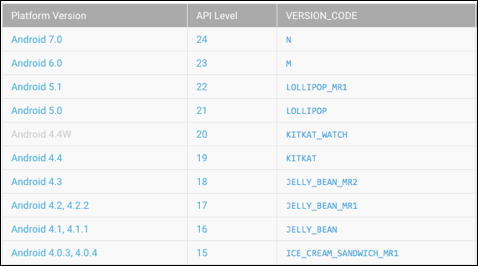<![endif]>

<a
name="_Toc352533887">Figure 3&#8209;1&#8209;</a><!--[if supportFields]> SEQ Figure \* ARABIC \s 2 <![endif]-->1<!--[if supportFields]><![endif]-->
Android Platform Versions

&nbsp;

<o:p>&nbsp;</o:p>

<o:p>&nbsp;</o:p>

<h2>&nbsp;<a
name="_Toc352593055">3.1.1&nbsp; Application
Module</a></h2>

<!--[if gte vml 1]><v:shape
 id="_x0000_i1060" type="#_x0000_t75" alt="Description: Macintosh HD:Users:matthew:Desktop:Screenshots:Screen Shot 2017-03-25 at 22.10.01.png"
 style='width:229pt;height:73pt;visibility:visible;mso-wrap-style:square'
 o:bordertopcolor="black" o:borderleftcolor="black" o:borderbottomcolor="black"
 o:borderrightcolor="black">
 <v:imagedata src="TrackMe_Project_Report_files/image015.png" o:title="Screen Shot 2017-03-25 at 22.10.01.png"/>
 <w:bordertop type="single" width="6"/>
 <w:borderleft type="single" width="6"/>
 <w:borderbottom type="single" width="6"/>
 <w:borderright type="single" width="6"/>
</v:shape><![endif]--><![if !vml]><![endif]>

Figure 3-1-2
Application Module

<o:p>&nbsp;</o:p>

In order for the application to be able to
interact with the backend server I used AndroidÕs Volley Library. Volley is an HTTP
library that makes networking for Android apps easier and most importantly,
faster. [10]

The application module sets up the core
Volley objects, such as the Volley request queue, and URLS needed to store user
location.

The Volley request queue is a handler for
request objects. It manages worker threads for running the network operations,
reading from and writing to the cache and parsing responses. [11]

<o:p>&nbsp;</o:p>

<!--[if gte vml 1]><v:shape
 id="_x0000_i1059" type="#_x0000_t75" alt="Description: Macintosh HD:Users:matthew:Desktop:Screenshots:Screen Shot 2017-03-25 at 19.44.31.png"
 style='width:415pt;height:50pt;visibility:visible;mso-wrap-style:square'
 o:bordertopcolor="yellow pure" o:borderleftcolor="yellow pure"
 o:borderbottomcolor="yellow pure" o:borderrightcolor="yellow pure">
 <v:imagedata src="TrackMe_Project_Report_files/image017.png" o:title="Screen Shot 2017-03-25 at 19.44.31.png"/>
 <w:bordertop type="single" width="6"/>
 <w:borderleft type="single" width="6"/>
 <w:borderbottom type="single" width="6"/>
 <w:borderright type="single" width="6"/>
</v:shape><![endif]--><![if !vml]>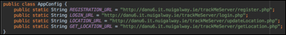<![endif]>

Figure
3&#8209;1-3 AppConfig.java

<o:p>&nbsp;</o:p>

<o:p>&nbsp;</o:p>

<h2><a name="_Toc352593056">3.1.2&nbsp;&nbsp; Activity Module</a></h2>

<h2><!--[if gte vml 1]><v:shape id="_x0000_i1058"
 type="#_x0000_t75" alt="Description: Macintosh HD:Users:matthew:Desktop:Screenshots:Screen Shot 2017-03-25 at 23.42.02.png"
 style='width:226pt;height:97pt;visibility:visible;mso-wrap-style:square'
 o:bordertopcolor="black" o:borderleftcolor="black" o:borderbottomcolor="black"
 o:borderrightcolor="black">
 <v:imagedata src="TrackMe_Project_Report_files/image019.png" o:title="Screen Shot 2017-03-25 at 23.42.02.png"/>
 <w:bordertop type="single" width="6"/>
 <w:borderleft type="single" width="6"/>
 <w:borderbottom type="single" width="6"/>
 <w:borderright type="single" width="6"/>
</v:shape><![endif]--><![if !vml]>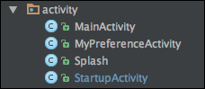<![endif]></h2>

&nbsp;&nbsp;&nbsp;&nbsp;&nbsp;&nbsp;&nbsp;&nbsp;&nbsp;&nbsp;&nbsp;&nbsp;&nbsp;&nbsp;&nbsp;&nbsp;&nbsp;&nbsp;&nbsp;&nbsp;
Figure 3-1-4 Activity Module

<o:p>&nbsp;</o:p>

The activity module of the application was
built to handle fragment transaction &amp; the application navigation drawers.
The application navigation drawer allows the user to access the application
features such as login, registration, home screen &amp; preferences screen.

<o:p>&nbsp;</o:p>

<h3><a name="_Toc352593057">Splash</a></h3>

The Splash activity implements the
applicationsÕ splash screen. A splash screen is a screen usually seen upon app
start up that displays branding for the application. It is implemented in order
to give the application time to start up.

The splash screen implemented for TrackMe
is displayed for 5 seconds.

This class queries if the user device has
location services turned on and if not it asks the user to enable location
services as theyÕre vital to the functionality of this application. If Location
Services are enabled this class proceeds to check is a user login session is
active using the <i style='mso-bidi-font-style:normal'>SessionManager</i>
(Detailed later). If there is a login session active the <i style='mso-bidi-font-style:
normal'>MainActivity</i> is initiated and if not the <i style='mso-bidi-font-style:
normal'>StartupActivity</i> is initiated.

<o:p>&nbsp;</o:p>

<!--[if gte vml 1]><v:shape
 id="_x0000_i1057" type="#_x0000_t75" style='width:154pt;height:199pt;
 visibility:visible;mso-wrap-style:square' o:bordertopcolor="black"
 o:borderleftcolor="black" o:borderbottomcolor="black" o:borderrightcolor="black">
 <v:imagedata src="TrackMe_Project_Report_files/image021.png" o:title=""
  croptop="4013f" cropbottom="13991f"/>
 <w:bordertop type="single" width="6"/>
 <w:borderleft type="single" width="6"/>
 <w:borderbottom type="single" width="6"/>
 <w:borderright type="single" width="6"/>
</v:shape><![endif]--><![if !vml]><![endif]>&nbsp;&nbsp;&nbsp;&nbsp; &nbsp;&nbsp;&nbsp;&nbsp;&nbsp;&nbsp;&nbsp;&nbsp;&nbsp;&nbsp;&nbsp;&nbsp;&nbsp;&nbsp;&nbsp;&nbsp;&nbsp;&nbsp;&nbsp;&nbsp;&nbsp;&nbsp;&nbsp;&nbsp;&nbsp;&nbsp;&nbsp;&nbsp;&nbsp;&nbsp;&nbsp;<!--[if gte vml 1]><v:shape id="_x0000_i1056" type="#_x0000_t75"
 style='width:153pt;height:199pt;visibility:visible;mso-wrap-style:square'
 o:bordertopcolor="black" o:borderleftcolor="black" o:borderbottomcolor="black"
 o:borderrightcolor="black">
 <v:imagedata src="TrackMe_Project_Report_files/image023.png" o:title=""
  croptop="2f" cropbottom="17608f"/>
 <w:bordertop type="single" width="6"/>
 <w:borderleft type="single" width="6"/>
 <w:borderbottom type="single" width="6"/>
 <w:borderright type="single" width="6"/>
</v:shape><![endif]--><![if !vml]><![endif]>

&nbsp;&nbsp;&nbsp;&nbsp;&nbsp;&nbsp;&nbsp;&nbsp;
Figure 3-1-5 Splash Screen&nbsp;&nbsp;&nbsp;&nbsp;&nbsp;&nbsp;&nbsp;&nbsp;&nbsp;&nbsp;&nbsp;&nbsp;&nbsp;&nbsp;&nbsp;&nbsp;&nbsp;&nbsp;&nbsp;&nbsp;&nbsp;&nbsp;&nbsp;&nbsp;&nbsp;&nbsp;&nbsp;&nbsp;&nbsp;&nbsp;&nbsp;&nbsp;&nbsp;&nbsp;&nbsp;&nbsp;&nbsp;&nbsp;&nbsp;&nbsp;&nbsp;&nbsp;&nbsp;&nbsp;&nbsp;&nbsp;&nbsp;&nbsp;&nbsp;&nbsp;&nbsp;&nbsp;&nbsp;&nbsp;&nbsp;&nbsp;&nbsp;&nbsp;&nbsp;&nbsp;&nbsp;&nbsp;&nbsp; 
Figure 3&#8209;1-6 Location Services Request

<o:p>&nbsp;</o:p>

<h3><a name="_Toc352593058">StartupActivity</a></h3>

The <i style='mso-bidi-font-style:normal'>StartupActivity</i>
class hosts the Login &amp; Registration fragments as well providing access to
the About &amp; Help Fragments. This activity also hosts the startup navigation
drawer which allows the user to navigate between the available fragments. This
activity uses the local database handler class to query if a database for
TrackMe exists on the user device. If there is an existing database it is
assumed that the user has already registered an account so the user is
navigated to the login page, if not the user is navigated to the registration
page.

&nbsp;&nbsp;&nbsp; <!--[if gte vml 1]><v:shape id="Picture_x0020_4"
 o:spid="_x0000_i1055" type="#_x0000_t75" style='width:176pt;height:179pt;
 visibility:visible;mso-wrap-style:square' o:bordertopcolor="black"
 o:borderleftcolor="black" o:borderbottomcolor="black" o:borderrightcolor="black">
 <v:imagedata src="TrackMe_Project_Report_files/image025.png" o:title=""
  croptop="1f" cropbottom="28048f"/>
 <w:bordertop type="single" width="6"/>
 <w:borderleft type="single" width="6"/>
 <w:borderbottom type="single" width="6"/>
 <w:borderright type="single" width="6"/>
</v:shape><![endif]--><![if !vml]><![endif]>

&nbsp;&nbsp;&nbsp;&nbsp;&nbsp;&nbsp; Figure 3&#8209;1-7
StartupActivity Navigation Drawer

<h3><a name="_Toc352593059">MainActivity</a></h3>

The <i style='mso-bidi-font-style:normal'>MainActivity</i>
class hosts the applications main navigation drawer as well as handling the
navigation between all of the fragments that control the main features of the
app. 

The main activity also handles the
notification that is created when the application detects a possible fall. This
activity receives, through the implementation of a broadcast receiver, the
countdown timer information from a broadcast sent from the fall detection
service. If the stop button on the notification is not clicked before the time
runs out a text is sent to the users emergency contact letting them know that
the user may just have fallen.

<!--[if gte vml 1]><v:shape id="Picture_x0020_3"
 o:spid="_x0000_i1054" type="#_x0000_t75" style='width:215pt;height:276pt;
 visibility:visible;mso-wrap-style:square' o:bordertopcolor="black"
 o:borderleftcolor="black" o:borderbottomcolor="black" o:borderrightcolor="black">
 <v:imagedata src="TrackMe_Project_Report_files/image027.png" o:title=""
  croptop="-1f" cropbottom="18148f"/>
 <w:bordertop type="single" width="6"/>
 <w:borderleft type="single" width="6"/>
 <w:borderbottom type="single" width="6"/>
 <w:borderright type="single" width="6"/>
</v:shape><![endif]--><![if !vml]>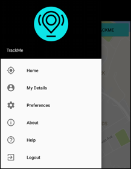<![endif]>

Figure
3&#8209;1-8 MainActivity Navigation Drawer

<o:p>&nbsp;</o:p>

<!--[if gte vml 1]><v:shape id="Picture_x0020_13"
 o:spid="_x0000_i1053" type="#_x0000_t75" style='width:276pt;height:111pt;
 visibility:visible;mso-wrap-style:square' o:bordertopcolor="black"
 o:borderleftcolor="black" o:borderbottomcolor="black" o:borderrightcolor="black">
 <v:imagedata src="TrackMe_Project_Report_files/image029.png" o:title=""
  cropbottom="50740f"/>
 <w:bordertop type="single" width="6"/>
 <w:borderleft type="single" width="6"/>
 <w:borderbottom type="single" width="6"/>
 <w:borderright type="single" width="6"/>
</v:shape><![endif]--><![if !vml]>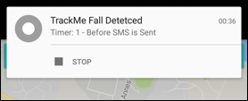<![endif]>

Figure
3&#8209;1-9 Fall Detection Notification

<o:p>&nbsp;</o:p>

<o:p>&nbsp;</o:p>

<h3><a name="_Toc352593060">MyPreferenceActivity</a></h3>

This activity hosts the application
preferences fragment where the user can specify their preferences &amp;
settings for the following:

<![if !supportLists]>á&nbsp;&nbsp;&nbsp;&nbsp;&nbsp;
<![endif]>Fall Detection Enable

<![if !supportLists]>á&nbsp;&nbsp;&nbsp;&nbsp;&nbsp;
<![endif]>GPS Boundary Existing

<![if !supportLists]>á&nbsp;&nbsp;&nbsp;&nbsp;&nbsp;
<![endif]>Emergency Contact Phone Number

<![if !supportLists]>á&nbsp;&nbsp;&nbsp;&nbsp;&nbsp;
<![endif]>Notification Timer

<![if !supportLists]>á&nbsp;&nbsp;&nbsp;&nbsp;&nbsp;
<![endif]>Location Update Frequency

The preference fragment automatically
implements handling of shared preferences so when a user changes a preference
it is automatically changed in the applications <i style='mso-bidi-font-style:
normal'>SharedPreference</i> file. This class automatically loads shared
preferences based on the user profile type (i.e. Default, Teenager, Adult or
Elderly).

&nbsp;&nbsp; <!--[if gte vml 1]><v:shape id="Picture_x0020_2"
 o:spid="_x0000_i1052" type="#_x0000_t75" style='width:208pt;height:214pt;
 visibility:visible;mso-wrap-style:square' o:bordertopcolor="black"
 o:borderleftcolor="black" o:borderbottomcolor="black" o:borderrightcolor="black">
 <v:imagedata src="TrackMe_Project_Report_files/image031.png" o:title=""
  croptop="1f" cropbottom="27559f"/>
 <w:bordertop type="single" width="6"/>
 <w:borderleft type="single" width="6"/>
 <w:borderbottom type="single" width="6"/>
 <w:borderright type="single" width="6"/>
</v:shape><![endif]--><![if !vml]>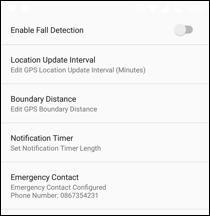<![endif]>

Figure 3&#8209;1-10
Preferences

<o:p>&nbsp;</o:p>

<h2><a name="_Toc352593061">3.1.2&nbsp;&nbsp; Fragment Module</a></h2>

<h2><!--[if gte vml 1]><v:shape id="Picture_x0020_37"
 o:spid="_x0000_i1051" type="#_x0000_t75" alt="Description: Macintosh HD:Users:matthew:Desktop:Screenshots:Screen Shot 2017-03-29 at 16.00.15.png"
 style='width:223pt;height:167pt;visibility:visible;mso-wrap-style:square'
 o:bordertopcolor="black" o:borderleftcolor="black" o:borderbottomcolor="black"
 o:borderrightcolor="black">
 <v:imagedata src="TrackMe_Project_Report_files/image033.png" o:title="Screen Shot 2017-03-29 at 16.00.15.png"/>
 <w:bordertop type="single" width="6"/>
 <w:borderleft type="single" width="6"/>
 <w:borderbottom type="single" width="6"/>
 <w:borderright type="single" width="6"/>
</v:shape><![endif]--><![if !vml]>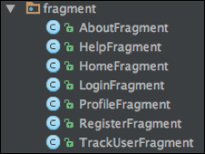<![endif]></h2>

&nbsp;&nbsp;&nbsp;&nbsp;&nbsp; &nbsp;&nbsp;&nbsp;&nbsp;&nbsp;&nbsp;&nbsp;&nbsp;&nbsp;&nbsp;&nbsp;&nbsp;&nbsp;&nbsp;Figure
3-1-11 Fragment Module

<o:p>&nbsp;</o:p>

The fragment module of the application consists
of all of the fragment classes that formulate the main UI features of the
application. These fragments and their interactions are managed by the
applications activities.

<h3><a name="_Toc352593062"><o:p>&nbsp;</o:p></a></h3>

<h3>HomeFragment</h3>

The applications <i style='mso-bidi-font-style:
normal'>HomeFragment</i> class is the first fragment loaded upon successful user
login. This class queries the permission status of the necessary device
features that the application needs access to. On the occasion that the user
has not yet granted the necessary permissions to the application this activity
will request the user to grant permissions.

<!--[if gte vml 1]><v:shape id="Picture_x0020_11"
 o:spid="_x0000_i1050" type="#_x0000_t75" style='width:177pt;height:201pt;
 visibility:visible;mso-wrap-style:square' o:bordertopcolor="black"
 o:borderleftcolor="black" o:borderbottomcolor="black" o:borderrightcolor="black">
 <v:imagedata src="TrackMe_Project_Report_files/image035.png" o:title=""
  croptop="-1f" cropbottom="23724f"/>
 <w:bordertop type="single" width="6"/>
 <w:borderleft type="single" width="6"/>
 <w:borderbottom type="single" width="6"/>
 <w:borderright type="single" width="6"/>
</v:shape><![endif]--><![if !vml]><![endif]>&nbsp;&nbsp;&nbsp;&nbsp;&nbsp;&nbsp;&nbsp;&nbsp;&nbsp;&nbsp;&nbsp;&nbsp;&nbsp;&nbsp;&nbsp;
<!--[if gte vml 1]><v:shape id="Picture_x0020_12"
 o:spid="_x0000_i1049" type="#_x0000_t75" style='width:177pt;height:199pt;
 visibility:visible;mso-wrap-style:square' o:bordertopcolor="black"
 o:borderleftcolor="black" o:borderbottomcolor="black" o:borderrightcolor="black">
 <v:imagedata src="TrackMe_Project_Report_files/image037.png" o:title=""
  croptop="-1f" cropbottom="24137f"/>
 <w:bordertop type="single" width="6"/>
 <w:borderleft type="single" width="6"/>
 <w:borderbottom type="single" width="6"/>
 <w:borderright type="single" width="6"/>
</v:shape><![endif]--><![if !vml]><![endif]>

Figure 3&#8209;1-12 Location Permission&nbsp;&nbsp;&nbsp;&nbsp; &nbsp;&nbsp;&nbsp;&nbsp;&nbsp;&nbsp;&nbsp;&nbsp;&nbsp;&nbsp;&nbsp;&nbsp;&nbsp;&nbsp;&nbsp;&nbsp;&nbsp;&nbsp;&nbsp;&nbsp;&nbsp;&nbsp;&nbsp;&nbsp;&nbsp;&nbsp;&nbsp;&nbsp;&nbsp;&nbsp;&nbsp;&nbsp;&nbsp;&nbsp;&nbsp; &nbsp;&nbsp;&nbsp;&nbsp; Figure 3&#8209;1-13
SMS Permission

<o:p>&nbsp;</o:p>

This fragment hosts a Google Maps API <i
style='mso-bidi-font-style:normal'>SupportMapFragment</i> that displays the
current user location. If the GPS tracking service is running it will broadcast
an intent that is received by this fragment and the UI is updated to display a
marker at the latest user location.

<o:p>&nbsp;</o:p>

<o:p>&nbsp;</o:p>

<o:p>&nbsp;</o:p>

<o:p>&nbsp;</o:p>

<!--[if gte vml 1]><v:shape id="Picture_x0020_14"
 o:spid="_x0000_i1048" type="#_x0000_t75" style='width:198pt;height:278pt;
 visibility:visible;mso-wrap-style:square' o:bordertopcolor="black"
 o:borderleftcolor="black" o:borderbottomcolor="black" o:borderrightcolor="black">
 <v:imagedata src="TrackMe_Project_Report_files/image039.png" o:title=""
  croptop="-2f" cropbottom="13540f"/>
 <w:bordertop type="single" width="6"/>
 <w:borderleft type="single" width="6"/>
 <w:borderbottom type="single" width="6"/>
 <w:borderright type="single" width="6"/>
</v:shape><![endif]--><![if !vml]>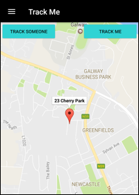<![endif]>

Figure
3&#8209;1-14 HomeFragment

<o:p>&nbsp;</o:p>

This fragment provides buttons that allow
the user to start/stop the GPS tracking service, the service that tracks their
location, and to allow the user to track another users latest location update
to the cloud server by entering their username.

<!--[if gte vml 1]><v:shape id="Picture_x0020_15"
 o:spid="_x0000_i1047" type="#_x0000_t75" style='width:243pt;height:148pt;
 visibility:visible;mso-wrap-style:square' o:bordertopcolor="black"
 o:borderleftcolor="black" o:borderbottomcolor="black" o:borderrightcolor="black">
 <v:imagedata src="TrackMe_Project_Report_files/image041.png" o:title=""
  croptop="18954f" cropbottom="22896f"/>
 <w:bordertop type="single" width="6"/>
 <w:borderleft type="single" width="6"/>
 <w:borderbottom type="single" width="6"/>
 <w:borderright type="single" width="6"/>
</v:shape><![endif]--><![if !vml]><![endif]>

Figure
3&#8209;1-15 Tracking A User<o:p></o:p>

<o:p>&nbsp;</o:p>

<h3><a name="_Toc352593063">TrackUserFragment</a></h3>

Upon the successful request for the latest
location update of a user in the <i style='mso-bidi-font-style:normal'>HomeFragment</i>
the <i style='mso-bidi-font-style:normal'>TrackUserFragment</i> is opened and
it displays the users latest location and the time at which that location
update was posted to the backend server. The location update is retrieved using
the Cloud Database Handler class.

<!--[if gte vml 1]><v:shape
 id="Picture_x0020_19" o:spid="_x0000_i1046" type="#_x0000_t75" style='width:414pt;
 height:170pt;visibility:visible;mso-wrap-style:square' o:bordertopcolor="black"
 o:borderleftcolor="black" o:borderbottomcolor="black" o:borderrightcolor="black">
 <v:imagedata src="TrackMe_Project_Report_files/image043.png" o:title=""
  croptop="23161f" cropbottom="27240f"/>
 <w:bordertop type="single" width="6"/>
 <w:borderleft type="single" width="6"/>
 <w:borderbottom type="single" width="6"/>
 <w:borderright type="single" width="6"/>
</v:shape><![endif]--><![if !vml]>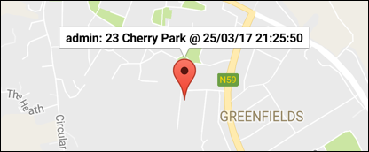<![endif]>

Figure
3&#8209;1-16 Remotely Viewing User Location<o:p></o:p>

<o:p>&nbsp;</o:p>

<h3><a name="_Toc352593064">RegisterFragment</a></h3>

The <i style='mso-bidi-font-style:normal'>RegisterFragment</i>
class allows the user to create a TrackMe account and post their details to the
TrackMe backend server.

This fragment allows the user to enter the
following details:

<![if !supportLists]>á&nbsp;&nbsp;&nbsp;&nbsp;&nbsp;
<![endif]>Name

<![if !supportLists]>á&nbsp;&nbsp;&nbsp;&nbsp;&nbsp;
<![endif]>Email

<![if !supportLists]>á&nbsp;&nbsp;&nbsp;&nbsp;&nbsp;
<![endif]>Username

<![if !supportLists]>á&nbsp;&nbsp;&nbsp;&nbsp;&nbsp;
<![endif]>Phone Number

<![if !supportLists]>á&nbsp;&nbsp;&nbsp;&nbsp;&nbsp;
<![endif]>Password + Confirmation

<![if !supportLists]>á&nbsp;&nbsp;&nbsp;&nbsp;&nbsp;
<![endif]>Profile Type

<o:p>&nbsp;</o:p>

<o:p>&nbsp;</o:p>

The fragment implements a Volley post
request and posts the users details server side database interaction
application that in turn posts the data to the TrackMe backend server. This
fragment runs error some checking making sure that the fundamental profile
details are entered by the user (i.e. Name, Email, Username, Password). If the
user has not entered all mandatory details the application will prompt the user
to enter the missing information. [1]

&nbsp;&nbsp;&nbsp; <!--[if gte vml 1]><v:shape id="_x0000_i1045" type="#_x0000_t75" style='width:169pt;
 height:266pt;visibility:visible;mso-wrap-style:square' o:bordertopcolor="black"
 o:borderleftcolor="black" o:borderbottomcolor="black" o:borderrightcolor="black">
 <v:imagedata src="TrackMe_Project_Report_files/image045.png" o:title=""
  croptop="3580f" cropbottom="3907f"/>
 <w:bordertop type="single" width="6"/>
 <w:borderleft type="single" width="6"/>
 <w:borderbottom type="single" width="6"/>
 <w:borderright type="single" width="6"/>
</v:shape><![endif]--><![if !vml]><![endif]>

Figure
3&#8209;1-17 Register Fragment UI

<o:p>&nbsp;</o:p>

<h3><a name="_Toc352593065">LoginFragment</a></h3>

The <i style='mso-bidi-font-style:normal'>LoginFragment</i>
class allows the user to log in to their TrackMe account. This fragment uses a
volley post request to post the login details entered by the user to the server
side database interaction application.

Since the application requires Internet
access to function at itÕs highest capacity &amp; connect to the backend cloud
database this fragment will only allow a user to login if thereÕs an Internet
connection available on their device. [1]

<!--[if gte vml 1]><v:shape id="Picture_x0020_22"
 o:spid="_x0000_i1044" type="#_x0000_t75" style='width:205pt;height:235pt;
 visibility:visible;mso-wrap-style:square' o:bordertopcolor="yellow pure"
 o:borderleftcolor="yellow pure" o:borderbottomcolor="yellow pure"
 o:borderrightcolor="yellow pure">
 <v:imagedata src="TrackMe_Project_Report_files/image047.png" o:title=""
  croptop="2943f" cropbottom="31601f"/>
 <w:bordertop type="single" width="6"/>
 <w:borderleft type="single" width="6"/>
 <w:borderbottom type="single" width="6"/>
 <w:borderright type="single" width="6"/>
</v:shape><![endif]--><![if !vml]><![endif]>

Figure
3&#8209;1-18 Login Fragment UI

<o:p>&nbsp;</o:p>

<h3><a name="_Toc352593066">AboutFragment</a></h3>

This fragment displays some information
about the application to the user. It provides information such as the goals of
the application and the applicationsÕ features.

<!--[if gte vml 1]><v:shape id="Picture_x0020_5"
 o:spid="_x0000_i1043" type="#_x0000_t75" style='width:201pt;height:218pt;
 visibility:visible;mso-wrap-style:square' o:bordertopcolor="black"
 o:borderleftcolor="black" o:borderbottomcolor="black" o:borderrightcolor="black">
 <v:imagedata src="TrackMe_Project_Report_files/image049.png" o:title=""
  croptop="3595f" cropbottom="21920f"/>
 <w:bordertop type="single" width="6"/>
 <w:borderleft type="single" width="6"/>
 <w:borderbottom type="single" width="6"/>
 <w:borderright type="single" width="6"/>
</v:shape><![endif]--><![if !vml]>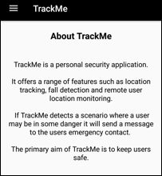<![endif]>

Figure
3&#8209;1-19 AboutFragment

<h3><a name="_Toc352593067">HelpFragment</a></h3>

This fragment
displays some information about the application settings. 

It also offers
configuration guidelines for these user settings.

<!--[if gte vml 1]><v:shape
 id="Picture_x0020_6" o:spid="_x0000_i1042" type="#_x0000_t75" style='width:180pt;
 height:269pt;visibility:visible;mso-wrap-style:square' o:bordertopcolor="black"
 o:borderleftcolor="black" o:borderbottomcolor="black" o:borderrightcolor="black">
 <v:imagedata src="TrackMe_Project_Report_files/image051.png" o:title=""
  croptop="3489f" cropbottom="6822f"/>
 <w:bordertop type="single" width="6"/>
 <w:borderleft type="single" width="6"/>
 <w:borderbottom type="single" width="6"/>
 <w:borderright type="single" width="6"/>
</v:shape><![endif]--><![if !vml]>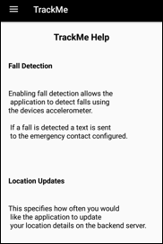<![endif]>

Figure
3&#8209;1-20 HelpFragment

<o:p>&nbsp;</o:p>

<h3><a name="_Toc352593068">ProfileFragment</a></h3>

This fragment displays user profile
details. These details include items such as a users phone number, email,
username, first name and surname.

It has a private inner class that acts as an
adapter to display the <i style='mso-bidi-font-style:normal'>hashmap</i>
entries in a <i style='mso-bidi-font-style:normal'>ListView</i> object. This
adapter takes in a <i style='mso-bidi-font-style:normal'>hashmap</i> as a
parameter and puts itsÕ entries into the <i style='mso-bidi-font-style:normal'>ListView</i>
object specified in the fragments layout xml file.

<o:p>&nbsp;</o:p>

<!--[if gte vml 1]><v:shape id="_x0000_i1041"
 type="#_x0000_t75" style='width:188pt;height:200pt;visibility:visible;
 mso-wrap-style:square' o:bordertopcolor="yellow pure" o:borderleftcolor="yellow pure"
 o:borderbottomcolor="yellow pure" o:borderrightcolor="yellow pure">
 <v:imagedata src="TrackMe_Project_Report_files/image053.png" o:title=""
  cropbottom="26292f"/>
 <w:bordertop type="single" width="6"/>
 <w:borderleft type="single" width="6"/>
 <w:borderbottom type="single" width="6"/>
 <w:borderright type="single" width="6"/>
</v:shape><![endif]--><![if !vml]>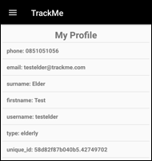<![endif]>

Figure
3-1-21 ProfileFragment

<o:p>&nbsp;</o:p>

<h2><a name="_Toc352593069">3.1.3&nbsp;&nbsp; Services Module</a></h2>

The services module contains the Service classes
that provide the applications fundamental features i.e. GPS Location Tracking
and Fall Detection.

<h2><!--[if gte vml 1]><v:shape id="Picture_x0020_9"
 o:spid="_x0000_i1040" type="#_x0000_t75" alt="Description: Macintosh HD:Users:matthew:Desktop:Screenshots:Screen Shot 2017-03-25 at 22.19.27.png"
 style='width:199pt;height:61pt;visibility:visible;mso-wrap-style:square'
 o:bordertopcolor="black" o:borderleftcolor="black" o:borderbottomcolor="black"
 o:borderrightcolor="black">
 <v:imagedata src="TrackMe_Project_Report_files/image055.png" o:title="Screen Shot 2017-03-25 at 22.19.27.png"/>
 <w:bordertop type="single" width="6"/>
 <w:borderleft type="single" width="6"/>
 <w:borderbottom type="single" width="6"/>
 <w:borderright type="single" width="6"/>
</v:shape><![endif]--><![if !vml]>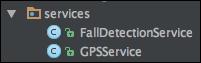<![endif]></h2>

Figure 3&#8209;1-22 Services Module

<o:p>&nbsp;</o:p>

<h3><a name="_Toc352593070">GPS Service</a></h3>

The GPS service implements an Android
Location listener. It is configurable to query location at a user specified
interval with the default interval being 60 seconds. The GPS service is set up
so that it uses the most accurate location data available at all times. 

<!--[if gte vml 1]><v:shape
 id="Picture_x0020_27" o:spid="_x0000_i1039" type="#_x0000_t75" alt="Description: Macintosh HD:Users:matthew:Desktop:Screenshots:Screen Shot 2017-03-26 at 03.26.08.png"
 style='width:415pt;height:255pt;visibility:visible;mso-wrap-style:square'>
 <v:imagedata src="TrackMe_Project_Report_files/image057.png" o:title="Screen Shot 2017-03-26 at 03.26.08.png"/>
</v:shape><![endif]--><![if !vml]>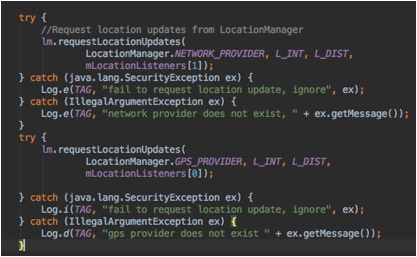<![endif]>

Figure
3&#8209;1-23 GPS Location Service

<o:p>&nbsp;</o:p>

When this service is started a <i
style='mso-bidi-font-style:normal'>LatLng</i> object is initialized so that the
user starting location is saved. This initial location object is used to check
if the user has travelled outside the specified boundary from their starting
point.

When a location update is obtained this
service updates both the local SQLite database and the MySQL cloud database (if
the user device is connected to the Internet) with the users latest location
details

Upon each location update the algorithm runs
verifications to check whether the user has travelled outside of a specified
boundary distance from their starting location. If the user has travelled
outside the specified boundary then an SMS is sent to their emergency contact with
their latest location details.

<o:p>&nbsp;</o:p>

<!--[if gte vml 1]><v:shape
 id="Picture_x0020_26" o:spid="_x0000_i1038" type="#_x0000_t75" alt="Description: Macintosh HD:Users:matthew:Desktop:Screenshots:Screen Shot 2017-03-26 at 03.24.48.png"
 style='width:396pt;height:147pt;visibility:visible;mso-wrap-style:square'>
 <v:imagedata src="TrackMe_Project_Report_files/image059.png" o:title="Screen Shot 2017-03-26 at 03.24.48.png"/>
</v:shape><![endif]--><![if !vml]>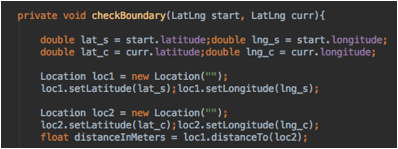<![endif]>

Figure
3&#8209;1-24 GPS Boundary Check

<o:p>&nbsp;</o:p>

<h3><a name="_Toc352593071">Fall Detection Service</a></h3>

The fall detection service is a fundamental
application feature. This class runs a background servicer that implements a
sensor event listener that is used to process readings from the device
accelerometer. 

Each time a sensor reading is processed this
service computes the reading using Euclidean vector mathematics to see if the
characteristics of the reading are deemed to be a possible fall. [16]

The criteria specified for a fall are that
the accelerometer value had spiked above 25m/s or below 1m/s bearing in mind
that at a standstill the computed reading would be approximately 9.8m/s
accounting for natural gravitational pull. If these criteria are met then fall
detection service deems the readings to constitute a possible fall. A timer is then
started and an intent containing the timerÕs readings is broadcast. If the
timer reaches 0 without being cancelled by the user (through the main activity
notification created) then an SMS is sent to the users emergency contact
letting them know that a possible fall may have occurred.

The timers default value is set to 30
seconds but is user configurable through the application preferences.

<!--[if gte vml 1]><v:shape
 id="Picture_x0020_28" o:spid="_x0000_i1037" type="#_x0000_t75" alt="Description: Macintosh HD:Users:matthew:Desktop:Screenshots:Screen Shot 2017-03-26 at 03.29.23.png"
 style='width:415pt;height:159pt;visibility:visible;mso-wrap-style:square'
 o:bordertopcolor="black" o:borderleftcolor="black" o:borderbottomcolor="black"
 o:borderrightcolor="black">
 <v:imagedata src="TrackMe_Project_Report_files/image061.png" o:title="Screen Shot 2017-03-26 at 03.29.23.png"/>
 <w:bordertop type="single" width="6"/>
 <w:borderleft type="single" width="6"/>
 <w:borderbottom type="single" width="6"/>
 <w:borderright type="single" width="6"/>
</v:shape><![endif]--><![if !vml]>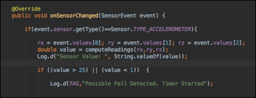<![endif]>

Figure
3&#8209;1-25 Fall Detection

<o:p>&nbsp;</o:p>

<h2><a name="_Toc352593072">3.1.4&nbsp;&nbsp; Helper Module</a></h2>

The Helper module provides utilities to
enhance the functionality of other classes in the application.

<h2><!--[if gte vml 1]><v:shape id="Picture_x0020_10"
 o:spid="_x0000_i1036" type="#_x0000_t75" alt="Description: Macintosh HD:Users:matthew:Desktop:Screenshots:Screen Shot 2017-03-25 at 22.19.19.png"
 style='width:211pt;height:136pt;visibility:visible;mso-wrap-style:square'>
 <v:imagedata src="TrackMe_Project_Report_files/image063.png" o:title="Screen Shot 2017-03-25 at 22.19.19.png"/>
</v:shape><![endif]--><![if !vml]>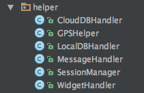<![endif]></h2>

&nbsp;&nbsp;&nbsp;&nbsp;&nbsp;&nbsp;&nbsp; Figure
3-1-26 Helper Module

<o:p>&nbsp;</o:p>

<h3><a name="_Toc352593073">CloudDBHandler</a></h3>

The <i style='mso-bidi-font-style:normal'>CloudDBHandler</i>
class handles user location data HTTP GET and POST requests to the Cloud
database. This includes posting of users location data to the cloud database as
well as querying a users latest location update. To achieve this functionality
this class uses Android Volley objects to manage GET and POST requests.

<o:p>&nbsp;</o:p>

<h3><a name="_Toc352593074">GPSHelper</a></h3>

The <i style='mso-bidi-font-style:normal'>GPSHelper</i>
class provides utilities to help augment the GPS location tracking functionality.
These utilities include retrieval of address Strings using a Geocoder (If an
internet connection is available on the device). This class also implements a <i
style='mso-bidi-font-style:normal'>LocationListener</i> so that the users
location can be retrieved upon app startup

<o:p>&nbsp;</o:p>

<h3><a name="_Toc352593075">LocalDBHandler</a></h3>

The <i style='mso-bidi-font-style:normal'>LocalDBHandler</i>
class provides utilities to manage the local devices SQLite database. Upon the
initial application install and startup this class creates the local SQLite
database and initializes the ÔuserÕ and ÔlocationÕ tables within this database.

The ÔuserÕ table contains user profile
details for any user that logs into the TrackMe application on that device.
These details include name, username, email, profile type, ID and unique ID.

The ÔlocationÕ table contains user location
details that are generated when running the applications GPS tracking service.
These details include id, username, latitude value, longitude value, unique ID
and a timestamp relating to when the location data was obtained.

The devices manages the size of the user ÔlocationÕ
table using an SQL trigger that limits the size of the table to 50 rows so that
the impact of the table on available device storage is limited.

This class also handles database upgrade so
when the application is upgraded any existing database is deleted and a new
database containing empty ÔuserÕ and ÔlocationÕ tables is created.

<o:p>&nbsp;</o:p>

<o:p>&nbsp;</o:p>

<o:p>&nbsp;</o:p>

<h3><a name="_Toc352593076">MessageHandler</a></h3>

The <i style='mso-bidi-font-style:normal'>MessageHandler</i>
class handles the transmission of SMS messages to the users specified emergency
contact. The message to be sent is taken in as an argument as the message
content is specific to the scenario detected by the application (i.e. Messages
sent for fall detection differ to messages sent for boundary detection).

<o:p>&nbsp;</o:p>

<h3><a name="_Toc352593077">SessionManager</a></h3>

The <i style='mso-bidi-font-style:normal'>SessionManager</i>
class handles the creation and termination of user login sessions. This
involves the setting of shared preferences for the logged in user (i.e. Setting
their profile details as the shared preferences) and the deletion of these
shared preferences from device storage upon a user logging out. [2]&nbsp;&nbsp;&nbsp;&nbsp;&nbsp;&nbsp; &nbsp;&nbsp;&nbsp;&nbsp;&nbsp;&nbsp;&nbsp;&nbsp;&nbsp;&nbsp;&nbsp;&nbsp;&nbsp;&nbsp;&nbsp;&nbsp;&nbsp;This
class contains getter and setter methods for all possible shared preferences.

<o:p>&nbsp;</o:p>

<h3><a name="_Toc352593078">WidgetHandler</a></h3>

This class defines the functionality of the
TrackMe application widget from which the user can start or stop the GPS
tracking service as well as being able to start the application or opening the
existing instance of the application if it has already been started.

<!--[if gte vml 1]><v:shape id="Picture_x0020_1"
 o:spid="_x0000_i1035" type="#_x0000_t75" style='width:262pt;height:3in;
 visibility:visible;mso-wrap-style:square'>
 <v:imagedata src="TrackMe_Project_Report_files/image065.png" o:title=""
  croptop="9427f" cropbottom="24069f" cropleft="1f" cropright="-1478f"/>
</v:shape><![endif]--><![if !vml]>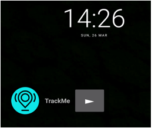<![endif]>

Figure
3&#8209;1-27 TrackMe Widget

<h2><a name="_Toc352593079">3.1.5&nbsp;&nbsp; UI</a></h2>

The applications UI was designed to be
user-friendly with ease of use being the primary objective behind the design
features. The application allows navigation between pages by utilizing
navigation drawers and the Android OSÕs native back button.&nbsp; The applications UI theme is a simple
theme that uses black, white and turquoise throughout.

<h2><a name="_Toc352593080">3.1.6&nbsp;&nbsp; Miscellaneous</a> </h2>

<h3><a name="_Toc352593081">Application Permissions</a></h3>

This is an overview of the permissions the
application requires to function in itsÕ fullest form:

<!--[if gte vml 1]><v:shape
 id="Picture_x0020_41" o:spid="_x0000_i1034" type="#_x0000_t75" alt="Description: Macintosh HD:Users:matthew:Desktop:Screenshots:Screen Shot 2017-03-30 at 01.35.43.png"
 style='width:415pt;height:146pt;visibility:visible;mso-wrap-style:square'>
 <v:imagedata src="TrackMe_Project_Report_files/image067.png" o:title="Screen Shot 2017-03-30 at 01.35.43.png"/>
</v:shape><![endif]--><![if !vml]>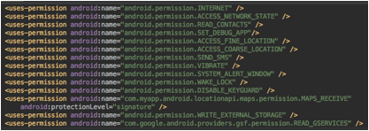<![endif]>

Figure
3&#8209;1-28 Application Permissions

<o:p>&nbsp;</o:p>

<h3><a name="_Toc352593082">Application Dependencies</a></h3>

This shows an overview of the libraries
that the application is using in itsÕ implementation:

<!--[if gte vml 1]><v:shape
 id="Picture_x0020_35" o:spid="_x0000_i1033" type="#_x0000_t75" alt="Description: Macintosh HD:Users:matthew:Desktop:Screenshots:Screen Shot 2017-03-26 at 17.47.41.png"
 style='width:385pt;height:96pt;visibility:visible;mso-wrap-style:square'
 o:bordertopcolor="black" o:borderleftcolor="black" o:borderbottomcolor="black"
 o:borderrightcolor="black">
 <v:imagedata src="TrackMe_Project_Report_files/image069.png" o:title="Screen Shot 2017-03-26 at 17.47.41.png"/>
 <w:bordertop type="single" width="6"/>
 <w:borderleft type="single" width="6"/>
 <w:borderbottom type="single" width="6"/>
 <w:borderright type="single" width="6"/>
</v:shape><![endif]--><![if !vml]><![endif]>

Figure
3&#8209;1-29 Application Dependencies

<h3><a name="_Toc352593083">SDK Build numbers</a></h3>

This shows the SDKÕs that the application
is built for ranging from SDK version 15 (Android version 4.0.3) to SDK version
24 (Android version 7.0).

<h1><!--[if gte vml 1]><v:shape id="Picture_x0020_36"
 o:spid="_x0000_i1032" type="#_x0000_t75" alt="Description: Macintosh HD:Users:matthew:Desktop:Screenshots:Screen Shot 2017-03-26 at 17.48.13.png"
 style='width:250pt;height:48pt;visibility:visible;mso-wrap-style:square'
 o:bordertopcolor="black" o:borderleftcolor="black" o:borderbottomcolor="black"
 o:borderrightcolor="black">
 <v:imagedata src="TrackMe_Project_Report_files/image071.png" o:title="Screen Shot 2017-03-26 at 17.48.13.png"/>
 <w:bordertop type="single" width="6"/>
 <w:borderleft type="single" width="6"/>
 <w:borderbottom type="single" width="6"/>
 <w:borderright type="single" width="6"/>
</v:shape><![endif]--><![if !vml]>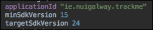<![endif]></h1>

Figure 3&#8209;1-30 Application SDKÕs

<h1><a name="_Toc352593084">3.2&nbsp;&nbsp;&nbsp;&nbsp;&nbsp; Server-Side Project</a></h1>

The <i style='mso-bidi-font-style:normal'>TrackMeServer</i>
PHP project, which is hosted on NUI GalwayÕs Danu6 server, handles the mobile
applications interactions with the MySQL cloud database.

<!--[if gte vml 1]><v:shape
 id="Picture_x0020_21" o:spid="_x0000_i1031" type="#_x0000_t75" alt="Description: Macintosh HD:Users:matthew:Desktop:Screenshots:Screen Shot 2017-03-26 at 14.53.42.png"
 style='width:415pt;height:71pt;visibility:visible;mso-wrap-style:square'
 o:bordertopcolor="yellow pure" o:borderleftcolor="yellow pure"
 o:borderbottomcolor="yellow pure" o:borderrightcolor="yellow pure">
 <v:imagedata src="TrackMe_Project_Report_files/image073.png" o:title="Screen Shot 2017-03-26 at 14.53.42.png"/>
 <w:bordertop type="single" width="6"/>
 <w:borderleft type="single" width="6"/>
 <w:borderbottom type="single" width="6"/>
 <w:borderright type="single" width="6"/>
</v:shape><![endif]--><![if !vml]>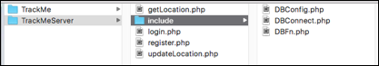<![endif]>

<a
name="_Toc352533888">Figure 3&#8209;2&#8209;</a><!--[if supportFields]> SEQ Figure \* ARABIC \s 2 <![endif]-->1<!--[if supportFields]><![endif]--> Server-Side
Project Layout

<o:p>&nbsp;</o:p>

<h3><a name="_Toc352593085">DBFn</a></h3>

The <i style='mso-bidi-font-style:normal'>DBFn</i>
class contains all the database functions needed by the mobile application to
interact with the cloud database. 

This class contains all the SQL queries
needed by the application for user registration, login, location updates &amp;
location queries.

It provides error checking for user detail
duplication such as username, email and password. If any of these database
column entries already exists in the user details table, in the cloud database,
when a new user is registering an account this class echoes a JSON response to
the user device informing them of the duplication details.

<o:p>&nbsp;</o:p>

<o:p>&nbsp;</o:p>

This class provides functionality to insert
user details into the cloud database.

<!--[if gte vml 1]><v:shape
 id="Picture_x0020_23" o:spid="_x0000_i1030" type="#_x0000_t75" alt="Description: Macintosh HD:Users:matthew:Desktop:Screenshots:Screen Shot 2017-03-26 at 15.46.40.png"
 style='width:463pt;height:29pt;visibility:visible;mso-wrap-style:square'>
 <v:imagedata src="TrackMe_Project_Report_files/image075.png" o:title="Screen Shot 2017-03-26 at 15.46.40.png"/>
</v:shape><![endif]--><![if !vml]>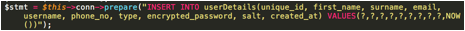<![endif]>

<a
name="_Toc352533889">Figure 3&#8209;2&#8209;</a><!--[if supportFields]> SEQ Figure \* ARABIC \s 2 <![endif]-->2<!--[if supportFields]><![endif]-->
Saving User Details

<o:p>&nbsp;</o:p>

Prior to user details being posted to the
cloud database the users password is encrypted using a hash/salt mechanism.
This provides a more secure user login implementation meaning that even if the
raw database were to be compromised user details would be unobtainable. [1]

<!--[if gte vml 1]><v:shape
 id="Picture_x0020_29" o:spid="_x0000_i1029" type="#_x0000_t75" alt="Description: Macintosh HD:Users:matthew:Desktop:Screenshots:Screen Shot 2017-03-26 at 15.48.10.png"
 style='width:415pt;height:88pt;visibility:visible;mso-wrap-style:square'>
 <v:imagedata src="TrackMe_Project_Report_files/image077.png" o:title="Screen Shot 2017-03-26 at 15.48.10.png"/>
</v:shape><![endif]--><![if !vml]>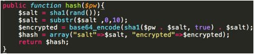<![endif]>

<a name="_Toc352533890">Figure 3&#8209;2&#8209;3 Hash Function</a>

User location details can be posted to the
server using this class. This class provides functionality that posts location
details to 2 different tables in the cloud database. 

One table contains all location updates for
every user whereas the other contains one entry for each user that has posted
location updates. This single entry per user corresponds to the users latest
location update that has been posted to the cloud database.

<h3><a name="_Toc352593086">DBConfig</a></h3>

This class defines the parameters needed to
make a connection to the cloud database. The parameters are the following:

<![if !supportLists]>á&nbsp;&nbsp;&nbsp;&nbsp;&nbsp;
<![endif]>Database Host

<![if !supportLists]>á&nbsp;&nbsp;&nbsp;&nbsp;&nbsp;
<![endif]>Database User

<![if !supportLists]>á&nbsp;&nbsp;&nbsp;&nbsp;&nbsp;
<![endif]>User Password

<![if !supportLists]>á&nbsp;&nbsp;&nbsp;&nbsp;&nbsp;
<![endif]>Database Name

<h3><a name="_Toc352593087">DBConnect</a></h3>

This class contains one method that uses
the database details configured in the <i style='mso-bidi-font-style:normal'>DBConfig</i>
class to connect to the cloud database.

If the connection is successful this class
returns the connection object.

If not, this class echoes response saying
that a database connection was unable to be established.

<!--[if gte vml 1]><v:shape
 id="Picture_x0020_30" o:spid="_x0000_i1028" type="#_x0000_t75" alt="Description: Macintosh HD:Users:matthew:Desktop:Screenshots:Screen Shot 2017-03-26 at 15.59.52.png"
 style='width:415pt;height:86pt;visibility:visible;mso-wrap-style:square'>
 <v:imagedata src="TrackMe_Project_Report_files/image079.png" o:title="Screen Shot 2017-03-26 at 15.59.52.png"/>
</v:shape><![endif]--><![if !vml]>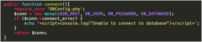<![endif]>

<a
name="_Toc352533891">Figure 3&#8209;2&#8209;4 Database Connection</a>

<o:p>&nbsp;</o:p>

<h3><a name="_Toc352593088">Register</a></h3>

This class handles user registration HTTP
POST requests.

It runs some error checking to see if a
user is attempting to register using an already occupied email address,
username or phone number.

If there isnÕt any duplication in the
request details then a <i style='mso-bidi-font-style:normal'>DBFn</i> object
method is called to save the user details. 

Upon successful registration of user
details this class returns a JSON Object containing the users details and if
user registration is unsuccessful a JSON object containing some error
information is returned to the user device.

<!--[if gte vml 1]><v:shape
 id="Picture_x0020_31" o:spid="_x0000_i1027" type="#_x0000_t75" alt="Description: Macintosh HD:Users:matthew:Desktop:Screenshots:Screen Shot 2017-03-26 at 16.26.39.png"
 style='width:387pt;height:166pt;visibility:visible;mso-wrap-style:square'>
 <v:imagedata src="TrackMe_Project_Report_files/image081.png" o:title="Screen Shot 2017-03-26 at 16.26.39.png"/>
</v:shape><![endif]--><![if !vml]>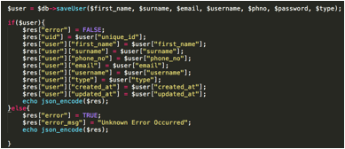<![endif]>

<a
name="_Toc352533892">Figure 3&#8209;2&#8209;5 Registration</a>

<o:p>&nbsp;</o:p>

<h3><a name="_Toc352593089">Login</a></h3>

This class handlers user login HTTP POST
requests received from the mobile application. If verifies the user details
entered using a <i style='mso-bidi-font-style:normal'>DBFn </i>object method.
If the details are deemed to be correct this class returns the user details in
a JSON response object.

If the user enters incorrect details an
error is flagged and JSON response containing an error message is sent back to
the user device containing the error details.

<o:p>&nbsp;</o:p>

<!--[if gte vml 1]><v:shape id="Picture_x0020_32"
 o:spid="_x0000_i1026" type="#_x0000_t75" alt="Description: Macintosh HD:Users:matthew:Desktop:Screenshots:Screen Shot 2017-03-26 at 16.27.28.png"
 style='width:252pt;height:188pt;visibility:visible;mso-wrap-style:square'>
 <v:imagedata src="TrackMe_Project_Report_files/image083.png" o:title="Screen Shot 2017-03-26 at 16.27.28.png"/>
</v:shape><![endif]--><![if !vml]>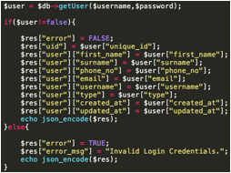<![endif]>

<a
name="_Toc352533893">Figure 3-2&#8209;6 Login</a>

<h3><a name="_Toc352593090">UpdateLocation</a></h3>

The <i style='mso-bidi-font-style:normal'>UpdateLocation</i>
class handles user location updates received from the mobile application. It
receives these HTTP POST request containing the users own details along with
their location details. It proceeds to call the <i style='mso-bidi-font-style:
normal'>saveUserLocation</i> method in the <i style='mso-bidi-font-style:normal'>DBFn</i>
class (functionality of which detailed above) to store the information in the
cloud database.

<o:p>&nbsp;</o:p>

<h3><a name="_Toc352593091">GetLocation</a></h3>

The <i style='mso-bidi-font-style:normal'>GetLocation</i>
class handles user location queries.

It receives POST requests from the mobile
application with the username to query the latest location data for.

This class then proceeds to call the <i
style='mso-bidi-font-style:normal'>getUserLocation</i> method in the <i
style='mso-bidi-font-style:normal'>DBFn</i> class (functionality of which
detailed above)

Upon successful retrieval of a users
location data the method returns the location details in a JSON response

<o:p>&nbsp;</o:p>

<o:p>&nbsp;</o:p>

<o:p>&nbsp;</o:p>

<o:p>&nbsp;</o:p>

<o:p>&nbsp;</o:p>

<o:p>&nbsp;</o:p>

<o:p>&nbsp;</o:p>

<o:p>&nbsp;</o:p>

<h1><a name="_Toc352593092">3.3&nbsp;&nbsp;&nbsp;&nbsp;&nbsp; Database</a></h1>

This section details the schemas used in
the MySQL cloud database.

This database consists of 3 tables used by
the mobile application:

<![if !supportLists]>á&nbsp;&nbsp;&nbsp;&nbsp;&nbsp;
<![endif]><i style='mso-bidi-font-style:normal'>userDetails<o:p></o:p></i>

<![if !supportLists]>á&nbsp;&nbsp;&nbsp;&nbsp;&nbsp;
<![endif]><i style='mso-bidi-font-style:normal'>usersLocations<o:p></o:p></i>

<![if !supportLists]>á&nbsp;&nbsp;&nbsp;&nbsp;&nbsp;
<![endif]><i style='mso-bidi-font-style:normal'>latestUserLocation<o:p></o:p></i>

<!--[if gte vml 1]><v:shape
 id="Picture_x0020_34" o:spid="_x0000_i1025" type="#_x0000_t75" alt="Description: Macintosh HD:Users:matthew:Desktop:Screenshots:Screen Shot 2017-03-26 at 16.40.15.png"
 style='width:349pt;height:233pt;visibility:visible;mso-wrap-style:square'
 o:bordertopcolor="black" o:borderleftcolor="black" o:borderbottomcolor="black"
 o:borderrightcolor="black">
 <v:imagedata src="TrackMe_Project_Report_files/image085.png" o:title="Screen Shot 2017-03-26 at 16.40.15.png"/>
 <w:bordertop type="single" width="6"/>
 <w:borderleft type="single" width="6"/>
 <w:borderbottom type="single" width="6"/>
 <w:borderright type="single" width="6"/>
</v:shape><![endif]--><![if !vml]>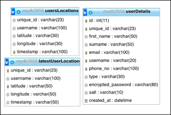<![endif]>

3&#8209;3-1
Cloud Database Schemas

<o:p>&nbsp;</o:p>

The <i style='mso-bidi-font-style:normal'>userDetails</i>
table uses <i style='mso-bidi-font-style:normal'>id</i> (an auto incrementing
integer value) as itÕs primary key with <i style='mso-bidi-font-style:normal'>unique_id</i>,
<i style='mso-bidi-font-style:normal'>email, username and phone_no</i> being indexes
in the table.

The <i style='mso-bidi-font-style:normal'>usersLocations</i>
table uses <i style='mso-bidi-font-style:normal'>timestamp</i> as itÕs primary
key with <i style='mso-bidi-font-style:normal'>unique_id</i> being an index in
the table.

The <i style='mso-bidi-font-style:normal'>latestUserLocation</i>
table uses the <i style='mso-bidi-font-style:normal'>unique_id</i> field as
itÕs primary key with <i style='mso-bidi-font-style:normal'>username</i> acting
as its index.

<o:p>&nbsp;</o:p>

<a name="_Toc352593093">4. Testing &amp; Evaluation</a> 

<h1><a name="_Toc352593094">4.1&nbsp;&nbsp;&nbsp;&nbsp;&nbsp; Testing</a> </h1>

This section gives an overview of the
testing completed throughout the course of the applications development. The
majority of the testing was carried out on a Motorola G4 Plus smartphone device
running Android version 6.0.1 (API 23).&nbsp;&nbsp;&nbsp;&nbsp;&nbsp;&nbsp;&nbsp;&nbsp;&nbsp;&nbsp;&nbsp;&nbsp;&nbsp;&nbsp;&nbsp;&nbsp;&nbsp;&nbsp;&nbsp;&nbsp;&nbsp;
&nbsp;&nbsp;&nbsp;&nbsp;&nbsp;&nbsp;&nbsp;&nbsp;&nbsp;&nbsp;&nbsp;&nbsp;&nbsp;&nbsp;&nbsp;Other
devices used to test the application were an LG G4, a OnePlus Three, a Sony
Xperia Z3 and the Android Studio IDEÕs inbuilt emulator. All devices used to
test were running Android versions between 4.0.3 and 7.0.

<o:p>&nbsp;</o:p>

<h2><a name="_Toc352593095">Testing Of GPS Tracking Algorithm</a></h2>

To test the GPS location algorithmsÕ
accuracy I started the tracking algorithms in multiple known locations where
the address was known to me so I could assess whether or not the location
address obtained from the Geocoder was accurate. 

I found the location data received to be
very accurate as around 80% of the time the exact address location was obtained
(accuracy to the detail of the exact house number) and the rest of the time the
location data obtained was very close to the real location (Usually one house
number, or the equivalent, away from the actual location).

During the testing process of the GPS
boundary algorithm I used various different boundary settings. Each time I
started the GPS tracking algorithm when I was in the same location, I would
travel slightly beyond the approximate distance of the boundary variable I had
set and then test whether or not an ÔemergencyÕ message was sent to the
emergency contact that I had defined. The boundary tracking always proved to be
very accurate with the only real issue arising being the permissions needed to
send a background SMS, Once this was rectified the boundary tracking and SMS
sending worked flawlessly. 

The reliability of the algorithm was tested
by running several instances of the application, with the GPS Tracking service
running, over a long period of time. It was observed whether ach of these
instances tested location data was uploaded to the cloud database as expected.
This never proved to be an issue.

<h2><a name="_Toc352593096">Testing Of Fall Detection
Algorithm</a></h2>

The fall detection algorithm was tested and
tuned over the period of a number of weeks. The application was reconfigured
and tuned several times with different characteristics defined that would
indicate a possible fall. Each time it was reconfigured I simulated a number of
accelerometer spikes that I would have either classified as falls or not.
Throughout the course of this testing I was able to identify the most accurate
parameters for fall detection so that the algorithm would be slightly
oversensitive. I decided to implement the algorithm in this way as personal
security is the fundamental aim of this application and because of that I would
rather detect a false positive rather than a false negative.

<h1><a name="_Toc352593097">4.2&nbsp;&nbsp;&nbsp;&nbsp;&nbsp; User Feedback</a></h1>

Throughout the course of the development
process I deployed the application to a number of my friends and familyÕs Android
devices.

The application was deployed to user
devices in various stages of development to test a range of the applications
features such as fall detection, GPS tracking as well as UI interactions and
compatibility with various devices.

The versions of the application deployed to
user devices ranged from early version with very little background
functionality, so to allow users to test the application UI and
login/registration features of the application, to later versions of the
application deployed to user devices to allow them to test the accuracy of the
fall detection and GPS tracking.

<o:p>&nbsp;</o:p>

<o:p>&nbsp;</o:p>

User feedback proved to be a very effective
method of discovering application functionality based bugs and changes that
needed to be implemented. This was due to the fact new users of the application
often carried out variating sequences of interaction with the app that I had
not anticipated. 

This led to the discovery of several bugs
in the applications underlying functionality.

Some bugs identified by users are as
follows:

<![if !supportLists]>1.&nbsp;&nbsp;&nbsp;&nbsp;
<![endif]>Email duplication upon
registration let to error and inability for application to continue.

<![if !supportLists]>2.&nbsp;&nbsp;&nbsp;&nbsp;
<![endif]>Opening of application without
location services turned on led to application crash.

<![if !supportLists]>3.&nbsp;&nbsp;&nbsp;&nbsp;
<![endif]>Emergency contact configuration
was not saved upon re-opening of the application.

<![if !supportLists]>4.&nbsp;&nbsp;&nbsp;&nbsp;
<![endif]>No functionality to check for
duplication of username of phone number was present in earlier versions of the
application.

I also adopted user feedback as my main
source of UI testing as I felt that errors and bad practice in the applications
UI would be very easily picked up by first time users due to their impartial
and newly-formulated perspective of the application.&nbsp;&nbsp;&nbsp;&nbsp;&nbsp;&nbsp;&nbsp;&nbsp;
&nbsp;&nbsp;&nbsp;This method
helped identify several application UI bugs that I had not previously observed
as well as suggestions to improve that applications flow and ease of use. 

This feedback led to the following changes
in the application:

<![if !supportLists]>1.&nbsp;&nbsp;&nbsp;&nbsp;
<![endif]>Change to using navigation
drawers to navigate through application.

<![if !supportLists]>2.&nbsp;&nbsp;&nbsp;&nbsp;
<![endif]>Placement of <i
style='mso-bidi-font-style:normal'>TrackMe</i> and <i style='mso-bidi-font-style:
normal'>Track Someone</i> button at the top of the <i style='mso-bidi-font-style:
normal'>HomeFragment</i> UI.

<![if !supportLists]>3.&nbsp;&nbsp;&nbsp;&nbsp;
<![endif]>The decision to include <i
style='mso-bidi-font-style:normal'>HelpFragment</i> and <i style='mso-bidi-font-style:
normal'>AboutFragment</i> in the application so users would have access to
guidelines for application configurations as well as being able to see a
summary of the features the application offered.

<o:p>&nbsp;</o:p>

<o:p>&nbsp;</o:p>

Overall I found user feedback to be a very useful
and productive method of application testing.

I found it useful for several reasons such
as:

<![if !supportLists]>1.&nbsp;&nbsp;&nbsp;&nbsp;
<![endif]>New users offered a fresh
perspective on the application.

<![if !supportLists]>2.&nbsp;&nbsp;&nbsp;&nbsp;
<![endif]>New users oftentimes carried
out interactions of the application that I had not considered of previously
used leading to the discovery of bugs or the opportunity to add new features to
the application.

<![if !supportLists]>3.&nbsp;&nbsp;&nbsp;&nbsp;
<![endif]>New users often used the
application with device settings configurations that I had not considered or
tested leading to the discovery of bugs.

<o:p>&nbsp;</o:p>

<h1><a name="_Toc352593098">4.3&nbsp;&nbsp;&nbsp;&nbsp;&nbsp; Functional Requirements Review</a></h1>

This section reviews the functional
requirements set out in the original Software Requirements Specification for
the project. It details whether or not the requirements were completed and if
not the reasoning or rationale behind the decision or constraint.

<h2><a name="_Toc352593099">Core Requirements</a></h2>

<b style='mso-bidi-font-weight:normal'><i style='mso-bidi-font-style:
normal'>FR1 - User Registration<o:p></o:p></i></b>

<i style='mso-bidi-font-style:normal'>Complete
As Defined. </i><i style='mso-bidi-font-style:normal'><o:p></o:p></i>

The application allows for users to
register an account for the TrackMe application. 

<b style='mso-bidi-font-weight:normal'><i style='mso-bidi-font-style:
normal'>FR2 - User Profile <o:p></o:p></i></b>

<i style='mso-bidi-font-style:normal'>Complete
As Defined.</i><i style='mso-bidi-font-style:normal'><o:p></o:p></i>

The application allows the user to
configure profile details and choose from various default profile types. 

<o:p>&nbsp;</o:p>

<o:p>&nbsp;</o:p>

<b style='mso-bidi-font-weight:normal'><i style='mso-bidi-font-style:
normal'>FR3 - Location Tracking<o:p></o:p></i></b>

<i style='mso-bidi-font-style:normal'>Complete
As Defined.</i><i style='mso-bidi-font-style:normal'><o:p></o:p></i>

The application has the ability to track a
users location at all times given that there is either network or internet
connection available on the user device.<o:p></o:p>

<b style='mso-bidi-font-weight:normal'><i style='mso-bidi-font-style:
normal'>FR4 - TrackMe (Request To Be Tracked) <o:p></o:p></i></b>

<i style='mso-bidi-font-style:normal'>Incomplete
As Defined.</i><i style='mso-bidi-font-style:normal'><o:p></o:p></i>

The application sends an SMS to the users
defined emergency contact if a scenario is detected where the user might be in
danger. This SMS contains information such as their username and latest location
address. The username can be used to see a visual representation of the latest
location of the user.

<b style='mso-bidi-font-weight:normal'><i style='mso-bidi-font-style:
normal'>FR5 - Fall Detection <o:p></o:p></i></b>

<i style='mso-bidi-font-style:normal'>Complete
As Defined</i><i style='mso-bidi-font-style:normal'>.<o:p></o:p></i>

The application has the ability to detect a
user fall. 

This service can also be enabled or
disabled depending on user preference.

<b style='mso-bidi-font-weight:normal'><i style='mso-bidi-font-style:
normal'>FR6 - Messaging Settings <o:p></o:p></i></b>

<i style='mso-bidi-font-style:normal'>Incomplete
as Defined<o:p></o:p></i>

The application has been defined so that it
uses SMS as itÕs messaging service as it is the only means of sending a message
that doesnÕt require any user interaction which was a fundamental requirement
of the applications messaging feature.

<b style='mso-bidi-font-weight:normal'><i style='mso-bidi-font-style:
normal'>FR7 - Contacts <o:p></o:p></i></b>

<i style='mso-bidi-font-style:normal'>Incomplete
As Defined.<o:p></o:p></i>

The application allows the selection of an
emergency contact that is sent an SMS upon the detection an <i
style='mso-bidi-font-style:normal'>emergency</i> situation.

<o:p>&nbsp;</o:p>

<b style='mso-bidi-font-weight:normal'><i style='mso-bidi-font-style:
normal'>FR8 - Help Menu <o:p></o:p></i></b>

<i style='mso-bidi-font-style:normal'>Complete
As Defined</i><i style='mso-bidi-font-style:normal'><o:p></o:p></i>

The user is given the ability to access
guidelines for configuring the application.

<b style='mso-bidi-font-weight:normal'><i style='mso-bidi-font-style:
normal'>FR9 - Push Notifications <o:p></o:p></i></b>

<i style='mso-bidi-font-style:normal'>Complete
As Defined</i><i style='mso-bidi-font-style:normal'><o:p></o:p></i>

The ability to show push notifications on
the Android OS home screen in the case of a fall being detected.

<o:p>&nbsp;</o:p>

<h2><a name="_Toc352593100">Additional Requirements</a></h2>

<b style='mso-bidi-font-weight:normal'><i style='mso-bidi-font-style:
normal'>FR10 - Social Media Account Integration <o:p></o:p></i></b>

<i style='mso-bidi-font-style:normal'>Incomplete
as defined</i><i style='mso-bidi-font-style:normal'><o:p></o:p></i>

Due to time constraints and a change in
direction this wasnÕt seen as a fundamental requirement as social media
accounts wouldnÕt be used as a messaging service in the application.

<b style='mso-bidi-font-weight:normal'><i style='mso-bidi-font-style:
normal'>FR11 - DB Management Web Service <o:p></o:p></i></b>

<i style='mso-bidi-font-style:normal'>Incomplete
As Defined</i><i style='mso-bidi-font-style:normal'><o:p></o:p></i>

Development of a web service to administer
the DB was not undertaken due to time constraints and requirement
prioritization.

<b style='mso-bidi-font-weight:normal'><i style='mso-bidi-font-style:
normal'>FR12 - Real Time Data Analytics <o:p></o:p></i></b>

<i style='mso-bidi-font-style:normal'>Incomplete
As Defined</i><i style='mso-bidi-font-style:normal'><o:p></o:p></i>

Due to time constraints I was unable to
complete the implementation of a backend web service that ran data analytics on
the user location data uploaded to the backend server. 

<h1><a name="_Toc352593101">4.4&nbsp;&nbsp;&nbsp;&nbsp;&nbsp; Comparison With Similar Applications</a></h1>

The TrackMe performs admirably in terms of
available features in comparison to the other personal security applications researched
as part of this project.

The feature matrix below, that includes
similar applications, highlights that TrackMe provides many of the same
fundamental security features that are provided by professional subscription
based services. TrackMe also has the added ability of fall detection that gives
it another dimension in comparison to other similar products.

<table class=MsoTableGrid border=1 cellspacing=0 cellpadding=0 width=467
 style='width:466.7pt;border-collapse:collapse;border:none;mso-border-alt:solid windowtext .5pt;
 mso-yfti-tbllook:1184;mso-padding-alt:0cm 5.4pt 0cm 5.4pt'>
 <tr style='mso-yfti-irow:0;mso-yfti-firstrow:yes;height:26.6pt'>
  <td width=111 style='width:111.35pt;border:solid windowtext 1.0pt;mso-border-alt:
  solid windowtext .5pt;padding:0cm 5.4pt 0cm 5.4pt;height:26.6pt'>
  
<b style='mso-bidi-font-weight:normal'>Feature/Application<o:p></o:p></b>

  </td>
  <td width=54 style='width:54.25pt;border:solid windowtext 1.0pt;border-left:
  none;mso-border-left-alt:solid windowtext .5pt;mso-border-alt:solid windowtext .5pt;
  padding:0cm 5.4pt 0cm 5.4pt;height:26.6pt'>
  
<b style='mso-bidi-font-weight:normal'>TrackMe<o:p></o:p></b>

  </td>
  <td width=71 style='width:71.0pt;border:solid windowtext 1.0pt;border-left:
  none;mso-border-left-alt:solid windowtext .5pt;mso-border-alt:solid windowtext .5pt;
  padding:0cm 5.4pt 0cm 5.4pt;height:26.6pt'>
  
<b style='mso-bidi-font-weight:normal'>Emergensee<o:p></o:p></b>

  </td>
  <td width=38 style='width:38.25pt;border:solid windowtext 1.0pt;border-left:
  none;mso-border-left-alt:solid windowtext .5pt;mso-border-alt:solid windowtext .5pt;
  padding:0cm 5.4pt 0cm 5.4pt;height:26.6pt'>
  
<b style='mso-bidi-font-weight:normal'>BSafe<o:p></o:p></b>

  </td>
  <td width=79 style='width:79.35pt;border:solid windowtext 1.0pt;border-left:
  none;mso-border-left-alt:solid windowtext .5pt;mso-border-alt:solid windowtext .5pt;
  padding:0cm 5.4pt 0cm 5.4pt;height:26.6pt'>
  
<b style='mso-bidi-font-weight:normal'>FamilyLocator<o:p></o:p></b>

  </td>
  <td width=59 style='width:59.3pt;border:solid windowtext 1.0pt;border-left:
  none;mso-border-left-alt:solid windowtext .5pt;mso-border-alt:solid windowtext .5pt;
  padding:0cm 5.4pt 0cm 5.4pt;height:26.6pt'>
  
<b style='mso-bidi-font-weight:normal'>DigitalLife<o:p></o:p></b>

  </td>
  <td width=53 style='width:53.2pt;border:solid windowtext 1.0pt;border-left:
  none;mso-border-left-alt:solid windowtext .5pt;mso-border-alt:solid windowtext .5pt;
  padding:0cm 5.4pt 0cm 5.4pt;height:26.6pt'>
  
<b style='mso-bidi-font-weight:normal'>SafeTrek<o:p></o:p></b>

  </td>
 </tr>
 <tr style='mso-yfti-irow:1'>
  <td width=111 style='width:111.35pt;border:solid windowtext 1.0pt;border-top:
  none;mso-border-top-alt:solid windowtext .5pt;mso-border-alt:solid windowtext .5pt;
  padding:0cm 5.4pt 0cm 5.4pt'>
  
<b style='mso-bidi-font-weight:normal'>Remote
  Monitoring<o:p></o:p></b>

  </td>
  <td width=54 style='width:54.25pt;border-top:none;border-left:none;
  border-bottom:solid windowtext 1.0pt;border-right:solid windowtext 1.0pt;
  mso-border-top-alt:solid windowtext .5pt;mso-border-left-alt:solid windowtext .5pt;
  mso-border-alt:solid windowtext .5pt;padding:0cm 5.4pt 0cm 5.4pt'>
  
&#10004;

  </td>
  <td width=71 style='width:71.0pt;border-top:none;border-left:none;border-bottom:
  solid windowtext 1.0pt;border-right:solid windowtext 1.0pt;mso-border-top-alt:
  solid windowtext .5pt;mso-border-left-alt:solid windowtext .5pt;mso-border-alt:
  solid windowtext .5pt;padding:0cm 5.4pt 0cm 5.4pt'>
  
&#10004;

  </td>
  <td width=38 style='width:38.25pt;border-top:none;border-left:none;
  border-bottom:solid windowtext 1.0pt;border-right:solid windowtext 1.0pt;
  mso-border-top-alt:solid windowtext .5pt;mso-border-left-alt:solid windowtext .5pt;
  mso-border-alt:solid windowtext .5pt;padding:0cm 5.4pt 0cm 5.4pt'>
  
&#10004;

  </td>
  <td width=79 style='width:79.35pt;border-top:none;border-left:none;
  border-bottom:solid windowtext 1.0pt;border-right:solid windowtext 1.0pt;
  mso-border-top-alt:solid windowtext .5pt;mso-border-left-alt:solid windowtext .5pt;
  mso-border-alt:solid windowtext .5pt;padding:0cm 5.4pt 0cm 5.4pt'>
  
&#10004;

  </td>
  <td width=59 style='width:59.3pt;border-top:none;border-left:none;border-bottom:
  solid windowtext 1.0pt;border-right:solid windowtext 1.0pt;mso-border-top-alt:
  solid windowtext .5pt;mso-border-left-alt:solid windowtext .5pt;mso-border-alt:
  solid windowtext .5pt;padding:0cm 5.4pt 0cm 5.4pt'>
  
&#10004;

  </td>
  <td width=53 style='width:53.2pt;border-top:none;border-left:none;border-bottom:
  solid windowtext 1.0pt;border-right:solid windowtext 1.0pt;mso-border-top-alt:
  solid windowtext .5pt;mso-border-left-alt:solid windowtext .5pt;mso-border-alt:
  solid windowtext .5pt;padding:0cm 5.4pt 0cm 5.4pt'>
  
<o:p>&nbsp;</o:p>

  </td>
 </tr>
 <tr style='mso-yfti-irow:2'>
  <td width=111 style='width:111.35pt;border:solid windowtext 1.0pt;border-top:
  none;mso-border-top-alt:solid windowtext .5pt;mso-border-alt:solid windowtext .5pt;
  padding:0cm 5.4pt 0cm 5.4pt'>
  
<b style='mso-bidi-font-weight:normal'>Fall
  Detection<o:p></o:p></b>

  </td>
  <td width=54 style='width:54.25pt;border-top:none;border-left:none;
  border-bottom:solid windowtext 1.0pt;border-right:solid windowtext 1.0pt;
  mso-border-top-alt:solid windowtext .5pt;mso-border-left-alt:solid windowtext .5pt;
  mso-border-alt:solid windowtext .5pt;padding:0cm 5.4pt 0cm 5.4pt'>
  
&#10004;

  </td>
  <td width=71 style='width:71.0pt;border-top:none;border-left:none;border-bottom:
  solid windowtext 1.0pt;border-right:solid windowtext 1.0pt;mso-border-top-alt:
  solid windowtext .5pt;mso-border-left-alt:solid windowtext .5pt;mso-border-alt:
  solid windowtext .5pt;padding:0cm 5.4pt 0cm 5.4pt'>
  
<o:p>&nbsp;</o:p>

  </td>
  <td width=38 style='width:38.25pt;border-top:none;border-left:none;
  border-bottom:solid windowtext 1.0pt;border-right:solid windowtext 1.0pt;
  mso-border-top-alt:solid windowtext .5pt;mso-border-left-alt:solid windowtext .5pt;
  mso-border-alt:solid windowtext .5pt;padding:0cm 5.4pt 0cm 5.4pt'>
  
<o:p>&nbsp;</o:p>

  </td>
  <td width=79 style='width:79.35pt;border-top:none;border-left:none;
  border-bottom:solid windowtext 1.0pt;border-right:solid windowtext 1.0pt;
  mso-border-top-alt:solid windowtext .5pt;mso-border-left-alt:solid windowtext .5pt;
  mso-border-alt:solid windowtext .5pt;padding:0cm 5.4pt 0cm 5.4pt'>
  
<o:p>&nbsp;</o:p>

  </td>
  <td width=59 style='width:59.3pt;border-top:none;border-left:none;border-bottom:
  solid windowtext 1.0pt;border-right:solid windowtext 1.0pt;mso-border-top-alt:
  solid windowtext .5pt;mso-border-left-alt:solid windowtext .5pt;mso-border-alt:
  solid windowtext .5pt;padding:0cm 5.4pt 0cm 5.4pt'>
  
<o:p>&nbsp;</o:p>

  </td>
  <td width=53 style='width:53.2pt;border-top:none;border-left:none;border-bottom:
  solid windowtext 1.0pt;border-right:solid windowtext 1.0pt;mso-border-top-alt:
  solid windowtext .5pt;mso-border-left-alt:solid windowtext .5pt;mso-border-alt:
  solid windowtext .5pt;padding:0cm 5.4pt 0cm 5.4pt'>
  
<o:p>&nbsp;</o:p>

  </td>
 </tr>
 <tr style='mso-yfti-irow:3'>
  <td width=111 style='width:111.35pt;border:solid windowtext 1.0pt;border-top:
  none;mso-border-top-alt:solid windowtext .5pt;mso-border-alt:solid windowtext .5pt;
  padding:0cm 5.4pt 0cm 5.4pt'>
  
<b style='mso-bidi-font-weight:normal'>Emergency
  Contacts<o:p></o:p></b>

  </td>
  <td width=54 style='width:54.25pt;border-top:none;border-left:none;
  border-bottom:solid windowtext 1.0pt;border-right:solid windowtext 1.0pt;
  mso-border-top-alt:solid windowtext .5pt;mso-border-left-alt:solid windowtext .5pt;
  mso-border-alt:solid windowtext .5pt;padding:0cm 5.4pt 0cm 5.4pt'>
  
&#10004;

  </td>
  <td width=71 style='width:71.0pt;border-top:none;border-left:none;border-bottom:
  solid windowtext 1.0pt;border-right:solid windowtext 1.0pt;mso-border-top-alt:
  solid windowtext .5pt;mso-border-left-alt:solid windowtext .5pt;mso-border-alt:
  solid windowtext .5pt;padding:0cm 5.4pt 0cm 5.4pt'>
  
&#10004;

  </td>
  <td width=38 style='width:38.25pt;border-top:none;border-left:none;
  border-bottom:solid windowtext 1.0pt;border-right:solid windowtext 1.0pt;
  mso-border-top-alt:solid windowtext .5pt;mso-border-left-alt:solid windowtext .5pt;
  mso-border-alt:solid windowtext .5pt;padding:0cm 5.4pt 0cm 5.4pt'>
  
&#10004;

  </td>
  <td width=79 style='width:79.35pt;border-top:none;border-left:none;
  border-bottom:solid windowtext 1.0pt;border-right:solid windowtext 1.0pt;
  mso-border-top-alt:solid windowtext .5pt;mso-border-left-alt:solid windowtext .5pt;
  mso-border-alt:solid windowtext .5pt;padding:0cm 5.4pt 0cm 5.4pt'>
  
&#10004;

  </td>
  <td width=59 style='width:59.3pt;border-top:none;border-left:none;border-bottom:
  solid windowtext 1.0pt;border-right:solid windowtext 1.0pt;mso-border-top-alt:
  solid windowtext .5pt;mso-border-left-alt:solid windowtext .5pt;mso-border-alt:
  solid windowtext .5pt;padding:0cm 5.4pt 0cm 5.4pt'>
  
&#10004;<b style='mso-bidi-font-weight:normal'><o:p></o:p></b>

  </td>
  <td width=53 style='width:53.2pt;border-top:none;border-left:none;border-bottom:
  solid windowtext 1.0pt;border-right:solid windowtext 1.0pt;mso-border-top-alt:
  solid windowtext .5pt;mso-border-left-alt:solid windowtext .5pt;mso-border-alt:
  solid windowtext .5pt;padding:0cm 5.4pt 0cm 5.4pt'>
  
<o:p>&nbsp;</o:p>

  </td>
 </tr>
 <tr style='mso-yfti-irow:4'>
  <td width=111 style='width:111.35pt;border:solid windowtext 1.0pt;border-top:
  none;mso-border-top-alt:solid windowtext .5pt;mso-border-alt:solid windowtext .5pt;
  padding:0cm 5.4pt 0cm 5.4pt'>
  
<b style='mso-bidi-font-weight:normal'>Background
  SMS Transmission<o:p></o:p></b>

  </td>
  <td width=54 style='width:54.25pt;border-top:none;border-left:none;
  border-bottom:solid windowtext 1.0pt;border-right:solid windowtext 1.0pt;
  mso-border-top-alt:solid windowtext .5pt;mso-border-left-alt:solid windowtext .5pt;
  mso-border-alt:solid windowtext .5pt;padding:0cm 5.4pt 0cm 5.4pt'>
  
&#10004;

  </td>
  <td width=71 style='width:71.0pt;border-top:none;border-left:none;border-bottom:
  solid windowtext 1.0pt;border-right:solid windowtext 1.0pt;mso-border-top-alt:
  solid windowtext .5pt;mso-border-left-alt:solid windowtext .5pt;mso-border-alt:
  solid windowtext .5pt;padding:0cm 5.4pt 0cm 5.4pt'>
  
&#10004;

  </td>
  <td width=38 style='width:38.25pt;border-top:none;border-left:none;
  border-bottom:solid windowtext 1.0pt;border-right:solid windowtext 1.0pt;
  mso-border-top-alt:solid windowtext .5pt;mso-border-left-alt:solid windowtext .5pt;
  mso-border-alt:solid windowtext .5pt;padding:0cm 5.4pt 0cm 5.4pt'>
  
&#10004;

  </td>
  <td width=79 style='width:79.35pt;border-top:none;border-left:none;
  border-bottom:solid windowtext 1.0pt;border-right:solid windowtext 1.0pt;
  mso-border-top-alt:solid windowtext .5pt;mso-border-left-alt:solid windowtext .5pt;
  mso-border-alt:solid windowtext .5pt;padding:0cm 5.4pt 0cm 5.4pt'>
  
&#10004;

  </td>
  <td width=59 style='width:59.3pt;border-top:none;border-left:none;border-bottom:
  solid windowtext 1.0pt;border-right:solid windowtext 1.0pt;mso-border-top-alt:
  solid windowtext .5pt;mso-border-left-alt:solid windowtext .5pt;mso-border-alt:
  solid windowtext .5pt;padding:0cm 5.4pt 0cm 5.4pt'>
  
&#10004;

  </td>
  <td width=53 style='width:53.2pt;border-top:none;border-left:none;border-bottom:
  solid windowtext 1.0pt;border-right:solid windowtext 1.0pt;mso-border-top-alt:
  solid windowtext .5pt;mso-border-left-alt:solid windowtext .5pt;mso-border-alt:
  solid windowtext .5pt;padding:0cm 5.4pt 0cm 5.4pt'>
  
&#10004;

  </td>
 </tr>
 <tr style='mso-yfti-irow:5'>
  <td width=111 style='width:111.35pt;border:solid windowtext 1.0pt;border-top:
  none;mso-border-top-alt:solid windowtext .5pt;mso-border-alt:solid windowtext .5pt;
  padding:0cm 5.4pt 0cm 5.4pt'>
  
<b style='mso-bidi-font-weight:normal'>Backend
  Server Enhancement<o:p></o:p></b>

  </td>
  <td width=54 style='width:54.25pt;border-top:none;border-left:none;
  border-bottom:solid windowtext 1.0pt;border-right:solid windowtext 1.0pt;
  mso-border-top-alt:solid windowtext .5pt;mso-border-left-alt:solid windowtext .5pt;
  mso-border-alt:solid windowtext .5pt;padding:0cm 5.4pt 0cm 5.4pt'>
  
&#10004;<o:p></o:p>

  </td>
  <td width=71 style='width:71.0pt;border-top:none;border-left:none;border-bottom:
  solid windowtext 1.0pt;border-right:solid windowtext 1.0pt;mso-border-top-alt:
  solid windowtext .5pt;mso-border-left-alt:solid windowtext .5pt;mso-border-alt:
  solid windowtext .5pt;padding:0cm 5.4pt 0cm 5.4pt'>
  
<o:p>&nbsp;</o:p>

  </td>
  <td width=38 style='width:38.25pt;border-top:none;border-left:none;
  border-bottom:solid windowtext 1.0pt;border-right:solid windowtext 1.0pt;
  mso-border-top-alt:solid windowtext .5pt;mso-border-left-alt:solid windowtext .5pt;
  mso-border-alt:solid windowtext .5pt;padding:0cm 5.4pt 0cm 5.4pt'>
  
<o:p>&nbsp;</o:p>

  </td>
  <td width=79 style='width:79.35pt;border-top:none;border-left:none;
  border-bottom:solid windowtext 1.0pt;border-right:solid windowtext 1.0pt;
  mso-border-top-alt:solid windowtext .5pt;mso-border-left-alt:solid windowtext .5pt;
  mso-border-alt:solid windowtext .5pt;padding:0cm 5.4pt 0cm 5.4pt'>
  
<o:p>&nbsp;</o:p>

  </td>
  <td width=59 style='width:59.3pt;border-top:none;border-left:none;border-bottom:
  solid windowtext 1.0pt;border-right:solid windowtext 1.0pt;mso-border-top-alt:
  solid windowtext .5pt;mso-border-left-alt:solid windowtext .5pt;mso-border-alt:
  solid windowtext .5pt;padding:0cm 5.4pt 0cm 5.4pt'>
  
&#10004;

  </td>
  <td width=53 style='width:53.2pt;border-top:none;border-left:none;border-bottom:
  solid windowtext 1.0pt;border-right:solid windowtext 1.0pt;mso-border-top-alt:
  solid windowtext .5pt;mso-border-left-alt:solid windowtext .5pt;mso-border-alt:
  solid windowtext .5pt;padding:0cm 5.4pt 0cm 5.4pt'>
  
<o:p>&nbsp;</o:p>

  </td>
 </tr>
 <tr style='mso-yfti-irow:6'>
  <td width=111 style='width:111.35pt;border:solid windowtext 1.0pt;border-top:
  none;mso-border-top-alt:solid windowtext .5pt;mso-border-alt:solid windowtext .5pt;
  padding:0cm 5.4pt 0cm 5.4pt'>
  
<b style='mso-bidi-font-weight:normal'>Audio
  &amp; Video Streaming<o:p></o:p></b>

  </td>
  <td width=54 style='width:54.25pt;border-top:none;border-left:none;
  border-bottom:solid windowtext 1.0pt;border-right:solid windowtext 1.0pt;
  mso-border-top-alt:solid windowtext .5pt;mso-border-left-alt:solid windowtext .5pt;
  mso-border-alt:solid windowtext .5pt;padding:0cm 5.4pt 0cm 5.4pt'>
  
<o:p>&nbsp;</o:p>

  </td>
  <td width=71 style='width:71.0pt;border-top:none;border-left:none;border-bottom:
  solid windowtext 1.0pt;border-right:solid windowtext 1.0pt;mso-border-top-alt:
  solid windowtext .5pt;mso-border-left-alt:solid windowtext .5pt;mso-border-alt:
  solid windowtext .5pt;padding:0cm 5.4pt 0cm 5.4pt'>
  
&#10004;

  </td>
  <td width=38 style='width:38.25pt;border-top:none;border-left:none;
  border-bottom:solid windowtext 1.0pt;border-right:solid windowtext 1.0pt;
  mso-border-top-alt:solid windowtext .5pt;mso-border-left-alt:solid windowtext .5pt;
  mso-border-alt:solid windowtext .5pt;padding:0cm 5.4pt 0cm 5.4pt'>
  
<o:p>&nbsp;</o:p>

  </td>
  <td width=79 style='width:79.35pt;border-top:none;border-left:none;
  border-bottom:solid windowtext 1.0pt;border-right:solid windowtext 1.0pt;
  mso-border-top-alt:solid windowtext .5pt;mso-border-left-alt:solid windowtext .5pt;
  mso-border-alt:solid windowtext .5pt;padding:0cm 5.4pt 0cm 5.4pt'>
  
<o:p>&nbsp;</o:p>

  </td>
  <td width=59 style='width:59.3pt;border-top:none;border-left:none;border-bottom:
  solid windowtext 1.0pt;border-right:solid windowtext 1.0pt;mso-border-top-alt:
  solid windowtext .5pt;mso-border-left-alt:solid windowtext .5pt;mso-border-alt:
  solid windowtext .5pt;padding:0cm 5.4pt 0cm 5.4pt'>
  
<o:p>&nbsp;</o:p>

  </td>
  <td width=53 style='width:53.2pt;border-top:none;border-left:none;border-bottom:
  solid windowtext 1.0pt;border-right:solid windowtext 1.0pt;mso-border-top-alt:
  solid windowtext .5pt;mso-border-left-alt:solid windowtext .5pt;mso-border-alt:
  solid windowtext .5pt;padding:0cm 5.4pt 0cm 5.4pt'>
  
<o:p>&nbsp;</o:p>

  </td>
 </tr>
 <tr style='mso-yfti-irow:7'>
  <td width=111 style='width:111.35pt;border:solid windowtext 1.0pt;border-top:
  none;mso-border-top-alt:solid windowtext .5pt;mso-border-alt:solid windowtext .5pt;
  padding:0cm 5.4pt 0cm 5.4pt'>
  
<b style='mso-bidi-font-weight:normal'>Fake
  Call Triggers<o:p></o:p></b>

  </td>
  <td width=54 style='width:54.25pt;border-top:none;border-left:none;
  border-bottom:solid windowtext 1.0pt;border-right:solid windowtext 1.0pt;
  mso-border-top-alt:solid windowtext .5pt;mso-border-left-alt:solid windowtext .5pt;
  mso-border-alt:solid windowtext .5pt;padding:0cm 5.4pt 0cm 5.4pt'>
  
<o:p>&nbsp;</o:p>

  </td>
  <td width=71 style='width:71.0pt;border-top:none;border-left:none;border-bottom:
  solid windowtext 1.0pt;border-right:solid windowtext 1.0pt;mso-border-top-alt:
  solid windowtext .5pt;mso-border-left-alt:solid windowtext .5pt;mso-border-alt:
  solid windowtext .5pt;padding:0cm 5.4pt 0cm 5.4pt'>
  
<o:p>&nbsp;</o:p>

  </td>
  <td width=38 style='width:38.25pt;border-top:none;border-left:none;
  border-bottom:solid windowtext 1.0pt;border-right:solid windowtext 1.0pt;
  mso-border-top-alt:solid windowtext .5pt;mso-border-left-alt:solid windowtext .5pt;
  mso-border-alt:solid windowtext .5pt;padding:0cm 5.4pt 0cm 5.4pt'>
  
&#10004;

  </td>
  <td width=79 style='width:79.35pt;border-top:none;border-left:none;
  border-bottom:solid windowtext 1.0pt;border-right:solid windowtext 1.0pt;
  mso-border-top-alt:solid windowtext .5pt;mso-border-left-alt:solid windowtext .5pt;
  mso-border-alt:solid windowtext .5pt;padding:0cm 5.4pt 0cm 5.4pt'>
  
<o:p>&nbsp;</o:p>

  </td>
  <td width=59 style='width:59.3pt;border-top:none;border-left:none;border-bottom:
  solid windowtext 1.0pt;border-right:solid windowtext 1.0pt;mso-border-top-alt:
  solid windowtext .5pt;mso-border-left-alt:solid windowtext .5pt;mso-border-alt:
  solid windowtext .5pt;padding:0cm 5.4pt 0cm 5.4pt'>
  
<o:p>&nbsp;</o:p>

  </td>
  <td width=53 style='width:53.2pt;border-top:none;border-left:none;border-bottom:
  solid windowtext 1.0pt;border-right:solid windowtext 1.0pt;mso-border-top-alt:
  solid windowtext .5pt;mso-border-left-alt:solid windowtext .5pt;mso-border-alt:
  solid windowtext .5pt;padding:0cm 5.4pt 0cm 5.4pt'>
  
<o:p>&nbsp;</o:p>

  </td>
 </tr>
 <tr style='mso-yfti-irow:8'>
  <td width=111 style='width:111.35pt;border:solid windowtext 1.0pt;border-top:
  none;mso-border-top-alt:solid windowtext .5pt;mso-border-alt:solid windowtext .5pt;
  padding:0cm 5.4pt 0cm 5.4pt'>
  
<b style='mso-bidi-font-weight:normal'>Location
  Boundary Specification<o:p></o:p></b>

  </td>
  <td width=54 style='width:54.25pt;border-top:none;border-left:none;
  border-bottom:solid windowtext 1.0pt;border-right:solid windowtext 1.0pt;
  mso-border-top-alt:solid windowtext .5pt;mso-border-left-alt:solid windowtext .5pt;
  mso-border-alt:solid windowtext .5pt;padding:0cm 5.4pt 0cm 5.4pt'>
  
&#10004;<o:p></o:p>

  </td>
  <td width=71 style='width:71.0pt;border-top:none;border-left:none;border-bottom:
  solid windowtext 1.0pt;border-right:solid windowtext 1.0pt;mso-border-top-alt:
  solid windowtext .5pt;mso-border-left-alt:solid windowtext .5pt;mso-border-alt:
  solid windowtext .5pt;padding:0cm 5.4pt 0cm 5.4pt'>
  
<o:p>&nbsp;</o:p>

  </td>
  <td width=38 style='width:38.25pt;border-top:none;border-left:none;
  border-bottom:solid windowtext 1.0pt;border-right:solid windowtext 1.0pt;
  mso-border-top-alt:solid windowtext .5pt;mso-border-left-alt:solid windowtext .5pt;
  mso-border-alt:solid windowtext .5pt;padding:0cm 5.4pt 0cm 5.4pt'>
  
<o:p>&nbsp;</o:p>

  </td>
  <td width=79 style='width:79.35pt;border-top:none;border-left:none;
  border-bottom:solid windowtext 1.0pt;border-right:solid windowtext 1.0pt;
  mso-border-top-alt:solid windowtext .5pt;mso-border-left-alt:solid windowtext .5pt;
  mso-border-alt:solid windowtext .5pt;padding:0cm 5.4pt 0cm 5.4pt'>
  
&#10004;

  </td>
  <td width=59 style='width:59.3pt;border-top:none;border-left:none;border-bottom:
  solid windowtext 1.0pt;border-right:solid windowtext 1.0pt;mso-border-top-alt:
  solid windowtext .5pt;mso-border-left-alt:solid windowtext .5pt;mso-border-alt:
  solid windowtext .5pt;padding:0cm 5.4pt 0cm 5.4pt'>
  
<o:p>&nbsp;</o:p>

  </td>
  <td width=53 style='width:53.2pt;border-top:none;border-left:none;border-bottom:
  solid windowtext 1.0pt;border-right:solid windowtext 1.0pt;mso-border-top-alt:
  solid windowtext .5pt;mso-border-left-alt:solid windowtext .5pt;mso-border-alt:
  solid windowtext .5pt;padding:0cm 5.4pt 0cm 5.4pt'>
  
<o:p>&nbsp;</o:p>

  </td>
 </tr>
 <tr style='mso-yfti-irow:9;mso-yfti-lastrow:yes'>
  <td width=111 style='width:111.35pt;border:solid windowtext 1.0pt;border-top:
  none;mso-border-top-alt:solid windowtext .5pt;mso-border-alt:solid windowtext .5pt;
  padding:0cm 5.4pt 0cm 5.4pt'>
  
<b style='mso-bidi-font-weight:normal'>Alert
  Countdown Timer<o:p></o:p></b>

  </td>
  <td width=54 style='width:54.25pt;border-top:none;border-left:none;
  border-bottom:solid windowtext 1.0pt;border-right:solid windowtext 1.0pt;
  mso-border-top-alt:solid windowtext .5pt;mso-border-left-alt:solid windowtext .5pt;
  mso-border-alt:solid windowtext .5pt;padding:0cm 5.4pt 0cm 5.4pt'>
  
&#10004;<o:p></o:p>

  </td>
  <td width=71 style='width:71.0pt;border-top:none;border-left:none;border-bottom:
  solid windowtext 1.0pt;border-right:solid windowtext 1.0pt;mso-border-top-alt:
  solid windowtext .5pt;mso-border-left-alt:solid windowtext .5pt;mso-border-alt:
  solid windowtext .5pt;padding:0cm 5.4pt 0cm 5.4pt'>
  
&#10004;

  </td>
  <td width=38 style='width:38.25pt;border-top:none;border-left:none;
  border-bottom:solid windowtext 1.0pt;border-right:solid windowtext 1.0pt;
  mso-border-top-alt:solid windowtext .5pt;mso-border-left-alt:solid windowtext .5pt;
  mso-border-alt:solid windowtext .5pt;padding:0cm 5.4pt 0cm 5.4pt'>
  
&#10004;

  </td>
  <td width=79 style='width:79.35pt;border-top:none;border-left:none;
  border-bottom:solid windowtext 1.0pt;border-right:solid windowtext 1.0pt;
  mso-border-top-alt:solid windowtext .5pt;mso-border-left-alt:solid windowtext .5pt;
  mso-border-alt:solid windowtext .5pt;padding:0cm 5.4pt 0cm 5.4pt'>
  
<o:p>&nbsp;</o:p>

  </td>
  <td width=59 style='width:59.3pt;border-top:none;border-left:none;border-bottom:
  solid windowtext 1.0pt;border-right:solid windowtext 1.0pt;mso-border-top-alt:
  solid windowtext .5pt;mso-border-left-alt:solid windowtext .5pt;mso-border-alt:
  solid windowtext .5pt;padding:0cm 5.4pt 0cm 5.4pt'>
  
&#10004;

  </td>
  <td width=53 style='width:53.2pt;border-top:none;border-left:none;border-bottom:
  solid windowtext 1.0pt;border-right:solid windowtext 1.0pt;mso-border-top-alt:
  solid windowtext .5pt;mso-border-left-alt:solid windowtext .5pt;mso-border-alt:
  solid windowtext .5pt;padding:0cm 5.4pt 0cm 5.4pt'>
  
<o:p>&nbsp;</o:p>

  </td>
 </tr>
</table>

<o:p>&nbsp;</o:p>

<a
name="_Toc352533894">Figure 4&#8209;4&#8209;</a><!--[if supportFields]> SEQ Figure \* ARABIC \s 2 <![endif]-->1<!--[if supportFields]><![endif]-->
Comparison Matrix

<o:p>&nbsp;</o:p>

<o:p>&nbsp;</o:p>

<o:p>&nbsp;</o:p>

<a name="_Toc352593102">5. Conclusion</a>

<h1><a name="_Toc352593103">5.1&nbsp;&nbsp;&nbsp;&nbsp;&nbsp; Project Outcome</a></h1>

This project meets the primary goals of
developing a smartphone application that is used to aid the personal security
of vulnerable adults and children. The application enables periodic device
check-in, remote monitoring of device location, detection of lack of movement
(through the fall detection algorithm) and has the ability to detect user movement
outside specified boundaries depending on the requirements of the individual
being monitored. The smartphone application in enhanced by a backend server
that serves that purposes of making data available to other relevant users of
the application that can query the data.

Overall I am happy with the experience I
have gained in Android Development that enhanced my ability to built smartphone
application as well as enhancing my competency in Java programming.

The completion of the project also gave my
good experience in using PHP and learning about the fundamentals database administration.

I believe that the skills IÕve learned due
to competing this project will be of great benefit to me in my future career.

<o:p>&nbsp;</o:p>

<o:p>&nbsp;</o:p>

<o:p>&nbsp;</o:p>

<o:p>&nbsp;</o:p>

<o:p>&nbsp;</o:p>

<o:p>&nbsp;</o:p>

<h1><a name="_Toc352593104">5.2&nbsp;&nbsp;&nbsp;&nbsp;&nbsp; Future Work</a></h1>

The smartphone application that I have
developed has met its main primary goals but I have identified some areas in
which I could improve or enhance the implementation of the project as a whole.

<o:p>&nbsp;</o:p>

<h2><a name="_Toc352593105">Profile Editing</a></h2>

I would like to implement a means for users
to edit their profile details.

This would involve making changes to both
the mobile application and PHP database interaction project. Addition of this
feature would make the application more well rounded and professional.

<o:p>&nbsp;</o:p>

<h2><a name="_Toc352593106">Data Analytics</a></h2>

Another feature I would like to implement
is the harnessing of all of the dormant user location data stored in the MySQL
database. If statistical data was generated about this information there could
be a lot of data discovered such as possible Ôdangerous areasÕ or areas in
which falls are more likely to occur.

<o:p>&nbsp;</o:p>

<h2><a name="_Toc352593107">Password Retrieval/Change</a></h2>

A feature that I think would greatly benefit
the usability as well as the longevity of the mobile application would be a
means for the user to retrieve a forgotten password using their email and/or
username. I think this feature would add a lot of value to the application as
it would increase the user retention.

<o:p>&nbsp;</o:p>

<o:p>&nbsp;</o:p>

<o:p>&nbsp;</o:p>

<a name="_Toc352593108">References</a><o:p></o:p>

[1] androidhive. 2017. Android Login and Registration with PHP,
MySQL and SQLite. [ONLINE] Available at: <a
href="http://www.androidhive.info/2012/01/android-login-and-registration-with-php-mysql-and-sqlite/">http://www.androidhive.info/2012/01/android-login-and-registration-with-php-mysql-and-sqlite/</a>.<o:p></o:p>

[2] androidhive. 2017. Android User Session Management using Shared
Preferences. [ONLINE] Available at: <a
href="http://www.androidhive.info/2012/08/android-session-management-using-shared-preferences/">http://www.androidhive.info/2012/08/android-session-management-using-shared-preferences/</a>.<o:p></o:p>

[3] bSafe. 2017. bSafe You - The End Of Worry. [ONLINE] Available
at: <a href="http://getbsafe.com/">http://getbsafe.com</a>.<o:p></o:p>

[4]&nbsp;&nbsp; The Journal. 2017.
IrelandÕs missing people: The numbers behind the <o:p></o:p>

heartbreak. [ONLINE] Available at: <a
href="http://www.thejournal.ie/missing-persons-ireland-statistics-facts-numbers-2015-2450180-Nov2015/">http://www.thejournal.ie/missing-persons-ireland-statistics-facts-numbers-2015-2450180-Nov2015/</a>. [Accessed 23 March 2017].<o:p></o:p>

[5] Ireland's Leading Falls Screening, Prevention &amp; Monitoring
Service. 2017. Ireland's Leading Falls Screening, Prevention &amp; Monitoring
Service. [ONLINE] Available at: <a
href="http://www.falls.ie/">http://www.falls.ie</a>.<o:p></o:p>

[6] Thousands of elderly injured in falls . 2017. Thousands of
elderly injured in falls . [ONLINE] Available at: <a href="http://www.irishhealth.com/article.html?id=18209">http://www.irishhealth.com/article.html?id=18209</a>.<o:p></o:p>

[7] Silicon Republic. 2017. Ireland is an Android haven as iOS
suffers drop. [ONLINE] Available at: <a
href="https://www.siliconrepublic.com/gear/ireland-android-v-ios-market-smartphones">https://www.siliconrepublic.com/gear/ireland-android-v-ios-market-smartphones</a>.<o:p></o:p>

[8] Silicon Republic. 2017. 70pc of Irish population now owns a
smartphone (infographic). [ONLINE] Available at: <a
href="https://www.siliconrepublic.com/comms/tech-nation-irish-population-smartphone">https://www.siliconrepublic.com/comms/tech-nation-irish-population-smartphone</a>.<o:p></o:p>

[9] Statista. 2017. Smartphones industry: Statistics &amp; Facts |
Statista. [ONLINE] Available at: <a
href="https://www.statista.com/topics/840/smartphones/">https://www.statista.com/topics/840/smartphones/</a>.<o:p></o:p>

[10] Transmitting Network Data Using Volley | Android Developers .
2017. Transmitting Network Data Using Volley | Android Developers . [ONLINE]
Available at: <a
href="https://developer.android.com/training/volley/index.html">https://developer.android.com/training/volley/index.html</a>.<o:p></o:p>

[11] Sending a Simple Request | Android Developers . 2017. Sending a
Simple Request | Android Developers . [ONLINE] Available at: <a href="https://developer.android.com/training/volley/simple.html">https://developer.android.com/training/volley/simple.html</a>.<o:p></o:p>

[12] Digital Life Personal Security - Android Apps on Google Play.
2017. Digital Life Personal Security - Android Apps on Google Play. [ONLINE]
Available at: <a
href="https://play.google.com/store/apps/details?id=com.att.digitallife.personalsecurity&amp;hl=en">https://play.google.com/store/apps/details?id=com.att.digitallife.personalsecurity&amp;hl=en</a>.<o:p></o:p>

[13] EmergenSee - Personal Safety - Android Apps on Google Play.
2017. EmergenSee - Personal Safety - Android Apps on Google Play. [ONLINE]
Available at: <a
href="https://play.google.com/store/apps/details?id=com.emergensee&amp;hl=en">https://play.google.com/store/apps/details?id=com.emergensee&amp;hl=en</a>.<o:p></o:p>

[14] Family Locator - GPS Tracker &nbsp;Android Apps on Google Play. 2017. Family
Locator - GPS Tracker &nbsp;Android Apps
on Google Play. [ONLINE] Available at: <a
href="https://play.google.com/store/apps/details?id=com.life360.android.safetymapd&amp;referrer=utm_source%3DAppszoom%26utm_medium%3DAppszoom%26utm_campaign%3DAppszoom">https://play.google.com/store/apps/details?id=com.life360.android.safetymapd&amp;referrer=utm_source%3DAppszoom%26utm_medium%3DAppszoom%26utm_campaign%3DAppszoom</a>. <o:p></o:p>

[15] SafeTrek - Hold Until Safe&nbsp; - Android Apps on Google Play.
2017. SafeTrek - Hold Until Safe&nbsp; - Android Apps on Google Play. [ONLINE]
Available at: <a
href="https://play.google.com/store/apps/details?id=com.safetrekapp.safetrek&amp;hl=en">https://play.google.com/store/apps/details?id=com.safetrekapp.safetrek&amp;hl=en</a><o:p></o:p>

[16] . 2017. Android Open
Source - Hardware accelerometer Fall-detection-in-Android. [ONLINE] Available
at: <a
href="http://www.java2s.com/Open-Source/Android_Free_Code/Hardware/accelerometer/BharadwajS_Fall_detection_in_Android.htm">http://www.java2s.com/Open-Source/Android_Free_Code/Hardware/accelerometer/BharadwajS_Fall_detection_in_Android.htm</a>.<o:p></o:p>

<o:p>&nbsp;</o:p>

<o:p>&nbsp;</o:p>

<o:p>&nbsp;</o:p>

<o:p>&nbsp;</o:p>

<o:p>&nbsp;</o:p>

<o:p>&nbsp;</o:p>

<o:p>&nbsp;</o:p>

<o:p>&nbsp;</o:p>

<o:p>&nbsp;</o:p>

<a name="_Toc352593109">Appendices</a>

<h1 style='line-height:normal'><a name="_Toc352593110">Table
of Figures</a></h1>

<o:p>&nbsp;</o:p>

<!--[if supportFields]>&nbsp;TOC \c &quot;Figure&quot; <![endif]-->Figure 2-2&#8209;1 bSafe Application............................................................................... <!--[if supportFields]>
PAGEREF _Toc352537134 \h <![endif]-->19<!--[if gte mso 9]><xml>
 <w:data>08D0C9EA79F9BACE118C8200AA004BA90B02000000080000000E0000005F0054006F0063003300350032003500330037003100330034000000</w:data>
</xml><![endif]--><!--[if supportFields]><![endif]--><o:p></o:p>

Figure 2-2&#8209;2 EmergenSee Application................................................................... 20<o:p></o:p>

Figure 2-2&#8209;3 DigitalLife Application...................................................................... 21<o:p></o:p>

Figure 2-2&#8209;4 Family Locator
Application............................................................... 22<o:p></o:p>

Figure 3&#8209;1&#8209;1 Android Platform
Versions................................................................ <!--[if supportFields]>
PAGEREF _Toc352537136 \h <![endif]-->23<!--[if gte mso 9]><xml>
 <w:data>08D0C9EA79F9BACE118C8200AA004BA90B02000000080000000E0000005F0054006F0063003300350032003500330037003100330036000000</w:data>
</xml><![endif]--><!--[if supportFields]><![endif]--><o:p></o:p>

Figure 3&#8209;1&#8209;2 Application Module........................................................................... 25<o:p></o:p>

Figure 3&#8209;1&#8209;3 AppConfig.java..................................................................................... 25<o:p></o:p>

Figure 3&#8209;1&#8209;4 Activity Module.................................................................................... 26<o:p></o:p>

Figure 3&#8209;1&#8209;5 Splash Screen...................................................................................... 27<o:p></o:p>

Figure 3&#8209;1&#8209;6 Location Services
Request................................................................ 27<o:p></o:p>

Figure 3&#8209;1&#8209;7 StartupActivity
Navigation Drawer................................................... 27<o:p></o:p>

Figure 3&#8209;1&#8209;8 MainActivity
Navigation Drawer....................................................... 28<o:p></o:p>

Figure 3&#8209;1&#8209;9 Fall Detection
Notification............................................................... 29<o:p></o:p>

Figure 3&#8209;1&#8209;10 Preferences........................................................................................ 30<o:p></o:p>

Figure 3&#8209;1&#8209;11 Fragment Module............................................................................. 30<o:p></o:p>

Figure 3&#8209;1&#8209;12 Location
Permission......................................................................... 31<o:p></o:p>

Figure 3&#8209;1&#8209;13 SMS Permission................................................................................. 31<o:p></o:p>

Figure 3&#8209;1&#8209;14 HomeFragment.................................................................................. 32<o:p></o:p>

Figure 3&#8209;1&#8209;15 Tracking A User.................................................................................. 32<o:p></o:p>

Figure 3&#8209;1&#8209;16 Remotely Viewing
User Location................................................... 33<o:p></o:p>

Figure 3&#8209;1&#8209;17 Register Fragment
UI....................................................................... 34<o:p></o:p>

Figure 3&#8209;1&#8209;18 Login Fragment UI............................................................................. 35<o:p></o:p>

Figure 3&#8209;1&#8209;19 AboutFragment.................................................................................. 35<o:p></o:p>

Figure 3&#8209;1&#8209;20 HelpFragment.................................................................................... 36<o:p></o:p>

Figure 3&#8209;1&#8209;21 ProfileFragment................................................................................ 37<o:p></o:p>

Figure 3&#8209;1&#8209;22 Services Module................................................................................ 37<o:p></o:p>

Figure 3&#8209;1&#8209;23 GPS Location
Service......................................................................... 38<o:p></o:p>

Figure 3&#8209;1&#8209;24 GPS&nbsp; Boundary Check........................................................................ 39<o:p></o:p>

Figure 3&#8209;1&#8209;25 Fall Detection.................................................................................... 40<o:p></o:p>

Figure 3&#8209;1&#8209;26 Helper Module.................................................................................. 40<o:p></o:p>

Figure 3&#8209;1&#8209;27 TrackMe Widget................................................................................ 42<o:p></o:p>

Figure 3&#8209;1&#8209;28 Application Permissions................................................................. 43<o:p></o:p>

Figure 3&#8209;1&#8209;29 Application
Dependencies............................................................. 43<o:p></o:p>

Figure 3&#8209;1&#8209;30 Application SDK's.............................................................................. 44<o:p></o:p>

Figure 3&#8209;2&#8209;1 Server-Side
Project Layout................................................................. 44<o:p></o:p>

Figure 3&#8209;2&#8209;2 Saving User
Details............................................................................ 45<o:p></o:p>

Figure 3&#8209;2&#8209;3 Hash Function..................................................................................... 45<o:p></o:p>

Figure 3&#8209;2&#8209;4 Database
Connection........................................................................ 46<o:p></o:p>

Figure 3&#8209;2&#8209;5 Registration......................................................................................... 47<o:p></o:p>

Figure 3&#8209;2&#8209;6 Login...................................................................................................... 47<o:p></o:p>

Figure 3&#8209;3&#8209;1 Cloud Database
Schemas................................................................. 49<o:p></o:p>

Figure 4&#8209;4&#8209;1 Comparison Matrix............................................................................. 56<o:p></o:p>

<o:p>&nbsp;</o:p>

<o:p>&nbsp;</o:p>

<o:p>&nbsp;</o:p>

<o:p>&nbsp;</o:p>

<o:p>&nbsp;</o:p>

<!--[if supportFields]><![endif]--><o:p>&nbsp;</o:p>

</body>

</html>
